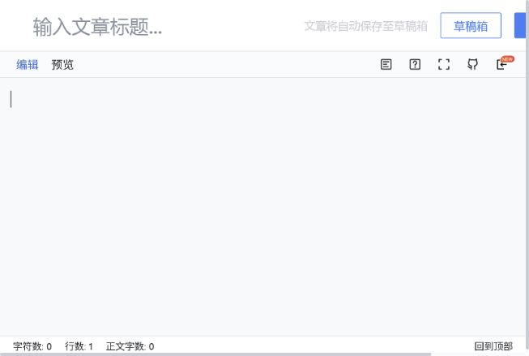

# Media Publishing Notes

Last checked: 2026-07-18

This folder records the manual publishing workflow for Chinese technical media platforms that are not covered by the current automated publisher.

Canonical machine-readable ledgers use one JSON file per platform under [platforms/](platforms/), with shared source scanning rules in [sources.json](sources.json). To refresh the per-platform coverage count, run:

```bash
python .github/publisher/media/check_media_ledger.py --show-missing
```

## Current Setup

The existing publisher in `.github/publisher/` is API-based and only targets Medium and Dev.to through `publish.py`. It reads `.github/publisher/posts_queue.txt`, extracts the first Markdown title, publishes through `https://media-publisher.vercel.app/api/publish-multi`, then removes the entry from the queue after success.

Zhihu and Juejin currently need browser-based manual review because their editors, account state, category/tag choices, and final publish dialogs are platform UI workflows rather than stable local APIs.

For all social/media platforms in this folder, do not directly access platform
APIs, hidden endpoints, or background HTTP interfaces. Ledger evidence should
come only from normal browser interactions: navigation, scrolling, visible
clicks, rendered profile/article/post pages, editor workflows, and screenshots.

## Recommended Model

1. Keep the canonical draft in `docs/blog/posts/` or the relevant docs/tutorial source. Default coverage intentionally excludes legacy `docs/blogs/` pages.
2. Use `.github/publisher/posts_queue.txt` only as the Medium/Dev.to queue; use `platforms/*.json` as the canonical cross-platform ledger, with `published.md` and `not-published.md` as readable snapshots.
3. Prepare a platform copy before opening the editor:
   - Remove YAML front matter.
   - Keep one clear H1 title.
   - Convert relative image links to public `https://eunomia.dev/...` URLs or upload images through the platform editor.
   - Review code blocks, tables, Mermaid, math, footnotes, and HTML blocks after paste/import.
4. Stop automation on the editor page or publish-settings page unless the run is executing the standing authorization in `eunomia-content-patrol`. Outside that skill, the final `发布`, `确定并发布`, comment, like, follow, or repost action requires explicit user confirmation.
5. After a real publish, add the platform URL to `published.md` and remove/update the item in `not-published.md`.

## What Others Do

The safest common pattern is "Markdown source, platform editor confirmation." OpenWrite describes a Chrome-extension workflow where Markdown is written once, distributed to multiple platforms, then confirmed in each platform editor before publishing: <https://openwrite.cn/>.

For Juejin, the old xitu/gold-miner guide still captures the core flow: enter the write page, fill title, paste Markdown, choose category and tags, optionally upload a cover, then publish. It also emphasizes selecting accurate categories and tags: <https://github.com/xitu/gold-miner/wiki/%E5%88%86%E4%BA%AB%E5%88%B0%E6%8E%98%E9%87%91%E6%8C%87%E5%8D%97>.

For Zhihu, Markdown import/paste needs extra QA. Community tooling such as `md2zhihu` exists because Zhihu formatting can need conversion for tables, formulas, and images: <https://blog.openacid.com/toolkit/md2zhihu/>.

## Local Skills And Ledgers

- Canonical Zhihu skill: [`../../../.agents/skills/zhihu-publisher/SKILL.md`](../../../.agents/skills/zhihu-publisher/SKILL.md)
- Canonical Juejin skill: [`../../../.agents/skills/juejin-publisher/SKILL.md`](../../../.agents/skills/juejin-publisher/SKILL.md)
- Canonical Xiaohongshu skill: [`../../../.agents/skills/xiaohongshu-publisher/SKILL.md`](../../../.agents/skills/xiaohongshu-publisher/SKILL.md)
- Daily content patrol skill: [`../../../.agents/skills/eunomia-content-patrol/SKILL.md`](../../../.agents/skills/eunomia-content-patrol/SKILL.md)
- Media Zhihu notes: [zhihu-skill.md](zhihu-skill.md)
- Media Juejin notes: [juejin-skill.md](juejin-skill.md)
- Source-set config: [sources.json](sources.json)
- Per-platform JSON ledgers: [platforms/](platforms/)
- Ledger checker: [check_media_ledger.py](check_media_ledger.py)
- [Confirmed published items](published.md)
- [Not published / pending items](not-published.md)

## Editor Screenshots

These screenshots were captured from the logged-in browser session without publishing anything. Future platform checks should default to the sidebar / in-app browser.



