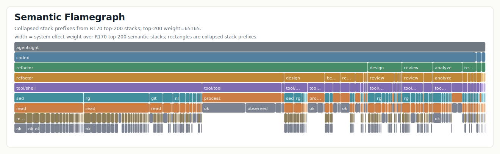
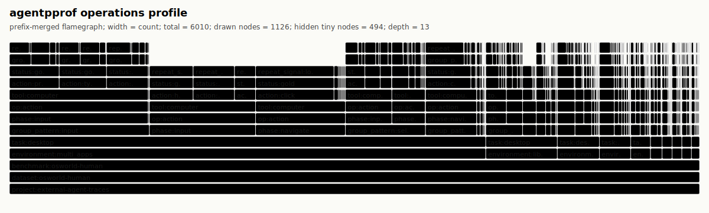

# agentpprof: profiling AI agents with semantic flamegraphs

End of month, the bill shows the agent spent $3000. What types of work consumed
that budget? How much went to code review, how much to debugging, how much to
documentation? This question seems simple, but none of the existing agent
observability tools can answer it directly.

`agentpprof` is a profiling tool built for exactly this question. It reads local
agent trace history and aggregates prompts and tool calls by semantic intent
into flamegraphs: width represents token consumption, execution time, or
operation count. At a glance, you can see where the budget went by category.
Currently supports Codex and Claude Code local trace files; other agents can be
added via the `agent-session` parser.

## Limitations of existing tools

LLM observability platforms like LangSmith, Langfuse, and Phoenix can show token
counts and latency for each call, but when you have 80000 calls, they can only
arrange them by timestamp into a timeline. You can inspect each one and see
"this call used 500 tokens," but you cannot answer "how much did review tasks
cost in total." These tools are designed for single-trace debugging: timeline
views help you locate the failing span at 14:03, span trees show call hierarchy,
waterfall charts reveal parallelism. They excel at answering "what happened" but
for the question "where did the budget go by category," inspecting 80000 spans
one by one simply does not scale.

Datadog and Laminar are starting to move in the right direction with semantic
classification. Datadog uses topic clustering to group user messages, Laminar
uses Signals to extract structured events from traces. But their clustering
primarily targets the distribution of user inputs, not "width represents budget
share" aggregate views. You can see "30% of users asked about code," but not
"code review consumed 40% of the token budget."

CPU profilers solved a similar aggregation problem long ago. Flamegraphs
compress millions of function calls into one chart, width representing time
share. The stack indicates context, and repeated calls to the same function
merge into wider bars. This works because function names are **deterministic**:
the same code path produces the same stack, and identical stacks can be directly
merged.

Agent traces break this assumption. Prompts are natural language: non-
deterministic, variable-length, multilingual, and often conversational. "Fix the
bug" and "修一下这个 error" express the same intent but share no common string.
If you use raw prompt text as frame labels, the flamegraph becomes too wide to
read, with each prompt as an isolated bar, losing the point of aggregation. And
raw prompts often contain sensitive information, making them unsuitable for
sharing.

## Semantic flamegraphs

`agentpprof` restores aggregation by introducing **semantic tagging**: mapping
free-form prompts to short, stable labels like `debug`, `review`, `paper`, or
`misc`. Once tagged, prompts behave like function names, and repeated activities
merge, and the flamegraph becomes readable.

The value of flamegraphs is not just aggregation but also **stack-based causal
linking**. Traditional CPU flamegraph stacks are function call chains:
`main → parse → tokenize` means tokenize was called by parse, which was called
by main. Semantic flamegraph stacks are agent behavior causal chains:
`prompt:debug → call:llm/analysis → tool:bash → file:src/main.rs` means this
file modification was triggered by bash, bash was decided by the LLM, and the
LLM was responding to a debug-type prompt.

| | Traditional CPU Flamegraph | Semantic Flamegraph |
| --- | --- | --- |
| **Stack meaning** | Function call chain | prompt → LLM → tool → effect causal chain |
| **Aggregation** | Same function name merges | Same semantic tag merges |
| **Width meaning** | CPU time share | token / time / operation count share |
| **Question answered** | Where does the program spend CPU | Where does the agent spend budget by category |

This causal linking lets you trace back or drill down from any layer: from a
file being modified, trace back to which tool, which LLM decision, which user
intent caused it; or from a prompt category, see what LLM calls, tool
executions, and system effects it triggered.

`agentpprof` exposes several projections over the same data, each answering a
different question:

| View | Width means | Primary question |
| --- | ---: | --- |
| `tokens` | reported token count (input/output/cache) | Which prompts consumed the most model budget? |
| `time` | duration in seconds | How long did each prompt/activity take? |
| `files` | file/path effect count | Which prompts touched which parts of the repository? |
| `network` | network/domain effect count | Which prompts contacted which domains? |

Start with `tokens` to find cost hotspots, use `time` to trace where wall-clock
time went, and use `files` and `network` for security audits.

## Example Flamegraphs

### Semantic Stack Overview



The figure shows the 200 highest-weight paths. Paths with the same opening
frames share a rectangle; wider rectangles have greater system-effect weight.
Paths end at different depths, producing an uneven outline.

### Tokens View

**Question:** Which activities consumed the most model budget?


The token distribution shows that code review (`prompt:review`) dominated the model budget, followed by git operations (`prompt:git`), code work (`prompt:code`), editing (`prompt:edit`), and debugging (`prompt:debug`). Through the stack, you can trace which LLM calls each prompt category triggered: `call:llm/usage` for token statistics events, `call:llm/code` and `call:llm/test` for code-related responses, `call:llm/tool` for tool calls, and `call:llm/edit` for modification responses.

### Time View

**Question:** Where did wall-clock time go?


Wall-clock time distribution follows a similar pattern to token consumption: review (`prompt:review`) leads, followed by git, edit, docs, and code prompts. Continuation prompts (`prompt:continue`) appear frequently, reflecting a workflow pattern where complex tasks required multiple follow-up exchanges. The `prompt:inspect` category captures quick look-at-this requests that are common in iterative development.

### BPF Benchmark Time


Width is elapsed seconds. LLM and tool frames make the upper outline especially
uneven.

### OSWorld-Human Operations



The figure folds 6,010 operations by shared stack prefix. Width is operation
count; its frames end at different depths.

### Files View

**Question:** Which parts of the codebase were touched and how?


File access patterns show heavy activity in `collector/src/` (the Rust codebase) and `collector/Cargo.toml`, consistent with development work. External paths (`external/tmp`, `external/home`, `external/codex`) appear frequently, reflecting tool invocations that touch temporary files, home directory configs, and Codex session data. The flamegraph distinguishes between read and write effects, revealing the balance of inspection versus modification across both project and external paths.

### Network View

**Question:** Which external services were contacted?


Network activity is sparse relative to file operations, confirming that most development work occurred locally. The contacted domains include `anthropic.com` for model inference, `crates.io` for Rust dependencies, `github.com` for version control, and various localhost ports for local development servers. Process chains visible in the upper frames show which tools initiated network requests, enabling attribution of network activity to specific agent actions.

### Rendering

The SVGs merge shared stack prefixes and size each frame by the metric shown in
the figure header. Stack depth sets the vertical row, so paths ending at
different frames form an uneven outline.

## Tagging

Mapping natural language prompts to stable semantic tags is not trivial. Prompts
in a single project may mix languages ("fix the 编译 error"), range from single
characters ("嗯", "ok") to long paragraphs, and include many fragments that make
no sense in isolation ("continue", "ok", system-generated context restoration
messages). To address these challenges, `agentpprof` provides a pluggable tagger
framework with multiple backends:

| Backend | Approach | Best for |
| --- | --- | --- |
| Regex + Agent iteration | Pattern matching, rules iteratively refined by AI agent | Production, CI, reproducible analysis |
| LLM tagger | Local LLM inference via llama.cpp | Complex prompts, initial rule discovery |
| Python clustering | TF-IDF + K-Means unsupervised clustering | Exploratory analysis, finding natural groupings |

### Regex Tagger and Agent Iteration Workflow

The regex tagger is the production default, but the workflow differs from
traditional regular expressions. **You don't need to hand-write all rules.**
The correct workflow is to have an AI agent observe actual prompt samples and
iteratively refine rules until the unmatched rate drops below 5%.

AgentSight provides the `agentpprof-flamegraph` skill to guide agents through
this iteration:

1. Run `agentpprof`, observe the unmatched rate and sample prompts
2. Propose new `--tag-rule` rules based on samples
3. Re-run and measure coverage
4. Repeat until unmatched < 5% and distribution is reasonable (10-20 categories,
   no single category > 50%)

This iteration typically takes 5-10 rounds, 1-2 minutes each. The final rule
set is deterministic and reproducible, suitable for version control and CI use.

By default there are no built-in rules, and all prompts are marked `unmatched`.
This is an intentional design choice: generic rules are unlikely to match your
project's actual prompt distribution, and blindly applying them produces
misleading aggregation.

Rule format is `KIND:TAG=REGEX`:

```bash
agentpprof -o tokens.svg \
  --tagger regex \
  --tag-rule prompt:review='(?i)review|diff|regression' \
  --tag-rule prompt:test='(?i)cargo test|pytest|unit test' \
  --tag-rule prompt:debug='(?i)fix|error|bug|broken'
```

`KIND` may be `prompt`, `llm`, or `all`. `TAG` must be a lowercase English word
between 3 and 12 letters. Rules are evaluated in command-line order; first
match wins.

For quick testing, use `--preset` to enable built-in demo rules:

```bash
agentpprof -o tokens.svg --tagger regex --preset
```

### LLM Tagger

For complex prompts or initial rule discovery, use a local LLM to generate tags.
Run a llama.cpp-compatible server:

```bash
llama-server -m /path/to/model.gguf --port 8080
agentpprof -o tokens.svg --tagger llm --llama-url http://127.0.0.1:8080
```

LLM tags are cached in `$XDG_CACHE_HOME/agentpprof/tags.json` by default. The
LLM tagger output can serve as a reference for writing regex rules: observe
what categories the LLM produces, then write a regex rule for each.

### Python Clustering Backend (Experimental)

For exploratory analysis, use the Python clustering backend to discover natural
groupings in prompts. This backend uses TF-IDF vectorization and K-Means
clustering, requiring no predefined rules:

```bash
# Export prompts
agentpprof --project-root . --format json -o prompts.json

# Cluster and generate tag cache
python agentpprof/backend/python/cluster_tagger.py \
  --input prompts.json --output tags.json --show-info

# Use the tag cache
agentpprof --project-root . --tag-cache tags.json -o flamegraph.svg
```

The clustering backend automatically selects the optimal cluster count (5-25)
and generates tag names from each cluster's keywords. This is useful for
understanding "what natural categories exist in my prompt distribution" and
can serve as a starting point for writing regex rules.

## Install

After release, install via `cargo install agentpprof`, or download prebuilt
binaries from AgentSight GitHub release artifacts. The release pipeline builds
and smoke-tests both `agentsight` and `agentpprof` from the same release tag.

From a source checkout:

```bash
cargo run --manifest-path agentpprof/Cargo.toml -- --version
cargo run --manifest-path agentpprof/Cargo.toml -- -o agent.pb.gz
```

## First profile

Generate a token profile for the current repository:

```bash
agentpprof --project-root . --view tokens -o tokens.pb.gz
```

Open the pprof profile with standard Go tooling:

```bash
go tool pprof -top tokens.pb.gz
go tool pprof -http=:0 tokens.pb.gz
```

Generate a browser-openable flamegraph instead:

```bash
agentpprof --project-root . --view tokens -o tokens.svg
```

The extension chooses the output format when `--format` is not provided:

```bash
agentpprof -o tokens.pb.gz  --view tokens   # pprof protobuf, gzip-compressed
agentpprof -o time.folded   --view time     # folded stack text
agentpprof -o files.svg     --view files    # standalone SVG flamegraph
agentpprof -o network.json  --view network  # redacted JSON summary and stacks
```

## What data does it read?

`agentpprof` reads agent-native local trace history. Today that means Codex
and Claude Code JSONL files parsed through the `agent-session` crate. It does
not load eBPF probes, require root, or record a live process. It is the offline
profiling side of AgentSight: use `agentsight` to observe live system behavior,
and use `agentpprof` to aggregate already-recorded agent traces.

By default, it scans recent local traces that match `--project-root`:

```bash
agentpprof --project-root /path/to/repo --view tokens -o tokens.svg
```

For repeatable analysis, pass explicit trace files:

```bash
agentpprof \
  --project-root /path/to/repo \
  --session-file ~/.codex/sessions/.../session.jsonl \
  --session-file ~/.claude/projects/.../session.jsonl \
  --view tokens \
  -o tokens.folded
```

Useful selectors:

```bash
agentpprof -o tokens.svg --agent codex
agentpprof -o tokens.svg --session-id 019ec5
agentpprof -o tokens.svg --session-tag debug
agentpprof -o tokens.svg --prompt-tag review
```

## The stack model

The semantic flamegraph stack is a projection, not a literal function call
stack: lower frames provide context (project, agent, prompt type), upper frames
describe the activity being counted, and the exact shape varies by view.

The `tokens` view uses model budget as the width:

```text
project:agentsight;agent:claude;session:profile;prompt:debug;call:llm/debug;model:claude-opus-4-6;kind:input 4200
project:agentsight;agent:claude;session:profile;prompt:debug;call:llm/debug;model:claude-opus-4-6;kind:output 980
project:agentsight;agent:claude;session:profile;prompt:debug;call:llm/debug;model:claude-opus-4-6;kind:cache 150000
```

The `time` view uses wall-clock duration (seconds) as the width:

```text
project:agentsight;agent:claude;session:profile;prompt:debug;kind:llm 45
project:agentsight;agent:claude;session:profile;prompt:debug;kind:tool 12
project:agentsight;agent:claude;session:profile;prompt:debug;kind:prompt 2
```

The `files` view makes repository areas the main branch:

```text
project:agentsight;agent:codex;session:release;prompt:docs;path:docs/flamegraph;effect:write;status:ok 1
```

The `network` view centers domains:

```text
project:agentsight;agent:codex;session:release;prompt:publish;domain:crates.io;process:cargo;status:ok 1
```

Choose the view based on your question: tokens for cost analysis, time for
performance analysis, files for impact assessment, network for security audits.

## Privacy and redaction

Local agent histories can contain prompts, tool outputs, paths, commands,
repository names, and model responses. `agentpprof` is conservative by default:

- SVG, pprof, and folded outputs contain stack labels and weights, not raw
  prompts or model responses.
- JSON output redacts previews unless `--include-previews` is set.
- Absolute paths outside the selected project root are grouped into stable
  buckets such as `external/home`, `external/tmp`, `external/codex`, and
  `external/claude`.
- Private-looking domains are collapsed instead of exposing user-specific
  hostnames.

Use explicit `--session-file` inputs when you need repeatability. Use
`--include-previews` only for private debugging or already-sanitized traces.

## Using agentpprof with AgentSight

`agentsight` provides live visibility (process trees, file effects, network
destinations), while `agentpprof` provides aggregate analysis (cost hotspots,
time distribution). A typical workflow is to record with `agentsight`, then
analyze with `agentpprof`:

```bash
sudo agentsight record -- claude
agentsight report
agentpprof --project-root . --view tokens -o tokens.svg
agentpprof --project-root . --view time -o time.svg
agentpprof --project-root . --view files -o files.svg
```

## Troubleshooting

If no traces are found, pass explicit `--session-file` paths and confirm the
trace `cwd` matches `--project-root`.

If labels are too generic, add a few `--tag-rule` entries for the project. Do
not try to make every prompt unique. Good tags preserve useful semantic
diversity while merging meaningless long-tail fragments.

If pprof output opens but looks unfamiliar, remember that the sample unit is
not CPU time. Use `go tool pprof -top` to inspect the widest semantic frames,
then generate SVG or folded output when you need the full stack shape.

If a public artifact might contain sensitive information, prefer SVG, folded,
or pprof output, and do not pass `--include-previews`.
