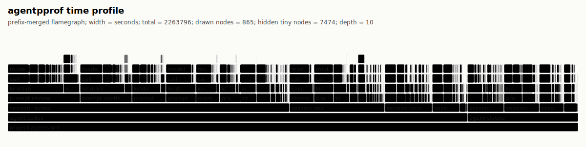
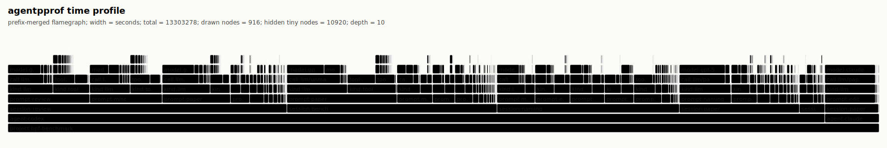
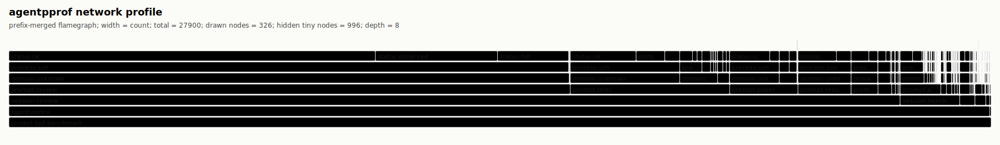

# AgentSight Flamegraph Gallery

AgentSight's semantic flamegraphs connect agent intent to observable activity.
Each horizontal frame adds context to the stack, while frame width represents
the selected metric: token volume, elapsed time, file activity, or network
activity. The examples below use checked-in, regenerable folded-stack outputs
from local development sessions.

## AgentSight Development Time

This profile uses real AgentSight development sessions. Width represents
elapsed seconds, and the uneven stack height comes from optional LLM, tool, and
event frames. It is the closest project-native example to a traditional CPU
flamegraph silhouette. Regenerate it with [`agentsight.sh`](agentsight.sh).

## AgentSight Token Cost

This profile uses the same AgentSight development sessions as the time view,
but width represents token count. Use it when the question is where model
budget went rather than where wall-clock time accumulated. Regenerate it with
[`agentsight.sh`](agentsight.sh).

## AgentSight File Activity

This profile groups local file effects by project, agent, prompt tag, path, and
operation result. Use it to inspect which code or artifact paths dominate an
agent run. Regenerate it with [`agentsight.sh`](agentsight.sh).

## BPF Benchmark Development Time

This profile uses real `bpf-benchmark` development sessions and also measures
elapsed seconds. Its variable-depth stacks produce the strongest ragged upper
outline in the gallery, making the separation between review, paper, naming,
benchmark, and editing sessions easy to see. Regenerate it with
[`bpf-benchmark.sh`](bpf-benchmark.sh).

## BPF Benchmark Network Activity

This profile uses real `bpf-benchmark` development sessions and groups observed
network destinations. Width represents event count. Regenerate it with
[`bpf-benchmark.sh`](bpf-benchmark.sh).

## Choosing a View

- Use **AgentSight time** when the example must come from this repository's own
  development history.
- Use **AgentSight token cost** when the example should explain model budget.
- Use **AgentSight file activity** when the example should explain local system
  effects.
- Use **BPF benchmark time** when a visibly variable stack silhouette matters.
- Use **BPF benchmark network activity** when the example should emphasize
  external service contact.

For the profiler data model, available views, tagging workflow, and CLI usage,
see [`docs/agentpprof.md`](../agentpprof.md).
