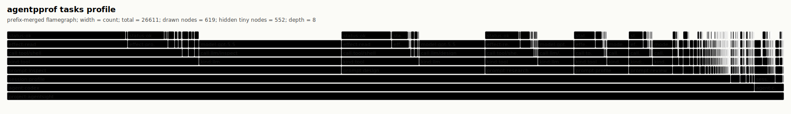
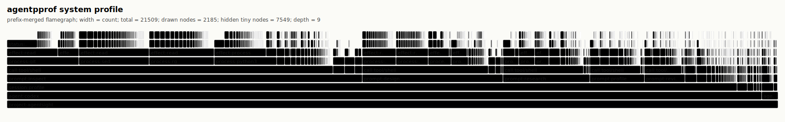
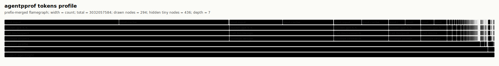
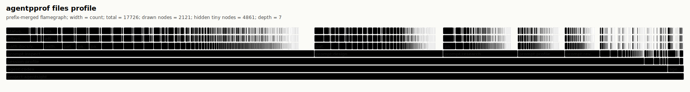
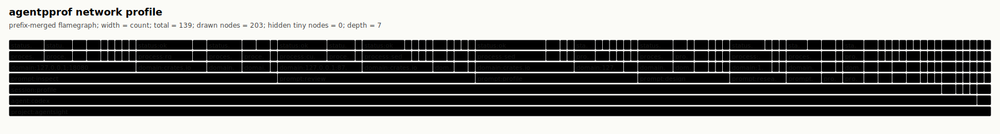

# Agent Flamegraphs

`agentpprof` turns local Codex and Claude Code sessions into pprof-style
semantic profiles. The SVG output is a prefix-merged flamegraph: shared stack
prefixes are drawn once, and each frame width is the inclusive weight below
that frame.

For the complete tool guide, release contract, and tagging model, see
[docs/agentpprof.md](../agentpprof.md).

Read the SVG from bottom to top. The lower frames are broader context such as
`project`, `agent`, `session`, and `prompt`; upper frames are more specific
activity such as LLM calls, tools, processes, file effects, network domains,
and status.

## Views

| View | Width means | Use it to answer | Stack shape |
| --- | ---: | --- | --- |
| `tasks` | LLM-call plus tool-event count | What work dominated this session? | `project -> agent -> session -> prompt -> kind -> call -> model/effect/status` |
| `system` | System-effect count | Which tool/process/effect/path/domain chains were heavy? | `project -> agent -> session -> prompt -> call:tool/* -> process... -> effect -> path/domain -> status` |
| `tools` | Tool-event count | Compatibility alias for the system-effect projection. | same as `system` |
| `tokens` | Reported or bounded-estimated token count | Which semantic regions consumed model budget? | `project -> agent -> model -> kind(input/output/cache/...) -> session -> prompt -> call` |
| `files` | File/path effect count | Which prompts touched which path groups? | `project -> agent -> session -> prompt -> path -> effect -> status` |
| `network` | Network/domain effect count | Which prompts contacted which domains, through which processes? | `project -> agent -> session -> prompt -> domain -> process... -> status` |

Start with `tasks`, then switch to the narrower views when a wide frame needs
explanation.

## Example Gallery

These checked-in images were generated from nine real local Codex/Claude
sessions for AgentSight with regex tags and redacted outputs. The committed
files are only SVG and folded-stack projections; they do not include raw
session logs, prompt previews, command previews, home paths, or secrets. The
source set includes Codex sessions, a Claude session, and a Claude subagent
session from local AgentSight development, not hand-written demo data.
Repo-external local paths are grouped as `external/home`, `external/tmp`,
`external/codex`, `external/claude`, or `external/path`; private domains that
include the local username are grouped as `private.domain`.

Gallery source summary:

| View | Sessions | Weight | Unique stacks |
| --- | ---: | ---: | ---: |
| `tasks` | 9 | 6,494 events | 602 |
| `system` | 9 | 3,514 system effects | 1,479 |
| `tokens` | 9 | 345,866,322 tokens | 732 |
| `files` | 9 | 2,474 file effects | 909 |
| `network` | 9 | 208 network effects | 104 |

### Tasks



### System



### Tokens



### Files



### Network



## Output Formats

The output extension selects the common format when `--format` is not provided:

```bash
agentpprof -o tasks.svg --view tasks       # prefix-merged SVG flamegraph
agentpprof -o system.folded --view system  # folded stacks for inferno/flamegraph.pl
agentpprof -o tokens.pb.gz --view tokens   # Go pprof protobuf
agentpprof -o files.json --view files      # redacted session summary plus stack table
```

Open pprof output with standard Go tooling:

```bash
go tool pprof -top tokens.pb.gz
go tool pprof -http=:0 tokens.pb.gz
```

Folded stacks are plain text:

```text
project:agentsight;agent:claude;session:design;prompt:design;call:tool/shell;process:git;effect:repo;path:feature/agent-behavior-skills;status:ok 1
```

## Tagging

The default tagger is deterministic and does not call a model:

```bash
agentpprof -o tasks.svg --tagger regex
```

Add project-specific rules with repeated `--tag-rule` arguments:

```bash
agentpprof -o tasks.svg \
  --tagger regex \
  --tag-rule prompt:review='(?i)review|diff|regression' \
  --tag-rule prompt:test='(?i)cargo test|pytest|unit test'
```

Rule syntax is:

```text
KIND:TAG=REGEX
```

`KIND` may be `session`, `prompt`, `llm`, or `all`. Rules are evaluated in
command-line order before the built-in keyword rules. The custom rule regex
matches the current object text only: a `prompt:*` rule matches prompt text, not
the session tag or model hint. `TAG` must be one lowercase English word between
3 and 12 letters, which keeps the flamegraph readable.

For model-produced one-word tags, run a llama.cpp-compatible server and switch
to the LLM tagger:

```bash
llama-server -m /path/to/model.gguf --port 8080
agentpprof -o tasks.svg --tagger llm --llama-url http://127.0.0.1:8080
```

`--tag-rule` is intentionally limited to `--tagger regex`; combining it with
`--tagger llm` returns an error instead of silently mixing policies.

## Local History

Without `--session-file`, `agentpprof` scans recent local Codex and Claude Code
sessions that match `--project-root`:

```bash
agentpprof --project-root /path/to/repo --view tasks -o tasks.svg
```

Local histories can contain prompts, paths, tool outputs, and model responses.
Use explicit `--session-file` inputs for controlled private investigations.
JSON output redacts previews by default; only pass `--include-previews` for
private debugging or already-sanitized sessions.

Useful selectors:

```bash
agentpprof -o tasks.svg --agent codex
agentpprof -o tasks.svg --session-id 019ec5
agentpprof -o tasks.svg --session-tag profile
agentpprof -o tasks.svg --prompt-tag review
```

## Regenerating Local Views

Regenerate views from your own local history:

```bash
for view in tasks system tokens files network; do
  agentpprof \
    --project-root /path/to/repo \
    --tagger regex \
    --view "$view" \
    -o "${view}.svg"
done
```

The checked-in gallery was regenerated from nine explicit real session files
whose `cwd` was the local AgentSight checkout. The command shape below keeps
the input set fixed without committing raw logs:

```bash
session_args=(
  --session-file ~/.codex/sessions/.../codex-session-1.jsonl
  --session-file ~/.codex/sessions/.../codex-session-2.jsonl
  --session-file ~/.claude/projects/.../claude-session.jsonl
  --session-file ~/.claude/projects/.../subagents/claude-subagent.jsonl
)

for view in tasks system tokens files network; do
  agentpprof \
    --project-root /path/to/agentsight \
    --project-name agentsight \
    --tagger regex \
    "${session_args[@]}" \
    --view "$view" \
    -o "docs/flamegraph/examples/${view}.svg"

  agentpprof \
    --project-root /path/to/agentsight \
    --project-name agentsight \
    --tagger regex \
    "${session_args[@]}" \
    --view "$view" \
    -o "docs/flamegraph/examples/${view}.folded"
done
```

For private, fixed-input analysis, pass one or more explicit session files:

```bash
agentpprof \
  --session-file ~/.codex/sessions/.../session.jsonl \
  --tagger regex \
  --view tasks \
  -o tasks.folded
```
