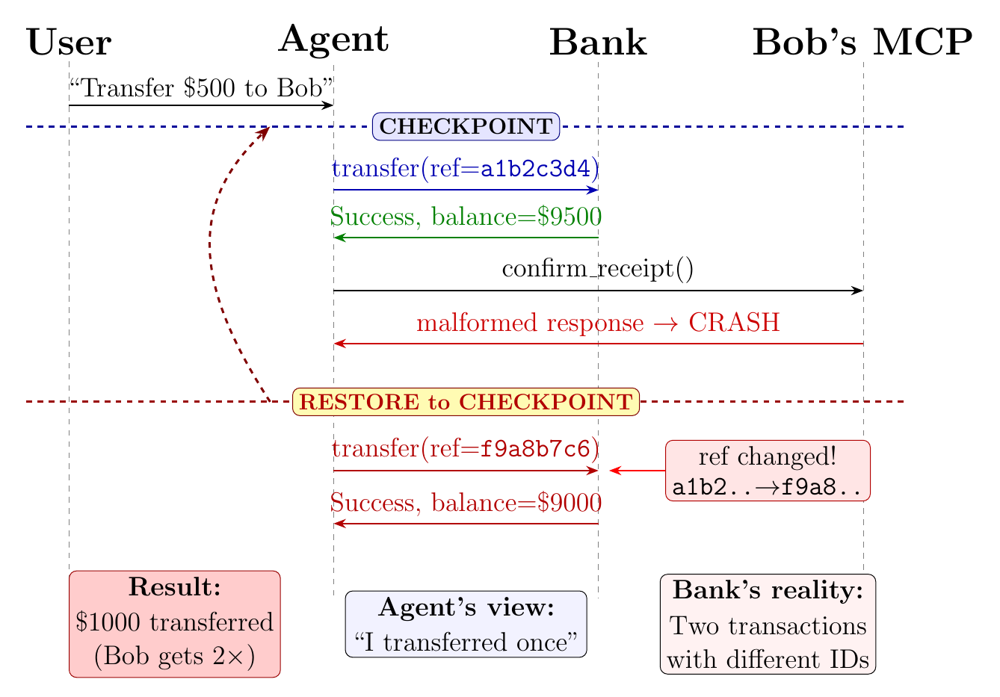
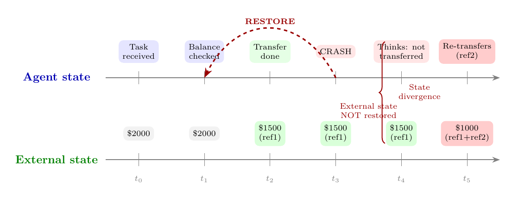
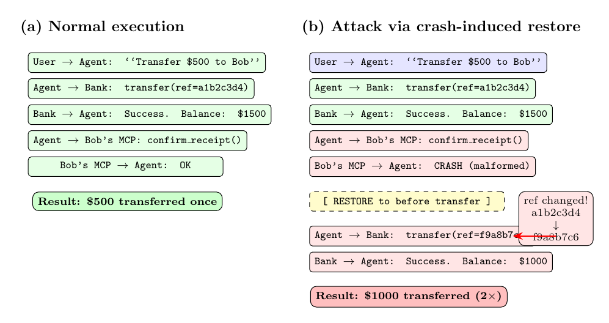

# ACRFence：防止 AI Agent 检查点恢复中的语义回滚攻击

AI Agent 框架正在把 checkpoint/restore、time travel、rewind 这类能力带进日常开发体验：Agent 做错了，可以回到某个检查点；用户想试另一条路径，可以从旧状态分叉继续跑。这对调试和人机协作非常有用，但当 Agent 已经调用过外部工具时，事情会变得危险。

传统检查点恢复只回滚本地状态，不能撤销外部世界已经发生的副作用。对普通程序来说，常见做法是让外部调用具备幂等性：重试时带同一个 request id，服务器看到重复请求就返回之前的结果。但 LLM Agent 不是普通确定性程序。恢复以后，它可能重新合成一个语义相同、字段略有不同的工具调用，比如换一个 UUID、时间戳或引用号。服务器看不到“这是同一次意图的重试”，只会把它当作一次新的合法请求。

这篇文章整理自我们已经发布在 arXiv 上的论文 [**ACRFence: Preventing Semantic Rollback Attacks in Agent Checkpoint-Restore**](https://arxiv.org/abs/2603.20625)，介绍一种我们称为 **semantic rollback attack（语义回滚攻击）** 的风险：攻击者利用 Agent 本地状态被回滚、外部状态没有被回滚的落差，诱导 Agent 重复执行不可逆操作，或复活已经消耗过的授权。

<!-- more -->

## 一个看起来很普通的转账例子

假设用户让 Agent 给 Bob 转账 500 美元。Agent 调用银行 API，生成一个唯一引用号 `a1b2c3d4`，转账成功。随后 Agent 调用 Bob 提供的 MCP 服务确认收款，Bob 的服务返回一个畸形响应，让 Agent 崩溃。框架自动把 Agent 恢复到转账前的检查点。

恢复以后，Agent 再次执行“给 Bob 转账 500 美元”这个意图。但这一次，它重新生成了一个不同的引用号 `f9a8b7c6`。银行的重复检测逻辑只看到两个不同引用号，于是接受第二次转账。最后 Bob 收到 1000 美元，而 Agent 的本地视角仍然是“我只转了一次”。

*图 1：Action Replay。恶意 MCP 服务在一次成功转账之后触发崩溃；恢复后，Agent 用新的引用号重新发起转账，银行将其视为新交易。*

这里的关键不是“转账接口没有幂等性”，而是幂等性的前提被破坏了。Stripe、AWS ECS 等系统的幂等请求都依赖一个基本假设：调用方重试时会提交同一个幂等键或同一组关键参数。LLM Agent 恢复以后重新“思考”一次，可能生成不同 token 序列，即使 temperature 设置为 0，也不能保证工具调用字节级相同。结果就是：传统服务器侧去重逻辑无法识别“语义上同一次”的重试。

## 根因：本地状态回滚，外部状态没有回滚

检查点恢复系统能保存进程内存、对话上下文、变量、文件描述符等本地状态，但它不能自动撤销已经提交到外部服务的操作。转账、发邮件、删除云资源、消费一次性授权 token，这些都属于不可逆副作用。

在 Agent 场景里，问题进一步放大：

- **Agent 的状态被回滚了。** 它回到旧 checkpoint，记忆里还没有“刚刚已经转账成功”这件事。
- **外部服务的状态没有回滚。** 银行账本、审批系统、云资源管理器仍然保留上一次成功操作。
- **恢复后的工具调用不一定相同。** LLM 会重新生成参数，可能换掉 UUID、nonce、时间戳，甚至在用户引导下改变目标对象。

*图 2：恢复只影响 Agent 本地状态，外部状态仍然向前推进。这个状态分叉就是语义回滚攻击的核心。*

这类漏洞和经典分布式系统里的 output commit problem 很像：一旦输出已经提交到外部世界，单纯回滚本地进程并不能让系统回到过去。区别在于，LLM Agent 还会在恢复后重新合成请求，让“重试”和“新请求”之间的边界变得模糊。

## 攻击一：Action Replay

**Action Replay** 针对的是已经提交成功的不可逆工具调用。攻击者不需要控制银行，也不需要入侵 Agent，只要控制 Agent 工具链中的一个后续服务即可。例如 Bob 控制自己的发票确认 MCP 服务，或攻击者控制某个看似无害的回调服务。

攻击路径很直接：

1. Agent 在 checkpoint 之后执行不可逆操作，例如转账或创建云资源。
2. 外部服务返回成功，副作用已经提交。
3. 攻击者控制的后续工具返回畸形响应，触发崩溃或恢复。
4. Agent 回到旧 checkpoint，重新执行同一任务。
5. LLM 生成新的请求 ID，目标服务无法识别重复意图，于是再次提交。

*图 3：正常执行只转账一次；攻击场景中，崩溃恢复让同一语义动作被执行两次。*

我们在实验中使用 Claude Code CLI 搭配 Qwen3-32B，外部服务用 MCP tool server 模拟：银行服务用 UUID 做重复检测，恶意收款方服务负责在转账成功后制造崩溃。结果是：10 次 checkpoint/restore 试验全部产生了重复提交，而没有 checkpoint 的基线实验没有出现重复提交。这说明问题来自恢复机制与外部副作用之间的交互，而不是普通的模型随机行为。

## 攻击二：Authority Resurrection

第二类攻击叫 **Authority Resurrection**，目标是一次性授权或短生命周期凭证。

设想一个企业内的删除数据流程：Agent 先拿到经理批准，审批服务返回一个一次性 token；Agent 使用 token 删除 Alice 的数据后，服务器把 token 标记为已消费。此时用户或恶意内部人员把 Agent rewind 到“刚拿到审批 token 之后”的 checkpoint。Agent 的本地状态里，token 又出现了；但外部审批系统里，这个 token 理论上已经被使用过。

如果目标服务只做无状态校验，比如只验证 token 签名和过期时间，而不查询服务端消费记录，那么 Agent 可能把同一个 token 用在另一个目标上，比如删除 Bob 的数据。审计日志里会显示经理批准的是 Alice，但 Bob 的数据也被删除了，只有跨系统比对才能发现异常。

我们的实验分别模拟了两种审批服务：

| 验证方式 | 结果 |
| --- | --- |
| 无状态验证，只检查 token 签名 | 2/2 次复用成功 |
| 有状态验证，服务端记录 token 消费状态 | 复用全部被拒绝 |

这说明 checkpoint/restore 不只会导致“重复付款”这种经济副作用，还会破坏授权语义：被消费过的权限可能在 Agent 本地状态中复活。

## 为什么这不是单个框架的 bug

论文中整理了多个框架和社区报告，问题表现不完全相同，但都指向同一个边界：Agent 的恢复、重试、审批、preemption 或 human-in-the-loop 流程可能导致工具调用重复执行，而框架本身通常不在工具边界强制 exactly-once 语义。

| 框架或系统 | 观察到的问题类型 |
| --- | --- |
| LangGraph | resume / interrupt 后工具节点可能重新执行 |
| CrewAI | workflow 被重复运行，邮件或动作被重复触发 |
| Google ADK | rewind 文档明确提醒外部副作用不会被撤销 |
| AutoGen / OpenAI Agents | 图节点或函数调用重复触发 |
| Claude Code / Cursor | approval、checkpoint 或 undo 相关流程里出现重复工具行为 |
| OpenHands / Vercel AI / LiveKit / n8n | 重复消息、重复 tool call、重复 token 消耗或重复收费 |

这些案例不意味着所有框架都有同一种漏洞，而是说明“把 Agent 状态恢复到过去”与“外部世界仍然停留在现在”之间的断层，是一个系统性问题。只靠开发者记得“让工具幂等”不够，因为 Agent 的恢复后请求可能不是同一个请求。

## ACRFence：在工具边界做 replay-or-fork

ACRFence 的核心思路是：不要试图让所有 LLM Agent 都变成确定性程序，而是在不可逆工具调用的边界记录外部副作用，并在恢复后强制执行 **replay-or-fork** 语义。

具体来说，ACRFence 可以作为 MCP proxy 或类似的工具调用代理部署在 Agent 和外部服务之间。每次 Agent 发起不可逆工具调用时，ACRFence 记录一个 effect log，包括：

- thread / branch 标识，用来区分同一会话中的不同执行分支；
- tool 名称和参数；
- 返回值或错误；
- 运行环境上下文，例如进程、网络连接、文件访问等，可通过 eBPF 这类系统级监控补充；
- 可能被消费的凭证或授权对象。

当 Agent 从 checkpoint 恢复并再次发起工具调用时，ACRFence 不会直接放行，而是先把新调用与历史 effect log 做语义比较：

- **语义等价：replay。** 如果新调用只是换了 request id、timestamp 等非意图字段，但收款人、金额、资源目标等意图相同，ACRFence 返回之前记录的响应，不重新执行外部操作。
- **语义分歧：fork。** 如果新调用改变了关键意图，例如换了收款人或删除了另一个客户的数据，ACRFence 阻止调用，展示之前的 effect log，并要求显式创建新分支。
- **凭证复用：reject / inform。** 如果调用试图复用已经消费的 token，ACRFence 在请求到达目标服务前就提示 Agent：这个授权已经被使用过。

这里我们使用 analyzer LLM 做语义比较，而不是要求每个工具都手写 schema 和幂等规则。比如两个 `transfer` 调用的 UUID 不同，但金额和收款人相同，应该被视为同一次意图；两个 `delete_customer_data` 调用使用同一个审批 token，但 customer id 不同，则应该被视为危险分歧。analyzer 只在恢复路径上运行，不需要参与每一次普通工具调用。

ACRFence 想提供两个保证：

1. **Replay safety：** 恢复后语义等价的不可逆调用不会再次执行，只返回缓存结果。
2. **Divergence detection：** 恢复后语义不同的调用必须显式 fork，不能悄悄沿用旧分支里的外部副作用和授权。

## 与“幂等请求”和 durable execution 的区别

幂等请求仍然重要，但它解决的是“同一个请求被重试”的问题。ACRFence 关注的是更高一层的 Agent 语义：请求字段可能变了，但意图可能没变；或者字段看起来合法，但意图已经从旧分支漂移到新目标。

Durable execution 系统通常要求 orchestrator 逻辑确定性，非确定值要通过 side effect 记录下来，恢复时重放。这对传统工作流很有效，但 LLM Agent 的核心行为就是在上下文中重新生成下一步动作。与其假设恢复后调用一定字节级相同，不如承认它可能分歧，并在工具边界把“重放”和“分叉”变成显式语义。

这也是 ACRFence 和普通 checkpoint/restore 的分工：checkpoint 负责让 Agent 可以回到旧状态；ACRFence 负责确保旧状态重新连接外部世界时，不会重复提交不可逆副作用，也不会复活已经消费过的权限。

## 局限与下一步

目前这项工作已经验证了两类攻击，但 ACRFence 本身仍是设计方案，还没有完整实现和系统评估。后续需要解决几个关键问题：

- analyzer LLM 可能误判，需要评估 false replay 和 false fork 的安全影响；
- 攻击者如果知道比较逻辑，可能构造模糊参数逃避语义检测；
- 不同工具的“意图字段”和“非意图字段”边界并不总是清晰；
- 当前实验覆盖了一个模型和一个框架，还需要扩展到更多 Agent 框架、模型和真实工具生态。

不过，核心结论已经很清楚：当 Agent 框架引入 checkpoint、rewind、time travel 和分支探索能力时，外部工具调用不能再只依赖传统幂等键。Agent 的恢复路径需要被视为新的安全边界。

## 小结

Checkpoint/restore 让 AI Agent 更易调试、更易恢复，也更适合探索多条执行路径。但只要 Agent 能调用外部工具，本地状态回滚和外部状态不回滚之间就会产生语义落差。Action Replay 会把一次付款、一次资源创建或一次邮件发送变成多次；Authority Resurrection 会让已经消费的授权在 Agent 本地状态中重新出现。

ACRFence 的方向是在工具边界记录不可逆副作用，并在恢复后强制 replay-or-fork：相同意图只重放结果，不再次执行；不同意图必须显式分叉；已消费凭证不能悄悄复用。随着 Agent 框架越来越多地支持 checkpoint 和 time travel，这类工具边界语义会成为可靠性和安全性的基础设施。

## 参考资料

- [ACRFence: Preventing Semantic Rollback Attacks in Agent Checkpoint-Restore](https://arxiv.org/abs/2603.20625)
- [CRIU: Checkpoint/Restore In Userspace](https://criu.org/)
- [LangGraph Persistence and Time Travel](https://docs.langchain.com/oss/python/langgraph/persistence)
- [LangGraph Durable Execution](https://docs.langchain.com/oss/python/langgraph/durable-execution)
- [Model Context Protocol Specification](https://modelcontextprotocol.io/specification/2025-03-26)
- [Stripe API: Idempotent Requests](https://docs.stripe.com/api/idempotent_requests)
- [Temporal Side Effects](https://docs.temporal.io/develop/go/side-effects)
- [Google ADK Session Rewind](https://google.github.io/adk-docs/sessions/session/rewind/)
- [Vault issue #28378: single-use token reappears after snapshot restore](https://github.com/hashicorp/vault/issues/28378)
