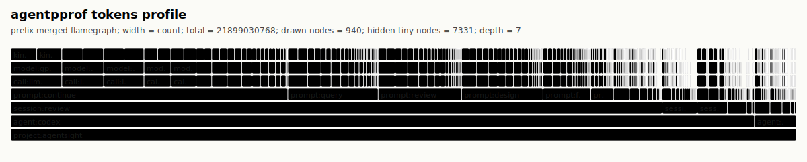
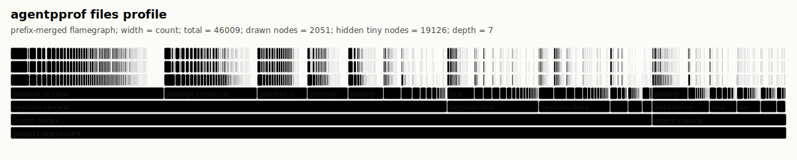
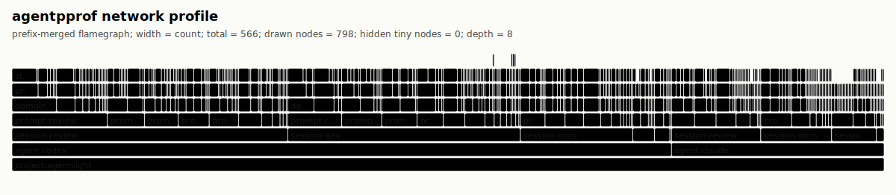

# Semantic Flamegraphs for AI Agent Traces

When an AI Agent finishes a month of work, you know the total token spend but not the breakdown. How much went to code review versus debugging? Were tool retries a significant cost, or did continuation prompts dominate? These questions matter for optimizing workflows, yet typical observability tools cannot answer them directly.

[agentpprof](https://github.com/eunomia-bpf/agentsight) addresses this by reading local agent trace history and aggregating prompts and tool calls by semantic intent into flamegraphs. Width encodes token consumption, execution time, or operation count, letting a team see which categories dominate before drilling into specific sessions. The tool is part of [AgentSight](https://github.com/eunomia-bpf/agentsight), an eBPF-based observability framework for AI agent behavior.

A wide bar is not automatically waste. A review-heavy profile may reflect necessary work, repeated inspection of the same files, an overly broad context window, or some combination. The profile provides a starting point for investigation, not a verdict.

<!-- more -->

## The Aggregation Problem

Most LLM observability tools are built around single-trace debugging. Timelines locate a failing span, span trees show call hierarchy, waterfall charts reveal parallelism. These views answer what happened in one execution. Cross-session analysis poses a different problem: after tens of thousands of calls, you need stable categories that merge repeated work and carry a meaningful weight, such as tokens, elapsed time, or effect count.

Topic clustering and structured trace extraction can group similar inputs, but an input distribution is not a budget profile. Knowing that many prompts mention code does not reveal how much model budget review consumed, which tools those prompts invoked, or which files they affected. agentpprof focuses on weighted, cross-session aggregation.

CPU profilers solved a structurally similar problem. Flamegraphs compress millions of function calls into one chart where width represents time share. The stack provides context; repeated calls to the same function merge into wider bars. This works because function names are deterministic: the same code path produces the same stack, and identical stacks merge directly.

Agent traces break this assumption. Prompts are natural language: non-deterministic, variable-length, multilingual, often conversational. "Fix the bug" and "修一下这个 error" express the same intent but share no common substring. Using raw prompt text as frame labels produces an unreadable flamegraph because each prompt becomes an isolated bar, defeating aggregation. Raw prompts also often contain sensitive information, making them unsuitable for sharing.

## Semantic Flamegraphs

agentpprof restores aggregation by mapping free-form prompts to short, stable labels: `debug`, `review`, `paper`, `docs`. Once tagged, prompts behave like function names; repeated activities merge and the flamegraph becomes readable.

Beyond aggregation, flamegraphs encode causal chains. In a CPU flamegraph, `main → parse → tokenize` indicates that tokenize was called by parse, which was called by main. In a semantic flamegraph, `prompt:debug → call:llm/analysis → tool:bash → file:src/main.rs` indicates that bash triggered the file modification, the LLM decided to invoke bash, and the LLM was responding to a debug-type prompt.

| | Traditional CPU Flamegraph | Semantic Flamegraph |
| --- | --- | --- |
| **Stack meaning** | Function call chain | prompt → LLM → tool → effect causal chain |
| **Aggregation** | Same function name merges | Same semantic tag merges |
| **Width meaning** | CPU time share | token / time / operation count share |
| **Question answered** | Where does the program spend CPU | Where does the agent spend budget by category |

This structure supports bidirectional navigation. From a modified file, trace back to the tool, LLM decision, and user intent that caused it. From a prompt category, see which LLM calls, tool executions, and system effects it triggered.

## Views

agentpprof projects the same trace data in several ways, each answering a different question.

| View | Width means | Primary question |
| --- | ---: | --- |
| `tokens` | reported token count (input/output/cache) | Which prompts consumed the most model budget? |
| `time` | duration in seconds | How long did each prompt/activity take? |
| `files` | file/path effect count | Which prompts touched which parts of the repository? |
| `network` | network/domain effect count | Which prompts contacted which domains? |

`tokens` locates cost hotspots; `time` traces wall-clock time; `files` and `network` support security audits.

### Quick Start

To generate a browser-openable profile of recent Codex or Claude Code traces for the current repository:

```bash
agentpprof --project-root . --view tokens --tagger regex --preset -o tokens.svg
```

The preset provides demo tagging rules, not a production taxonomy. For repeatable comparison, pass explicit `--session-file` inputs and replace the preset with version-controlled rules. Open the SVG, identify the widest prompt category, then inspect the underlying sessions before changing any workflow.

## Examples from AgentSight Development

The following profiles come from AgentSight's own Claude Code traces. They are descriptive, not controlled benchmarks; category names depend on the tagging rules used for this project. The examples illustrate what becomes inspectable once traces share stable labels.

### Tokens



Code review (`prompt:review`) dominated token consumption, followed by git operations, general code work, editing, and debugging. The stack traces each category to the LLM calls it triggered: `call:llm/usage` for token statistics events, `call:llm/code` and `call:llm/test` for code-related responses, `call:llm/tool` for tool invocations, `call:llm/edit` for modifications.

### Time


Wall-clock time roughly tracks token consumption: review leads, followed by git, edit, docs, and code. Continuation prompts (`prompt:continue`) appear frequently, reflecting tasks that required multiple follow-up exchanges. `prompt:inspect` captures quick look-at-this requests common in iterative development.

### Files



File access concentrates in `collector/src/` and `collector/Cargo.toml`, consistent with active Rust development. External paths (`external/tmp`, `external/home`, `external/codex`) reflect tool invocations touching temporary files, home directory configs, and Codex session data. The flamegraph distinguishes reads from writes, showing the balance of inspection versus modification.

### Network



Network activity is sparse relative to file operations; most work occurred locally. Contacted domains include `anthropic.com` (model inference), `crates.io` (Rust dependencies), `github.com` (version control), and localhost ports for local servers. Process chains in the upper frames show which tools initiated each request, enabling attribution to specific agent actions.

## Tagging

The core challenge is mapping natural language prompts to stable, meaningful tags. This is harder than CPU profiling, where function names are deterministic symbols. The project has working approaches but not solved ones; the limitations are worth stating explicitly.

### Why Tagging Is Difficult

Real prompts from a development session:

```
"fix the 编译 error"          # Mixed language
"嗯"                          # Single character confirmation
"ok"                          # Ambiguous intent
"继续"                        # Context-dependent
"[Session continued...]"      # System-generated
"看看 collector/src/main.rs"  # Inspection request
"为啥 cargo test 失败了"       # Debug question
```

These exhibit properties that break naive classification: multilingual mixing (English and Chinese in the same prompt, sometimes the same sentence), extreme length variance (1 character to multi-paragraph context restorations), context dependence ("继续" is meaningless without knowing what preceded it), implicit intent ("嗯" could be confirmation, acknowledgment, or thinking pause), and system noise (auto-generated continuations, tool outputs, error messages).

No single approach handles all cases well. agentpprof provides three backends with different tradeoffs.

### Approaches

**Regex + iteration** is the production default. Rules like `prompt:debug='(?i)fix|error|bug|broken|为啥'` pattern-match against prompt text. The workflow is iterative: run agentpprof, observe unmatched samples, write rules, repeat until coverage exceeds 95%. This typically takes 5-10 rounds for a new project. The result is deterministic, reproducible, fast, dependency-free, and suitable for version control and CI. The cost is project-specific maintenance: rules are brittle to prompt style changes and cannot handle semantic similarity ("fix the bug" versus "resolve the issue").

**LLM tagger** uses local inference via llama.cpp, constraining each result to a single tag and caching output for reuse. It handles similarity and multilingual prompts without rule writing. The cost is stability: the same prompt may receive different tags across runs, the local model must be configured, and tag quality depends on model capability. Cache results when repeatability matters, then convert useful categories into deterministic rules.

**TF-IDF + K-Means clustering** discovers natural groupings unsupervised, automatically selecting cluster count (5-25) and generating tag names from cluster keywords. It requires no predefined categories and can reveal unanticipated structure. The cost is interpretability: cluster boundaries are arbitrary, tag names are keyword-derived rather than semantic, and results need post-hoc interpretation.

### Open Questions

**Tag adequacy.** Grammar-constrained output keeps labels syntactically valid, but does not show that one-word tags preserve enough meaning for human decisions. "debug" might conflate bug fixing, error investigation, and performance debugging, each with different cost implications.

**Cross-project transfer.** Rules developed for one project may not transfer to another. A Rust systems project has different prompt patterns than a React frontend project; how much overlap exists is unknown.

**Optimal granularity.** Should "code review" be one tag or split into `review:style`, `review:logic`, `review:security`? Finer granularity preserves information but fragments the flamegraph.

**Multilingual normalization.** "Fix the bug" and "修一下这个 bug" should probably receive the same tag, but regex rules cannot express this. LLM taggers can, with stability tradeoffs.

## AgentSight Integration

agentpprof is the offline profiling component of [AgentSight](https://github.com/eunomia-bpf/agentsight), an eBPF-based observability framework for AI agent behavior. AgentSight provides live visibility through SSL/TLS interception and process monitoring; agentpprof aggregates already-recorded traces.

A typical workflow combines both: record agent activity with `sudo agentsight record -- claude`, generate summary reports with `agentsight report`, then profile with `agentpprof --view tokens`, `--view files`, or `--view network`.

For installation and detailed usage, see the [AgentSight repository](https://github.com/eunomia-bpf/agentsight) and the [agentpprof documentation](https://github.com/eunomia-bpf/agentsight/blob/master/docs/agentpprof.md).

## From Visibility to Action

Generating a flamegraph is straightforward; deciding what to do with it is harder. CPU profilers lead to clear actions: find the hot function, optimize the algorithm, reduce allocations. Agent cost profiles are different: you will not stop code review merely because it is the widest category, and you will not skip debugging because it is expensive. The flamegraph shows where budget goes, not why or how to reduce it.

Making the view actionable requires drilling deeper. Within-category analysis asks why review is the widest category: repeated reviews of the same file, unnecessarily broad context windows, or verbose prompts. Workflow pattern detection looks for repeated interaction shapes: frequent continuation prompts may indicate tasks that should be structured differently upfront; high unmatched rates may indicate prompt styles needing standardization. Cross-session comparison asks whether this month's distribution differs from last month's, or whether a workflow change increased debugging costs.

Work is underway to combine agentpprof with interaction analysis to produce reports recommending specific changes: CLAUDE.md rules to prevent repeated file reviews, prompt templates to reduce context overhead, workflow restructuring to minimize continuation churn.

## Limitations

**Agent coverage** is limited to Codex and Claude Code local traces. Other agents require parser extensions via the `agent-session` crate.

**Tagging** remains an open problem. Project-specific rules are required, and there is no evidence yet that one-word tags are semantically adequate.

**Validation** rests on mechanism evidence (the flamegraph correctly aggregates by tag), not user evidence (developers make better decisions with this view). The latter requires user studies not yet conducted.

**Cost attribution** depends on agent-reported usage, which may not reflect actual billing due to cached tokens, batch discounts, and model-specific pricing. The flamegraph shows relative distribution, not dollar amounts.

---

agentpprof is open source and part of the [AgentSight project](https://github.com/eunomia-bpf/agentsight). Contributions and feedback are welcome.

## References

- [AgentSight repository](https://github.com/eunomia-bpf/agentsight)
- [agentpprof documentation](https://github.com/eunomia-bpf/agentsight/blob/master/docs/agentpprof.md)
- [AgentSight: System-Level Observability for AI Agents Using eBPF](https://arxiv.org/abs/2508.02736)
- [Brendan Gregg, Flame Graphs](https://www.brendangregg.com/flamegraphs.html)
- [Go diagnostics: profiling](https://go.dev/doc/diagnostics#profiling)
