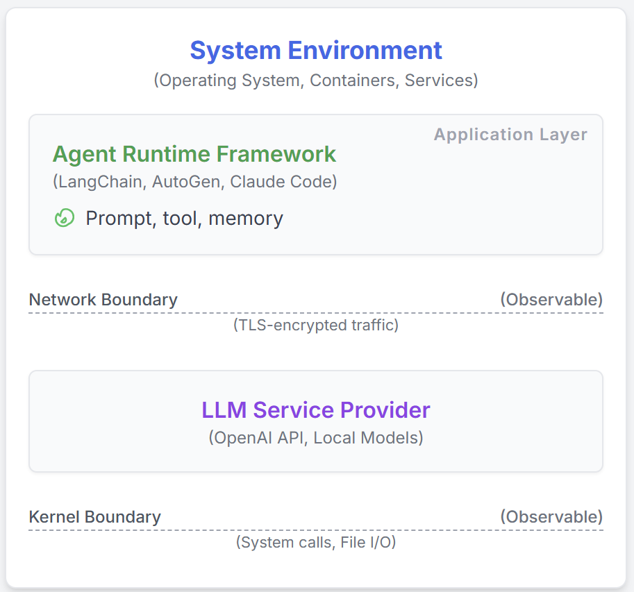

# AgentSight: Keeping Your AI Agents Under Control with eBPF-Powered System Observability

Picture this: your AI agent is autonomously writing code and executing commands, but you have no idea what it's actually doing. Sounds a bit unsettling, right? As LLM agents like Claude Code and Gemini-cli become increasingly prevalent, we're handing more and more control to AI. But here's the catch: these AI agents are fundamentally different from traditional software, and our existing monitoring tools are struggling to keep up. They can either see what the AI is "thinking" (through LLM prompts) or what it's "doing" (system calls), but never both together. It's like watching someone's mouth move or seeing their actions, but never connecting the two. This blind spot makes it nearly impossible to tell if your AI is working normally, under attack, or burning through your budget in an infinite loop.

That's why we built AgentSight. We leverage eBPF to monitor AI agents at system boundaries where they can't hide. AgentSight intercepts encrypted LLM communications to understand what the AI intends to do, monitors kernel events to track what it actually does, then uses a smart correlation engine to connect these dots into a complete causal chain. The best part? You don't need to modify your code, it works with any framework, and the performance overhead is less than 3%! In our tests, AgentSight successfully caught prompt injection attacks, spotted expensive reasoning loops before they drained budgets, and revealed hidden bottlenecks in multi-agent collaborations. AgentSight is now open source and ready to use at <https://github.com/agent-sight/agentsight>. The arxiv paper is available at <https://arxiv.org/abs/2508.02736>.
<!-- more -->

## Introduction

We're witnessing a revolution: AI is no longer just a helper tool, it's becoming a true system participant. Think about it - when you use [Claude Code](https://www.anthropic.com/news/claude-code), [Cursor Agent](https://cursor.com/), or [Gemini-cli](https://blog.google/technology/developers/introducing-gemini-cli-open-source-ai-agent/), you're essentially letting AI directly control your system, creating processes, modifying files, and executing commands. These AI agents can independently tackle complex software development and system maintenance tasks. It's exciting, but also brings a headache: we're deploying non-deterministic ML systems, which presents unprecedented challenges for system reliability, security, and verification.

The biggest issue? There's a critical semantic gap between what an AI agent *wants to do* (intent) and what it *actually does* (system actions). Traditional programs have predictable execution paths, but AI agents dynamically generate code and spawn various subprocesses, leaving existing monitoring tools completely in the dark. Here's a scary example: imagine an AI agent helping you refactor code. While searching for API documentation, it accidentally reads a malicious prompt from an external website and quietly plants a backdoor in your code (this is called an [indirect prompt injection attack](https://arxiv.org/abs/2403.02691)). Application-level monitoring only sees a "successful script execution" log, system monitoring only sees a bash process writing files, and nobody realizes that a benign operation has turned malicious. The monitoring tools are essentially flying blind.

Existing solutions are stuck on one side of this semantic gap. Frameworks like [LangChain](https://github.com/langchain-ai/langchain) and [AutoGen](https://github.com/microsoft/autogen) use *application-level instrumentation* to capture AI reasoning and tool calls. While they can see the AI's *intent*, this approach is fragile: it needs constant updates to chase API changes, and can be easily bypassed - a simple shell command and they're blind. On the flip side, *generic system monitoring* tools can see all the *actions*, tracking every system call and file access, but they have no clue about context. To them, an AI writing a data analysis script looks exactly the same as one planting malicious code. Without understanding the LLM instructions behind the actions, without knowing the "why" behind the "what", these low-level event streams are just meaningless noise.

Here's our fresh approach to bridge this semantic gap. The key insight: while AI agent internals and frameworks change constantly, the interfaces where they interact with the world (kernel for system operations, network for communications) are stable and unavoidable. By monitoring at these system boundaries, we can capture both the AI's high-level intent and its low-level system behavior. **AgentSight** brings this concept to life using eBPF to intercept encrypted LLM traffic (to understand intent) and monitor kernel events (to track actions). The magic happens in our two-stage correlation process: a real-time engine first links LLM responses to the system behaviors they trigger, then a secondary "observer" LLM analyzes these correlated traces to identify risks and explain why certain behavior patterns are suspicious. This approach needs zero code changes, works with any framework, adds less than 3% overhead, and has already proven effective at catching prompt injection attacks, expensive reasoning loops, and multi-agent bottlenecks.

## Background and Related Work

Before diving into the technical details, let's understand how LLM agents work, why existing monitoring solutions fall short, and how eBPF becomes our secret weapon.

### How AI Agents Work

Today's AI agent systems follow a pretty standard blueprint with three main components: (1) an LLM backend that does the "thinking", (2) a tool framework that handles the "doing", and (3) a control loop that coordinates everything. Whether it's [LangChain](https://github.com/langchain-ai/langchain), [AutoGen](https://github.com/microsoft/autogen), [Cursor Agent](https://cursor.com/), [Gemini-cli](https://blog.google/technology/developers/introducing-gemini-cli-open-source-ai-agent/), or [Claude Code](https://www.anthropic.com/news/claude-code), they're all variations on this theme. This architecture gives AI agents their superpower: you describe what you want in plain English, and they figure out how to do it - whether that's analyzing data, debugging code, or refactoring entire projects.

### The Current State of AI Agent Observability

Current monitoring solutions each have their blind spots. One camp focuses on "intent" - tools like Langfuse, LangSmith, and Datadog excel at tracking AI reasoning and application-level events, with the OpenTelemetry GenAI working group even pushing for standards. But the moment an AI executes an external command or spawns a subprocess, these tools go dark. The other camp focuses on "actions" - system monitoring tools like Falco and Tracee can see every system call, but they have no idea what these actions mean. To them, an AI writing legitimate code looks identical to one planting malware. Some researchers are working on making AI thought processes more transparent, but they're mainly focused on the LLM itself, not bridging the gap between AI intentions and system behaviors.

### eBPF: Our Secret Weapon

To monitor both network traffic and kernel activity simultaneously, we need something that's both safe and efficient. Enter eBPF (extended Berkeley Packet Filter) - it checks all the boxes. While eBPF started life as a packet filter, it's evolved into a powerful in-kernel virtual machine that powers many modern monitoring and security tools. For AI agent monitoring, eBPF is perfect: it can observe precisely at system boundaries, intercepting TLS-encrypted LLM communications to understand *intent* while monitoring system calls to track *actions*, all with minimal overhead. Most importantly, eBPF comes with kernel-level safety guarantees including verified termination and memory safety, making it production-ready.

## Design

AgentSight has one clear goal: connect what AI agents intend to do with what they actually do. We achieve this through monitoring at system boundaries, powered by a multi-signal correlation engine.

### Guarding the Chokepoints

Here's our key discovery: no matter how AI agents evolve internally, they must interact with the world through fixed "checkpoints" - primarily the network boundary (for LLM communications) and the kernel boundary (for system operations), as shown in Figure 1. By monitoring at these chokepoints, we capture the complete behavioral chain. This approach offers two major advantages. First, *complete coverage* - nothing escapes the kernel's eyes, from process creation to file I/O, even when AI spawns subprocesses. Second, *rock-solid stability* - system call interfaces and network protocols change far slower than AI frameworks, making our solution future-proof. Most importantly, this approach doesn't rely on the AI agent "cooperating" - we enforce monitoring at system boundaries where it can't be bypassed.

*Figure 1: agent framework overview*

### System Architecture: A Two-Pronged Monitoring Strategy

AgentSight's clever architecture monitors both critical boundaries simultaneously. As Figure 2 shows, we deploy non-intrusive eBPF probes that work like a double agent: one intercepts decrypted LLM communications (including prompts and responses) from SSL functions to understand intent, while another monitors kernel events to track actual behaviors. Our correlation engine then weaves these two threads together into a complete causal chain.

*Figure 2: AgentSight System Architecture*

Here's what makes AgentSight so powerful:

**eBPF Provides Safe and Efficient Probing:** We didn't choose eBPF by accident - it offers production-grade safety, blazing-fast performance, and unified access to both userspace and kernel data. By directly intercepting decrypted AI-to-LLM communications, we achieve better efficiency and simplicity than traditional packet capture or proxy solutions.

**Multi-Signal Correlation Engine Connects the Dots:** This is AgentSight's brain, responsible for linking intent to action. We use a triple correlation mechanism: (1) *Process lineage tracking* - monitoring `fork` and `execve` to build a complete process tree, ensuring even subprocess behaviors trace back to their source; (2) *Temporal correlation* - linking actions that occur shortly after LLM responses; (3) *Content matching* - directly matching filenames, URLs, and commands mentioned in LLM responses with actual system call parameters. Together, these three signals ensure the causal relationship between AI intent and behavior has nowhere to hide.

**"AI Watching AI" Semantic Analysis:** Traditional rule-based detection is too rigid, so we employ another LLM as our "security analyst." We feed it the correlated event traces, leveraging LLM's ability to understand complex semantics and infer causal relationships to spot anomalous behaviors that don't fit predefined patterns. This "using AI to monitor AI" approach makes AgentSight's detection capabilities more intelligent and flexible.

## Implementation

AgentSight is built with a Rust/C userspace daemon (6000 lines) that orchestrates eBPF programs, plus a TypeScript frontend (3000 lines) for visualization and analysis. The whole system is designed for high performance, turning massive streams of kernel events into human-readable, correlated traces in real-time.

### Casting a Wide Net at the Boundaries

Our eBPF probes act like two sentinels at different posts. The first sentinel uses uprobes to hook into SSL_read/SSL_write functions in crypto libraries like OpenSSL, intercepting decrypted LLM communications. We built smart reassembly logic to handle streaming protocols like SSE. The second sentinel monitors the kernel level, using tracepoints like sched_process_exec to build process trees and kprobes to watch critical syscalls like openat2, connect, and execve. To avoid drowning in data, we filter aggressively right in the kernel, only sending events from target AI agents to userspace, dramatically reducing overhead.

### Two-Stage Correlation Engine: From Data to Intelligence

Our Rust-powered correlation engine works in two stages. Stage one is real-time processing: reading events from eBPF ring buffers, enriching them with context (like converting file descriptors to actual paths), maintaining process tree state, and performing causal correlation within 100-500ms time windows. Stage two is semantic analysis: formatting the correlated events into structured logs, crafting carefully designed prompts, and having a secondary LLM play "security analyst" to perform deep analysis. The LLM outputs natural language analysis and risk scores. To manage latency and cost, we use asynchronous processing and optimized prompt engineering.

## Evaluation

We wanted to answer two key questions: Does AgentSight slow down your system? Can it actually catch real problems?

### Performance Testing: Nearly Invisible Overhead

We tested AgentSight's performance impact in real-world conditions on an Ubuntu 22.04 server (Linux 6.14.0) using Claude Code 1.0.62 as our test subject. We picked three typical developer scenarios from [this tutorial repo](https://github.com/eunomia-bpf/bpf-developer-tutorial): having AI understand an entire codebase (`/init` command), generating bpftrace scripts, and compiling a project with parallel builds. Each scenario was tested 3 times with and without AgentSight.

| Task | Baseline (s) | AgentSight (s) | Overhead |
|------|--------------|----------------|----------|
| Understand Repo | 127.98 | 132.33 | 3.4% |
| Code Writing | 22.54 | 23.64 | 4.9% |
| Repo Compilation | 92.40 | 92.72 | 0.4% |

*Table 1: Overhead Introduced by AgentSight*

The results are impressive! As Table 1 shows, AgentSight's average overhead is just 2.9% - practically unnoticeable. Even the worst case (code writing) adds less than 5%, and I/O-intensive tasks like compilation barely feel it at all.

### Real-World Case Studies: AgentSight in Action

We put AgentSight through its paces with three real-world scenarios.

#### Case 1: Catching Prompt Injection Attacks

We simulated an [indirect prompt injection attack](https://arxiv.org/abs/2403.02691) scenario. A data analysis AI agent received what looked like a normal task request, but hidden within were malicious instructions that eventually tricked it into leaking the system's `/etc/passwd` file.

AgentSight caught the entire attack chain perfectly: from the AI's initial interaction with a malicious webpage, through subprocess creation and suspicious network connections, all the way to reading the sensitive file. Our "security analyst" LLM reviewed the correlated data and immediately flagged it with the highest risk score (5/5). Its analysis was spot-on: an AI claiming to "analyze sales data" was executing shell commands to read system password files and connecting to unknown domains - classic signs of a successful prompt injection attack. This case perfectly demonstrates the value of correlating intent with action.

#### Case 2: Stopping Expensive Reasoning Loops

An AI agent made a common mistake while handling a complex task: it called a command-line tool with the wrong parameters. Worse, it couldn't learn from the error and kept repeating the same wrong command over and over.

AgentSight's real-time monitoring immediately spotted the anomaly: 12 API calls in quick succession, all following the same pattern. The "security analyst" LLM quickly diagnosed the problem: the AI was stuck in a "try-fail-retry" death loop, executing the same failing command, getting the same error, but never understanding what went wrong. After 3 cycles (our configurable threshold), the system raised an alert. By then, the AI had already burned through 4,800 tokens, costing about $2.40. Early intervention prevented much bigger losses - that's the power of intelligent monitoring.

#### Case 3: Revealing Multi-Agent Bottlenecks

We monitored a team of three AI agents collaborating on software development. AgentSight captured an astounding 12,847 events, revealing fascinating coordination patterns.

The biggest issue was waiting bottlenecks: Agent B spent 34% of its time waiting for Agent A to finish designs, and A's frequent revisions caused B to constantly redo work. Another issue was resource contention: Agent B (implementation) and Agent C (testing) fought over file locks, causing 23 retry cycles. Our analysis showed that while these AIs spontaneously developed some coordination mechanisms, implementing explicit collaboration strategies could cut total runtime by 25%. This case showcases the unique value of monitoring at system boundaries: traditional application-level monitoring can't see these cross-process coordination dynamics.

## Conclusion

AI agents are transforming how we develop software and manage systems, but their unpredictability and complexity bring unprecedented challenges. AgentSight successfully bridges the gap between AI intent and system behavior through innovative monitoring at system boundaries.

We use eBPF to cast a wide net at system boundaries, intercepting encrypted LLM communications to understand what AI is "thinking" while monitoring kernel events to track what it's "doing", then weaving these threads together with an intelligent correlation engine. In practice, AgentSight has proven it can detect prompt injection attacks, catch expensive reasoning loops, optimize multi-agent collaboration, all with less than 3% overhead - truly achieving "see clearly, control effectively, run efficiently."

This "AI watching AI" monitoring approach provides solid protection for safe AI agent deployment. As AI agents become increasingly powerful and autonomous, observability tools like AgentSight will become increasingly critical. We believe that only by truly understanding and controlling AI behavior can we confidently let them take on more responsibilities.

**Try AgentSight today:** <https://github.com/agent-sight/agentsight>

---

## References

1. **claudecode**: Anthropic. "Introducing Claude Code." Anthropic Blog, Feb 2025. https://www.anthropic.com/news/claude-code

2. **cursor**: Anysphere Inc. "Cursor: The AI‑powered Code Editor." 2025. https://cursor.com/

3. **geminicli**: Mullen, T., Salva, R.J. "Gemini CLI: Your Open‑Source AI Agent." Google Developers Blog, Jun 2025. https://blog.google/technology/developers/introducing-gemini-cli-open-source-ai-agent/

4. **indirect-prompt-inject**: Zhan, Q., Liang, Z., Ying, Z., Kang, D. "InjecAgent: Benchmarking Indirect Prompt Injections in Tool-Integrated Large Language Model Agents." ACL Findings, 2024. https://arxiv.org/abs/2403.02691

5. **langchain**: Chase, H. "LangChain: Building applications with LLMs through composability." 2023. https://github.com/langchain-ai/langchain

6. **autogen**: Wu, Q., et al. "AutoGen: Enable Next-Gen Large Language Model Applications." Microsoft Research, 2023. https://github.com/microsoft/autogen

7. **Maierhofer2025Langfuse**: Maierhöfer, J. "AI Agent Observability with Langfuse." Langfuse Blog, March 16, 2025. https://langfuse.com/blog/2024-07-ai-agent-observability-with-langfuse

8. **langfuse**: "Langfuse - LLM Observability & Application Tracing." 2024. https://langfuse.com/

9. **langsmith**: LangChain. "Observability Quick Start - LangSmith." 2023. https://docs.smith.langchain.com/observability

10. **Datadog2023Agents**: Datadog Inc. "Monitor, troubleshoot, and improve AI agents with Datadog." Datadog Blog, 2023. https://www.datadoghq.com/blog/monitor-ai-agents/

11. **helicone**: "Helicone / LLM-Observability for Developers." 2023. https://www.helicone.ai/

12. **Liu2025OTel**: Liu, G., Solomon, S. "AI Agent Observability -- Evolving Standards and Best Practices." OpenTelemetry Blog, March 6, 2025. https://opentelemetry.io/blog/2025/ai-agent-observability/

13. **Bandurchin2025Uptrace**: Bandurchin, A. "AI Agent Observability Explained: Key Concepts and Standards." Uptrace Blog, April 16, 2025. https://uptrace.dev/blog/ai-agent-observability

14. **Dong2024AgentOps**: Dong, L., Lu, Q., Zhu, L. "AgentOps: Enabling Observability of LLM Agents." arXiv preprint arXiv:2411.05285, 2024.

15. **Moshkovich2025Pipeline**: Moshkovich, D., Zeltyn, S. "Taming Uncertainty via Automation: Observing, Analyzing, and Optimizing Agentic AI Systems." arXiv preprint arXiv:2507.11277, 2025.

16. **falco**: The Falco Authors. "Falco: Cloud Native Runtime Security." 2023. https://falco.org/

17. **tracee**: Aqua Security. "Tracee: Runtime Security and Forensics using eBPF." 2023. https://github.com/aquasecurity/tracee

18. **Rombaut2025Watson**: Rombaut, B., et al. "Watson: A Cognitive Observability Framework for the Reasoning of LLM-Powered Agents." arXiv preprint arXiv:2411.03455, 2025.

19. **Kim2025AgenticInterp**: Kim, B., et al. "Because we have LLMs, we Can and Should Pursue Agentic Interpretability." arXiv preprint arXiv:2506.12152, 2025.

20. **brendangregg**: Gregg, B. "BPF Performance Tools." Addison-Wesley Professional, 2019.

21. **ebpfio**: eBPF Community. "eBPF Documentation." 2023. https://ebpf.io/

22. **cilium**: Cilium Project. "eBPF-based Networking, Observability, and Security." 2023. https://cilium.io/

23. **kerneldoc**: Linux Kernel Community. "BPF Documentation - The Linux Kernel." 2023. https://www.kernel.org/doc/html/latest/bpf/

24. **ebpftutorial**: eunomia-bpf. "eBPF Developer Tutorial." GitHub, 2024. https://github.com/eunomia-bpf/bpf-developer-tutorial

---

**Repository**: <https://github.com/eunomia-bpf/agentsight>

