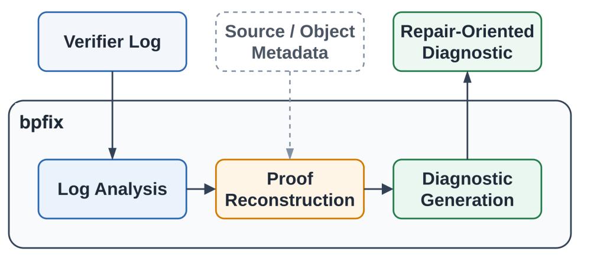

# Why eBPF Verifier Errors Are Hard to Fix: Lost Proofs, Ambiguous Messages, and bpfix

An eBPF verifier error can look precise enough to be actionable, until the line it names keeps failing after the obvious fix. The kernel reports the instruction where verification stopped, but the repair often belongs earlier, at the point where the program lost the pointer type, scalar range, lifetime, or provenance proof the verifier later needed.

The [bpfix paper](https://arxiv.org/abs/2607.02748) studies that gap across 235 reproduced verifier rejections. In this corpus, `EINVAL` was the errno in 47% of cases, and one normalized terminal error string mapped to as many as nine distinct root causes. The verifier log contains useful state, but the terminal error shows only the last frame of a proof story. This article presents the bpfix study and tool through that diagnostic gap, including the cases the current implementation does not solve.

<!-- more -->

## eBPF Verifier Errors Are Proof Failures

Before an eBPF program runs in the kernel, the verifier must prove that every execution path is safe. It does this by tracking abstract values for registers and memory at each instruction, building facts such as whether a packet pointer is still within bounds, whether a map-value pointer came from the right helper, whether a dynptr is still valid, and whether a scalar range is tight enough for the access that follows. These facts are the proofs a later instruction can rely on, and they survive only as long as the verifier can see them in its abstract state. The site's [eBPF security overview](https://eunomia.dev/blog/2024/02/11/the-secure-path-forward-for-ebpf-runtime-challenges-and-innovations/) covers that safety role more broadly; this post stays with the narrower diagnostic problem.

That model gives eBPF its safety boundary, but it also changes what a rejection means. A C line can be rejected even when the source-level mistake happened several operations earlier; the rejected instruction is simply the first place where the verifier needed a proof it no longer had.

Consider a packet-parsing example from the bpfix paper. The program computes a UDP header pointer, checks that pointer against `data_end`, then reads `dest`.

```c
if (udph + sizeof(struct udphdr) > data_end)
    return 1;

dst_port = __constant_ntohs(((struct udphdr *)udph)->dest);
```


Figure 1 from the paper puts three views side by side. The source line reads from a UDP header, the raw verifier log stops at `R5 invalid mem access 'scalar'`, and bpfix turns that terminal line into a source span plus the required proof: a verifier-recognized packet pointer at the rejected dereference.

The snippet looks guarded, but the bytecode no longer preserves the packet-pointer proof at the load. The terminal line `R5 invalid mem access 'scalar'` says the verifier sees a scalar where it expected a packet pointer. It does not say when the packet pointer became a scalar, whether the source forgot a bounds check, whether compiler lowering merged provenance away, or whether the developer should rederive a pointer the verifier can recognize.

In this post, a proof is the verifier-visible fact that makes an instruction safe. A packet load needs a register the verifier still classifies as a packet pointer, with a range that stays inside `data_end`. A map-value write needs a pointer returned by the proper helper and checked for null. A scalar offset needs a bounded range small enough for the object being accessed. The source may express the programmer's intent, but the verifier accepts only the facts that survive in its abstract state.

For a human, that difference matters: the line with the failed load may be perfectly reasonable source code, while the repair must restore the verifier-visible proof before that load.

## Why the Terminal Error Is Too Coarse

bpfix starts from a practical question most eBPF developers have encountered: when the verifier rejects a program, how much does the terminal error actually narrow the repair?

The authors assembled `bpfix-empirical` from 936 candidate reports drawn from Stack Overflow questions, GitHub issues, GitHub fix commits, and Linux kernel selftests. They rebuilt each candidate under a fixed toolchain (Linux 6.15.11 with clang 18 at verifier log level 2), where the verifier prints abstract state after each instruction along with the terminal error. The 235 candidates that reproduced as verifier rejections became the study corpus.

That reproduction filter matters. The study does not count every complaint about eBPF or every historical bug report. It keeps only cases that can be rebuilt, loaded, and rejected under one kernel and compiler configuration, so every terminal message, root-cause label, and repair layer is measured against the same verifier behavior.

The first split changes how a developer should read the error. In 191 of the 235 rejections, the developer's repair changed program source; the other 44 rejected correct source and were repaired outside it: 18 in the compiler, 14 in the environment, 12 in the verifier. A verifier-layer repair means the source program was judged correct after a kernel-side precision or verifier-behavior fix. About one in five reproduced rejections did not require the developer to change the eBPF program at all.

The 191 source bugs fell into 12 root-cause categories; 10 of those were eBPF-specific. The common cases involved proof families visible to the verifier. A proof family is the class of fact the verifier tries to establish, such as scalar range, dynptr lifetime, packet bounds on every path, null check after map lookup, or pointer provenance. Different proof families require different source-level repairs, so knowing which family a rejection belongs to narrows the repair target in a way the terminal error string alone cannot.

Root cause, proof family, and repair layer answer different questions. The root cause names the developer or toolchain mistake; the proof family names the verifier-visible fact that went missing; the repair layer names where the accepted fix belongs. Keeping those three labels separate prevents a terminal message from collapsing several repairs into one vague diagnosis.

The corpus separates three questions that blur together when reading a raw log.

| Debugging question | What the paper measures | Why it changes the repair |
|---|---|---|
| Did the source need to change? | 191 of 235 rejections were repaired in source; 44 were repaired in the compiler, environment, or verifier. | A terminal line can describe a real verifier failure even when source is not the layer to edit. |
| Which proof was missing? | The 191 source bugs covered 12 root causes, including scalar range, packet bounds, pointer provenance, dynptr lifetime, and map-lookup checks. | The repair must re-establish the specific proof family; silencing one error string is not enough. |
| How ambiguous is the terminal line? | The template `R# invalid mem access 'scalar'` covered 28 cases across nine root-cause categories. | The same terminal message can require different source edits, build changes, or verifier-side fixes. |

The terminal messages do not carry that structure. `EINVAL` was the errno in 47% of reproduced rejections, and after normalizing registers and offsets, 167 distinct error strings collapsed into 82 templates. Fifteen templates each spanned more than one root cause; the most common, `R# invalid mem access 'scalar'`, covered 28 cases across nine root-cause categories.

That ambiguity is where bpfix enters. The terminal line still matters as the symptom, but the missing repair information sits in the proof lifecycle that led to it.

## bpfix Reconstructs Where the Proof Was Lost

bpfix treats the verifier log as a proof trace. Under `log_level=2`, the verifier prints abstract state after each instruction, including register types, scalar ranges, pointer provenance, and reference counts, as analysis progresses. The terminal line marks the rejection, but earlier states often show when the relevant proof appeared, how long it survived, and where it became incompatible with the rejected operation.

bpfix parses the terminal line and per-instruction abstract states into a normalized evidence stream, abstracting away register numbers and offsets so the same proof family can be recognized across programs. From that stream, bpfix identifies the missing proof family, whether pointer provenance, packet bounds, scalar range, or map-value derivation, then tracks evidence for that proof through the log. The final diagnostic reports the required proof, relevant source spans, the observed loss point when visible, and guidance for re-establishing the proof.



The workflow matters because bpfix does not need to understand every source-level intention before it can help. Since evidence comes from the verifier's own abstract states rather than an inferred model of developer intent, the analysis works on programs bpfix has never seen. Source metadata improves how results are displayed but is not required.

The diagnostic objects are small but distinct.

| Diagnostic object | What it answers | Why it matters |
|---|---|---|
| Rejected operation | Which instruction made the verifier stop? | The symptom and anchor for reading the log. |
| Required proof | What fact did that operation need? | Names the verifier obligation the repair must restore. |
| Loss point | Where did evidence for that proof disappear? | Often closer to the real source or lowering problem. |
| Repair layer | Should the fix land in source, compiler settings, environment, or verifier behavior? | Prevents editing correct C when the bytecode or kernel-side analysis is the problem. |

The map-value case in the paper shows a different proof family. The rejected program treats the map object itself as ordinary memory by casting `&globals` to a value pointer. The terminal line points at the write, but the missing proof is earlier.

```c
__u64 *v = (__u64 *)&globals;
*v += 1;
```

A program can hold a pointer to a map object and still lack the proof needed to write a map value, because the verifier expects a value pointer derived through a helper. The repair follows that required proof.

```c
__u32 key = 0;
__u64 *v = bpf_map_lookup_elem(&globals, &key);
if (!v)
    return 0;
*v += 1;
```

The example is useful because the terminal line names only the rejected access, while the repair is a small protocol that establishes the missing fact: look up the map element, check the returned pointer, then write through it.

In the packet example, bpfix reports that the required proof is a verifier-recognized packet pointer at the rejected load. The log first shows the register as a packet pointer with bounds, later shows the same value as a scalar before the load. That transition is the useful debugging target.

The same idea separates bugs that look identical in the terminal line. One case may need a source fix because the code never derived a proper map-value pointer; another may need a compiler or build-setting change because correct source was lowered into bytecode that hides the verifier-visible pointer. Both can end with `invalid mem access 'scalar'`, but they belong to different repair layers.

The compiler-lowering case makes the layer distinction concrete. The paper includes a correct source expression whose context-field read becomes a scalar in bytecode under one compilation setting. The fix is a compiler flag that preserves verifier-visible pointer information; the C source stays untouched.

The bpfix diagnostic does more than make verifier output prettier. Pretty output helps, but localization is the important move: the diagnostic names the proof family that failed and points to the program transition that made the proof unavailable.

The 0.1.x CLI keeps that responsibility deliberately narrow. It reads verifier, build, `bpftool`, libbpf, Aya, or BCC logs produced by the workflow a developer already uses; optional object analysis can add control-flow context. The default path does not execute a loader command, replace the kernel verifier, check the semantics of an accepted program, or edit source automatically. bpfix supplies structured evidence for a repair; the developer or repair agent still owns the change and must validate it against the kernel and the program's tests.

## Why This Matters for LLM Repair

The verifier's diagnostic gap becomes more visible when a model tries to repair a rejected program. A human can sometimes infer missing verifier state from experience, but an LLM only gets the text it is given, and the raw terminal error often leaves too many plausible repairs.

To measure that effect, the paper builds `bpfix-bench`, a benchmark of 75 source-level verifier repair tasks. Forty tasks are constructed around a required verifier proof, meaning the task's verifier rejection can only be resolved by re-establishing a specific proof family in the eBPF program. The other 35 are minimized from open-source projects including Cilium, xdp-tools, and [bpftime](https://eunomia.dev/blog/2023/11/11/bpftime-extending-ebpf-from-kernel-to-user-space/). Each task includes an executable test suite independent of bpfix, so the kernel verifier and task tests judge the repair separately. A repair must load through the kernel verifier and pass functional and source-semantics checks.

That requirement makes `bpfix-bench` stricter than a compile-only patch benchmark. A candidate fix must return a program, compile, load through the kernel verifier, pass the functional test, then pass a source-semantics check that rejects repairs that simply delete behavior or change the intended program. A model that silences the verifier by removing the rejected code path fails the functional or semantics check. The benchmark therefore measures whether the diagnostic helps a model restore the verifier-visible proof while preserving what the original program was supposed to do.

The paper evaluates Qwen3.6 27B, GLM 5.2, and Qwen2.5 3B. With the raw verifier log, one-shot repair ranged from 0% for Qwen2.5 3B to 37% for GLM 5.2. Replacing the raw log with the bpfix diagnostic improved one-shot repair by 11 to 21 percentage points. For Qwen3.6 27B, the anchor model, one-shot success rose from 22/75 tasks to 38/75; with one failure-informed retry, the same model went from 30 to 44 accepted repairs.


Each model contributes paired bars comparing the raw verifier log with the bpfix diagnostic, so the chart is best read as localization evidence. The input program and test suite stay the same; the diagnostic text changes from a raw verifier log to a bpfix explanation of the missing proof and relevant span. When success rises under that intervention, the evidence points to a better repair target, with program, model, and acceptance tests held fixed.

The failure-stage breakdown makes the result more specific. The bpfix diagnostic mainly reduced verifier-load failures and source-semantics failures, the two stages where a repair must restore the verifier-visible proof while preserving the program's intended semantics. Compile failures stayed low for Qwen3.6 27B and GLM 5.2, so the gain did not come from making ordinary code generation easier. For Qwen2.5 3B, the raw log produced no accepted one-shot repairs; the bpfix diagnostic produced 8 accepted repairs and eliminated three context-window failures that occurred when the full raw log exceeded the small model's input budget.

That pattern matters beyond bpfix. In this benchmark, what changed the repair outcome was proof context in the prompt, with program, model, and test suite otherwise held fixed.

The remaining failures matter as much as the gain. The strongest reported one-shot result accepts 38/75 repairs, leaving 37 unresolved; one failure-informed retry raises the count to 44, not complete coverage. The experiment supports localization as a useful input to repair, not the stronger claim that a proof-aware diagnostic turns current LLMs into reliable automatic eBPF repair systems.

## What to Check When the Verifier Fails

bpfix changes the first debugging question. Instead of starting with the rejected instruction alone, start with the proof that instruction required: a packet load needs packet-pointer provenance and a valid bound; a map-value write needs a pointer derived through the right helper; a dynptr access needs an object whose lifetime still matches the verifier's model.

That shift gives developers a better reading order for raw verifier logs: move from the rejected operation to the required proof, then walk backward through the abstract states until the proof appeared, disappeared, or never existed. The repair layer often becomes clear at that point: source bugs, compiler-lowering artifacts, environment problems, and verifier limitations can all end in the same terminal string, but they do not call for the same fix.

A practical pass over the log has four checkpoints:

- Start at the rejected operation and name what kind of access it performs.
- Translate that access into the proof it required, such as packet-pointer provenance, a map-value pointer, a scalar range, or a live dynptr.
- Walk backward through the abstract states until the proof appears, disappears, or never appears.
- Decide the repair layer from that transition: a missing source check, a lost compiler-visible pointer, and a verifier precision limit leave different traces.

That reading order does not always terminate in source. When the abstract states show a proof the source did establish and the bytecode then discarded, the next place to look is the compiler, not the C code.

## References

- [Characterizing and Bridging the Diagnostic Gap in eBPF Verifier Rejections](https://arxiv.org/abs/2607.02748)
- [bpfix GitHub repository](https://github.com/eunomia-bpf/bpfix)
- [Linux kernel documentation on the eBPF verifier](https://docs.kernel.org/bpf/verifier.html)
- [BPF Verifier Visualizer](https://github.com/libbpf/bpfvv)
- [An Empirical Study on the Challenges of eBPF Application Development](https://doi.org/10.1145/3672197.3673429)
- [bpftime userspace eBPF runtime](https://github.com/eunomia-bpf/bpftime)
