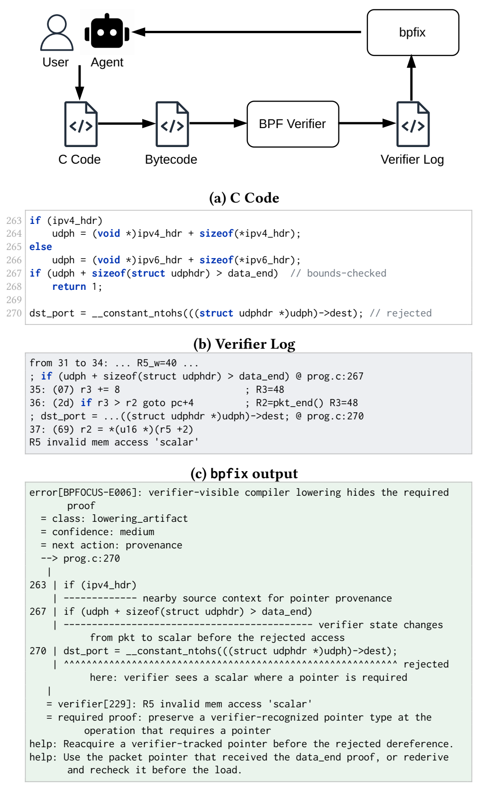

# 为什么 eBPF verifier 报错难修：诊断鸿沟

eBPF verifier 报错通常包含一条具体指令和一句简短消息，看起来已经把问题缩小到某一行；但开发者顺着这一行修改后，程序可能继续被拒绝。原因在于内核报告的是验证停止的位置，源代码中的问题往往更早出现：程序在那里丢掉了后续访问所需的指针类型、标量范围、生命周期或来源信息。

[Characterizing and Bridging the Diagnostic Gap in eBPF Verifier Rejections](https://arxiv.org/abs/2607.02748) 围绕这一落差研究了 235 个在同一套内核与编译器配置下可复现的失败案例。论文关心的核心问题并非报错是否更易读，而是终端消息究竟保留了多少修复信息，以及人类或 LLM 还需要哪些上下文才能选对修复位置。研究发现 `EINVAL` 覆盖了样本中的 47%，同一条归一化终端消息最多对应 9 类不同根因。

<!-- more -->

## 一次拒绝是证明生命周期的终点

eBPF 程序在内核运行之前，verifier 必须证明每条执行路径都是安全的。它在每条指令处跟踪寄存器和内存的抽象值，逐步建立一系列事实：包指针是否仍在边界内、map 值指针是否来自正确的辅助函数、dynptr 是否仍然有效、标量范围是否足够支撑后续访问。这些事实就是后续指令可以依赖的证明，只有当 verifier 在抽象状态里能看到它们时，它们才继续有效。站内的 [eBPF 安全概览](https://eunomia.dev/zh/blog/2024/02/11/the-secure-path-forward-for-ebpf-runtime-challenges-and-innovations/) 更系统地介绍了 verifier 的安全角色；本文聚焦诊断问题。

这一模型赋予了 eBPF 安全边界，也改变了拒绝信息的含义。一行 C 代码被拒绝时，源代码错误不一定在这一行；被拒绝的指令只是 verifier 第一次需要某项证明、却发现手里已经没有这项证明的位置。

论文中的数据包解析例子很典型。程序先计算 UDP header 指针，将其与 `data_end` 比较，再读取 `dest` 字段。

```c
if (udph + sizeof(struct udphdr) > data_end)
    return 1;

dst_port = __constant_ntohs(((struct udphdr *)udph)->dest);
```



论文图 1 将三种视角并列呈现：源代码读取 UDP header，原始 verifier log 停在 `R5 invalid mem access 'scalar'`，证明诊断则指出这次读取所需的条件：解引用发生时，寄存器仍应是 verifier 能识别的包指针。

这段代码看起来已经做了边界检查，但字节码在读取位置已不再保留包指针证明。终端报错 `R5 invalid mem access 'scalar'` 表明 verifier 看到的是标量，而它需要的是包指针。报错没有说明包指针何时变成了标量，也没有区分是源代码少了边界检查、编译器 lowering 抹掉了指针来源，还是开发者应该重新派生一个 verifier 能识别的指针。

本文所说的*证明*指 verifier 在抽象状态里能看见的事实。数据包读取需要寄存器仍被分类为包指针，且访问范围仍在 `data_end` 以内。map 值写入需要指针来自正确 helper，且已做过空指针检查。标量偏移需要范围被收紧到对象可接受的大小。源代码表达开发者意图，verifier 接受的是这些事实在抽象状态里是否还存在。

对人来说，这个差别很关键：被拒绝的读取所在行在源代码层面可能完全合理，真正的修复必须在它之前恢复 verifier 能看见的证明。

## 235 个可复现拒绝案例说明了什么

实证研究最初收集了 936 个候选报告，来源包括 Stack Overflow 问题、GitHub issue、GitHub 修复提交和 Linux kernel selftest。作者使用 Linux 6.15.11、clang 18 和 verifier log level 2 重新构建并加载每个候选，最终 235 个在这套固定配置下仍能触发 verifier 拒绝。其余案例有的依赖特定环境，有的在选定工具链下不再复现，还有一些缺少重新构建所需的源代码。

这一筛选过程限定了数据能够回答的问题：它提供的是一组可复现样本，并非对所有开发者遇到的 verifier 失败的估计。每个保留案例都包含出错的源代码和报告中的开发者修复，二者共同为根因及修复所在层次提供标注依据。

191 个案例通过修改程序源代码得到修复，占样本的 81%；另外 44 个案例的源代码符合原本意图，修复分别落在编译器 18 个、环境 14 个、verifier 12 个。以上下文字段读取为例，`-O0` 可能在 lowering 过程中让 verifier 可见的指针类型退化成标量，调整编译选项即可恢复，C 代码的逻辑保持不变。仅凭被拒绝的指令，很难判断应该从哪一层着手。

作者进一步把 191 个源代码 bug 分成 12 类根因，其中 10 类来自 eBPF 特有的约束，例如 verifier 可见的边界、指针来源、对象生命周期和 helper 调用协议。

| 根因类别 | 案例数 |
|---|---:|
| 未收紧的标量被用作偏移或长度 | 24 |
| dynptr 对象损坏或已经失效 | 23 |
| 部分路径缺少数据包边界证明 | 22 |
| 缺少空指针检查 | 19 |
| 指针类型或来源不匹配 | 16 |
| 解引用未经验证的地址 | 16 |
| 索引超过对象容量 | 15 |
| context 或接口契约使用错误 | 15 |
| 资源引用没有成对释放 | 15 |
| 中断标志恢复顺序错误 | 11 |
| probe 签名与 ABI 不匹配 | 9 |
| 栈缓冲区过大或未初始化 | 6 |

不同类别对应不同修复：收紧标量范围、保证每条路径都有数据包边界、检查 map 查询结果、按正确顺序释放引用，恢复的 verifier 事实各不相同。终端消息通常无法区分这些差别。

为了测量消息本身的区分能力，作者将终端报错中的寄存器编号和 offset 归一化。235 个拒绝产生了 167 个不同字符串，归一化后得到 82 个消息模板，其中 15 个模板各自覆盖多类根因。最常见的四类模板已经说明同一句报错可能对应多少种问题。

| 终端消息模板 | 案例数 | 根因类别数 |
|---|---:|---:|
| `R# invalid mem access 'scalar'` | 28 | 9 |
| `invalid access to packet` | 26 | 5 |
| `invalid access to map value` | 18 | 4 |
| `R# !read_ok` | 13 | 4 |

更粗粒度的 `EINVAL` 出现在全部可复现拒绝的 47% 中。这并不意味着 verifier log 缺少信息；log level 2 会记录逐指令抽象状态，真正缺失的是终端行之前的历史，开发者需要这段历史才能将被拒绝的操作连回根因和修复层次。

## 从拒绝位置追到修复信息

真正有助于修复的诊断需要补回终端行省略的证明生命周期。它从被拒绝的操作出发，判断该操作需要什么 verifier 可见事实，追踪这个事实何时出现、何时消失，并区分应在哪一层恢复它。被拒绝指令、所需证明、证明丢失点和修复层次各自回答不同问题，合起来才能把症状还原为可执行的排查方向。

论文用名为 [bpfix](https://github.com/eunomia-bpf/bpfix) 的研究原型实现了这套重建方法：它读取 log level 2 中的逐指令抽象状态，并在元数据可用时把证据映射回源代码区间。原型用于检验一个具体假设：逐指令状态能否补回终端行省略的修复信息。

论文里的 map 值案例说明了为什么这些信息需要同时出现。程序把 map 对象本身当作普通内存，将 `&globals` 转成值指针再写入，终端报错停在写操作上，实际错误却发生在更早的指针派生处。

```c
__u64 *v = (__u64 *)&globals;
*v += 1;
```

程序可以持有 map 对象指针，但 map 值写入要求的是通过 helper 派生的值指针，修复需沿这套调用协议展开。

```c
__u32 key = 0;
__u64 *v = bpf_map_lookup_elem(&globals, &key);
if (!v)
    return 0;
*v += 1;
```

终端行只指出被拒绝的访问；修复则用三个步骤建立所需证明：查找 map 元素、检查返回指针、通过该指针写入值。前面的数据包案例同理：寄存器早先还是带边界的包指针，到了读取前却变成标量。这次状态转换比最终读取指令更接近实际排查目标。

修复层次还能拆开终端消息相同的两类案例。一个程序从整数 offset 构造数据包地址，整个过程没有建立包指针来源，需要修改源代码；另一个程序正确派生并检查了指针，但编译器 lowering 在读取前把它合并成标量，修复最终落在编译行为上。两者都以 `invalid mem access 'scalar'` 结束，适用的修改位置却完全不同。

## LLM 修复与更优上下文

论文把自动修复当成下游实验，用来判断证明上下文能否改变实际决策。bpfix-bench 包含 75 个源代码级 verifier 修复任务：40 个围绕特定 verifier 证明构造，修复后的程序必须重新建立该证明；另外 35 个从 Cilium、xdp-tools 和 [bpftime](https://eunomia.dev/zh/blog/2023/11/11/bpftime-extending-ebpf-from-kernel-to-user-space/) 等开源项目中最小化得到。前一组便于控制证明类型，后一组保留真实项目历史中的失败形态。

每个任务都附带独立于诊断系统的可执行测试套件。候选补丁需先返回完整程序并完成编译，再通过内核 verifier 加载、功能测试和源语义检查。最后一项识别删除被拒绝路径或改变原始行为的表面修复。成功的含义因此很明确：补丁既恢复了 verifier 可以接受的程序，也保留了任务要求的行为。

实验在温度为 0 的设置下评测三种模型：主模型 Qwen3.6 27B、托管的 GLM 5.2、以及用于观察低容量条件的 Qwen2.5 3B。每个任务向模型提供同一份错误程序，唯一变量是提示中放入完整原始 verifier log 还是一份更短、能指出所需证明与相关源代码区间的定位诊断。一次生成模式直接评判首个候选；重试模式反馈一次失败信息后再给模型第二次机会。

| 模型 | 原始日志，一次生成 | 定位诊断，一次生成 | 原始日志，允许重试 | 定位诊断，允许重试 |
|---|---:|---:|---:|---:|
| Qwen3.6 27B | 22/75 | 38/75 | 30/75 | 44/75 |
| GLM 5.2 | 28/75 | 38/75 | 47/75 | 52/75 |
| Qwen2.5 3B | 0/75 | 8/75 | 0/75 | 10/75 |


一次生成对照中，三种模型的绝对提升为 11 至 21 个百分点。Qwen3.6 从 29.3% 升至 50.7%，GLM 从 37.3% 升至 50.7%，3B 模型从 0% 升至 10.7%。重试数据回答另一个问题：失败反馈能提高两个较大模型在两种输入下的成功数，但定位上下文带来的差距仍然保留。

研究还记录了每个一次生成候选最先失败的阶段，便于进一步拆解汇总数字。

| 模型 | 输入 | 编译 | verifier 加载 | 功能测试 | 源语义 | 未返回程序 | 通过 |
|---|---|---:|---:|---:|---:|---:|---:|
| Qwen3.6 27B | 原始日志 | 3 | 19 | 9 | 22 | 0 | 22 |
| Qwen3.6 27B | 定位诊断 | 1 | 10 | 10 | 16 | 0 | 38 |
| GLM 5.2 | 原始日志 | 1 | 10 | 11 | 25 | 0 | 28 |
| GLM 5.2 | 定位诊断 | 1 | 5 | 9 | 22 | 0 | 38 |
| Qwen2.5 3B | 原始日志 | 7 | 62 | 0 | 3 | 3 | 0 |
| Qwen2.5 3B | 定位诊断 | 14 | 39 | 6 | 8 | 0 | 8 |

Qwen3.6 的 verifier 加载失败从 19 降到 10，源语义失败从 22 降到 16；GLM 的对应数字分别从 10 降到 5、从 25 降到 22。这两个阶段都直接涉及 verifier 可见证明与程序行为，比单纯编译成功更能说明定位信息在哪里发挥作用。

小模型呈现不同取舍：verifier 加载失败从 62 降到 39，原先因日志超出上下文窗口而无法返回程序的 3 个任务也能继续执行，但编译失败从 7 增至 14。更短且更有针对性的上下文帮助模型进入有效修复尝试，但代码生成能力和语义保持仍然限制最终结果。

这些数字的适用范围需保持清楚：最高的一次生成结果是 38/75，仍有近一半任务失败；允许一次重试后的最高结果为 52/75。实验只覆盖三种模型、一套 75 任务基准、温度为 0 的生成和最多一次重试，测量的是补丁能否通过验收，并未测量开发者时间或生产环境可靠性。在此范围内，可以得出一个较窄的结论：给出缺失的证明及其位置，比只给验证停止的指令更有利于模型完成修复。

## verifier 失败后应该先看什么

这组实证结果给出了一个更合适的调试起点：与其只问“这一行哪里错了”，不如先判断被拒绝的操作需要什么证明。数据包读取需要包指针来源和有效边界；map 值写入需要通过正确辅助函数派生的指针；dynptr 访问依赖仍符合 verifier 模型的对象生命周期。

这一视角也给了原始 verifier log 更好的阅读顺序：先看被拒绝的操作，再看它需要的证明，然后沿抽象状态往前找，直到看到这个证明出现、消失或从未建立。走到这一步，修复层次通常就清楚了：源代码 bug、编译器 lowering、环境问题和 verifier 限制可能以同一终端字符串结束，需要的修复却完全不同。

实用的日志阅读可分四步：

- 从被拒绝的操作开始，先明确它是哪种访问。
- 将该访问翻译成所需证明，例如包指针来源、map 值指针、标量范围或有效的 dynptr。
- 沿抽象状态往前找，直到看到证明出现、消失或从未出现。
- 根据这一转换判断修复层次：源代码少检查、编译器丢掉指针信息、verifier 精度不够，会在日志里留下不同轨迹。

这一阅读顺序有时会越过源代码。如果抽象状态显示程序已建立某个证明而字节码随后将其丢失，下一步应检查编译器输出；verifier 精度或环境配置引起的拒绝会留下不同轨迹。终端报错提供起点，证明历史决定真正的修复位置。

## 参考文献

- [Characterizing and Bridging the Diagnostic Gap in eBPF Verifier Rejections](https://arxiv.org/abs/2607.02748)
- [bpfix GitHub 仓库](https://github.com/eunomia-bpf/bpfix)
- [Linux kernel eBPF verifier 文档](https://docs.kernel.org/bpf/verifier.html)
- [BPF Verifier Visualizer](https://github.com/libbpf/bpfvv)
- [An Empirical Study on the Challenges of eBPF Application Development](https://doi.org/10.1145/3672197.3673429)
- [bpftime userspace eBPF runtime](https://github.com/eunomia-bpf/bpftime)
