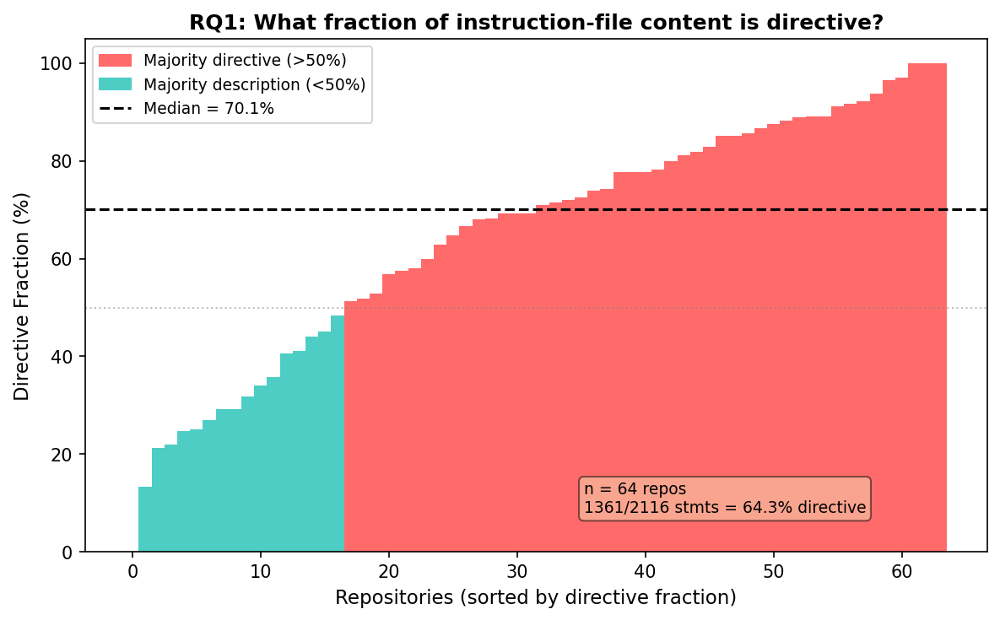
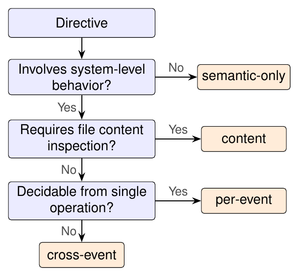
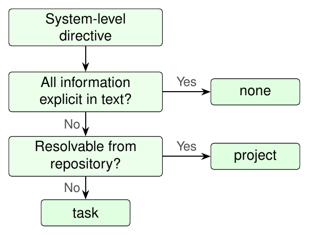
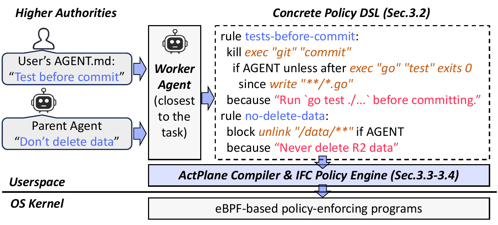

# AI Agent 规则需要上下文与分层执行

一个 AI coding agent 执行 `git commit` 时，内核只看见熟悉的进程在写熟悉的文件。仓库的 CLAUDE.md 里写着"提交前必须跑完整测试套件"，而这个 agent 在上次测试之后又修改了源码。这条规则来自论文数据集中的真实语句（statement），今天没有任何一层在强制执行（enforcement）它。

[ActPlane 论文](https://arxiv.org/abs/2606.25189)量化的问题早于具体的强制执行技术。开发者已经写下大量规则，指令文件中 64% 的语句属于行为策略。虽然 83% 描述系统可观测行为，但能直接映射到 OS hook 的只有单事件 29% 和跨事件 16%，合计 45%，其中 74% 仍需要项目或任务上下文。缺失的那一层必须先解析自然语言意图，确定性强制执行才有具体规则可用。

<!-- more -->

## 开发者已经写下了这些策略

讨论 AI agent 安全时，大多数人从威胁模型或攻击面入手。ActPlane 换了一个出发点：开发者已经告诉 agent 该做什么、不该做什么了，那把这些指令变成可执行的规则需要什么？

论文调研了 64 个含 CLAUDE.md 和 AGENTS.md 的热门仓库（中位数 20K GitHub star，快照 2026-05-23），覆盖 84 份指令文件和 2116 条独立语句。与此前只在文件或章节标题粒度做分析的研究不同，ActPlane 对每一条语句独立分类，提出三个问题：指令文件主要是行为策略还是描述性上下文？哪些策略需要 OS 级强制执行，需要什么类型的检查？将这些策略实例化为具体可执行规则又需要什么上下文？

语句的提取经过两遍 LLM agent 辅助流水线，为每条语句记录源行范围和四个标签：内容类型、主题、强制执行层级、上下文需求。验证脚本确认了完整的源覆盖和逐字 span 匹配，并由独立的 Claude 和 Codex agent 交叉检查。最后，100 条分层抽样语句经人工标注者独立审核，确认标签正确。

在这 2116 条语句中，64% 是策略：它们要求、禁止或约束某个具体 agent 行为。其余 36% 是描述性上下文，例如架构说明或项目背景。各仓库的策略密度差异很大，从 0% 到 97% 不等，70.1% 的仓库策略数量多于描述。按行统计会遗漏这个比例，因为描述平均 6.8 行而策略平均 3.6 行，按行数只显示 49% 是策略，这正是语句级分析的价值所在。

为了解策略在各关注领域的分布，论文将每条语句分配到改编自先前指令文件研究的 12 个主题类别中，应用于语句粒度而非文件粒度。开发流程和实现细节两类的策略占比最高，分别达到 87% 和 85%；架构以描述性内容为主，策略仅占 23%，因为目录布局和设计摘要构成了这些章节的主体。



数据集中的五条真实语句展示了强制执行需求的差异幅度：

| 语句 | 强制执行层级 | 上下文 |
|---|---|---|
| S4: "Never push to main directly." | 单事件（per-event） | 自包含（self-contained） |
| S5: "Never modify upstream source code." | 单事件 | 项目级 |
| S6: "Run the full test suite before committing." | 跨事件（cross-event） | 项目级 |
| S7: "Data read from .env must not reach the network." | 跨事件 | 项目级 |
| S8: "Do not update dependencies without approval." | 单事件 | 任务级 |

## 执行缺口首先来自上下文

论文把每条策略分类到强制执行瀑布（enforcement waterfall）的第一个匹配层级：纯语义（semantic-only）涵盖推理、沟通或输出风格；内容检测（content inspection）涵盖文件内容上的谓词；单事件涵盖单个命令、文件访问或网络连接；跨事件涵盖依赖跨操作的时间顺序或数据来源的策略。内容检测、单事件和跨事件的并集叫做系统可观测（system-observable）。

1361 条策略中只有 17% 是纯语义的，其余 83% 是系统可观测的，其中 38% 需要内容检测，29% 匹配单个 OS 事件，16% 需要跨事件状态。只有单事件和跨事件两类属于 OS 可执行子集，合计 45%。跨事件策略集中在开发流程领域，占全部跨事件策略的 39.5%。



这些跨事件策略遵循四种反复出现的模式。时序排序（temporal ordering）约束事件顺序："提交前先跑测试"要求一个事件发生在另一个之后，而不是仅仅在更早的某个时间点发生过。跨文件一致性（cross-file consistency）链接跨工件的变更："行为变更时同步更新文档"将源码编辑和文档更新耦合在一起。多步工作流（multi-step workflow）执行带有验证门的发布清单，每个步骤必须完成后才能进入下一步。条件触发（conditional trigger）耦合操作："改了 spec 就必须同步 SDK"只在前置条件满足时触发。这些策略都无法从单个事件判断：强制执行必须记录运行了什么、以什么顺序、以及从那时起发生了什么变化。此类策略很普遍：81% 的仓库至少包含一条跨事件策略，43% 的仓库横跨全部四个强制执行档位。

上下文依赖使强制执行的挑战进一步叠加。1127 条系统可观测策略中，只有 26.4% 是自包含的。多数（64.2%）需要项目上下文："测试套件"或"上游源码"必须对着具体仓库解析后才能变成可执行规则。即便是单事件策略，如 S5"不得修改上游源码"，也需要先解析哪些路径构成"上游源码"，才能让文件写入检查生效。另有 9.4% 需要任务上下文，例如"除非用户明确要求"或"未经批准不得操作"。

两种困难相互叠加：需要跨事件追踪状态的策略也正是那些很少指定编写规则所需具体命令和路径的策略。跨事件策略的上下文依赖高达 95%（77% 项目级，19% 任务级），而内容检测策略为 58%。"提交前跑测试"听起来简单，但强制执行引擎需要知道要监视哪条测试命令、哪些源码目录算"相关编辑"、以及测试是通过了还是仅仅运行了。



一组固定的静态规则只能覆盖自包含的部分。实例化其余策略需要先读取仓库、解释当前任务，然后才能运行任何检查。

> **执行 agent 策略的起点，是把仓库与任务上下文编译成确定性检查能够读取的具体状态。**

## 一条规则会跨越多个执行层级

基于 prompt 的指令依赖模型自身的遵从能力，但容易受 prompt 注入攻击，且在长上下文窗口中与用户的任务 prompt 争夺注意力。独立的 agent 或 LLM 守卫可以在运行时检查 prompt、响应或行为轨迹，但这些检查本质上是概率性的。

工具调用层面的守卫和应用级信息流控制系统在 harness 边界确定性地拦截，但它们只能观察经过 harness 中介的请求，看不到工具开始执行之后的系统级效果。间接子进程、shell 外调或编译出来的二进制文件都能绕过工具边界。比如 agent 写了一个包含 `subprocess.run(["git", "push"])` 的 Python 脚本然后执行它：工具调用层看到的是"执行 python script.py"，而不是脚本里的 `git push`。

seccomp、AppArmor、Landlock、Tetragon 等 OS 机制控制的是资源访问而非开发者所描述的行为。它们要求静态预写策略，报错也只有一句令 agent 困惑的不透明 `EPERM`，不解释违反了哪条规则，也不说明如何恢复。

论文把这些层串在一起的核心洞察是：大多数规则需要存在于 agent 处的项目或任务上下文，因此 agent 自身必须能将策略转化为具体规则；然而许多策略定义事件顺序或数据流，对工具调用层面的守卫不可见，因此规则必须足够具体以进行确定性 OS 级强制执行。弥合这个差距正是 ActPlane 要解决的问题。

这些发现确立了两项设计要求。第一，策略规范必须 agent 可编写且 OS 可执行：agent 需要用最少的专业知识将自然语言策略转化为具体规则，并且需要语义反馈来理解违规并恢复。第二，强制执行必须安全、隔离且高效：agent 编写的策略不能削弱更高权限设置的约束，不能影响其他 agent 的策略，也不能拖慢 agent 的正常工作负载。

## 把意图编译成可执行状态



每条 ActPlane 规则由五个部分组成：标识治理对象的来源声明、目标操作（如 exec、write、connect）、效果、可选的时序门（temporal gate）、以及用于语义反馈的原因字符串。论文的贯穿示例可以让这些组件具体化：

```
kill exec "git" "commit" unless after exec "go" "test" exits 0 since write "**/*.go"
```

这条规则会终止任何 `git commit`，除非 `go test` 在最近一次相关源码编辑之后成功退出过。这里省略的原因字段会在规则触发时向 agent 提供结构化的解释。

三种效果对应了指令与约束的区分。阻断（block）是操作前的同步拒绝，没有 TOCTOU 窗口：内核在系统调用执行之前拦截它，agent 可以改道重试。终止（kill）在操作开始后杀掉进程，防止 agent 在被阻断后切换到其他通道。通知（notify）只传递引导信息而不阻止操作。约束使用阻断或终止，指令使用通知。

时序门让规则表达顺序关系而不仅是时间点谓词。`after ... since ...` 结构编码了一个事件必须发生在另一个事件之后：测试必须在最近一次编辑之后运行过，而不是在更早的某个时间点运行过即可。`exits N` 限定符区分成功退出和失败退出。谱系门（lineage gate）检查进程祖先关系，允许规则将操作限制在特定的进程树中。

信息流标签（information-flow label）沿 fork、exec、read、write、connect 传播，且是单调的：一旦进程读取了带标签的对象，标签就不可移除。当进程读取 `.env` 时，它获得该文件的来源标签。如果它之后尝试连接到外部端点，匹配该标签的规则就会触发并阻断连接。研究中的 S7（"从 `.env` 读取的数据不得到达网络"）就是这样变成可执行跨事件规则的。

策略权限依靠时序信任边界。在 agent 启动前加载的规则是高权限规则，对 agent 不可写。Agent 及其子 agent 可以在子域中添加新规则或收窄现有规则，但不能削弱、移除或禁用继承的约束。运行时增量通过 ring buffer 到达内核，经完全在内核中运行的权限检查器校验每一项变更是否符合域层级，通过后才会激活。信任计算基础由内核强制执行引擎和高权限策略组成，该边界以下的一切都是不可信执行。由于权限检查器完全在内核空间运行，被攻陷的用户空间 agent 无法在其域层级允许的范围之外修改活跃规则集。

由于标签是单调的，长时间运行的会话有过标记风险：经过大量读取后，进程可能累积过多标签，导致后续每个操作都触发规则。在典型的编码会话中，一个进程可能读取几十个配置和源文件；没有缓解措施的话，每次读取都会添加标签，读取足够多之后每次写入或连接都会匹配某条规则。为缓解这个问题，ActPlane 在生成新子进程时清除继承的标签，将污染累积限制在每个进程的生命周期内而非整个会话。

607 条策略的数据集运用了大多数 DSL 特性，验证了语言的表达力。效果偏向观测：66% 的子句是通知，29% 是阻断，仅 5% 是终止，反映出大多数策略监控而非阻止。就挂载点而言，代码执行占 60%（exec），文件变更占 37%（write），网络和清理操作各不到 1%。跨事件特性使用广泛：28% 的策略使用 `after/since` 时序门，214 条使用 `unless` 编码例外。

实现规模紧凑。用户态编译器和运行器约 3.2K 行 Rust 代码，eBPF 强制执行引擎约 1.8K 行 BPF C 代码。其中 BPF-LSM hook 处理操作前决策（阻断），tracepoint 处理观测和操作后终止（kill）。标签以 64 位掩码存储在逐对象的 BPF map 中，传播归结为一次按位 OR。引擎支持最多 128 条并发规则，而数据集中观测到的最大仓库有 66 条策略。关于部署架构和机制细节的更深入介绍，见 [ActPlane：把 Agent Harness 强制执行下沉到内核 eBPF](https://eunomia.dev/zh/blog/2026/05/31/actplane-pushing-agent-harness-enforcement-down-to-kernel-ebpf/)。

## 违规后的恢复拉开了差距

策略翻译可以覆盖整个数据集。一个 Codex agent 在首次或二次尝试中为全部 607 条 OS 可执行策略编译了 ActPlane 规则，607 条里只有 2 条需要语法重试。翻译使用 7 个子 agent（4 个并行）在 34 分钟内完成，将 607 条策略扩展为 1283 条规则行。成本约每条 $0.028，使用 1.7M 输入 token 和 177K 输出，相比之下人工编写约每条 $11。大多数策略结构简单：74% 最多有两个强制执行子句，第 95 百分位也在 152 token 以下。

带上下文的强制执行解决的违规远多于任何基线。在决策合规基准（190 条轨迹、38 条源自实证研究的规则）上，ActPlane 的决策合规率（Decision Compliance Rate, DCR）为 75.8%：

| 系统 | DCR |
|---|---|
| ActPlane | 75.8% |
| ActPlane-opaque（无反馈） | 53.7% |
| FIDES（工具级信息流控制） | 48.9% |
| Prompt-filter | 48.4% |
| Tool-regex | 45.3% |

基准为每条规则生成五条轨迹：两条合规轨迹用于压力测试误报（一条演练接近边界的允许操作，一条执行技术上合规但类似违规的操作），三条违规轨迹（violation trace）反映部署中编码 agent 的执行路径类别。直接违规通过工具调用触发被禁止的操作；脚本违规将编写和执行拆分到子进程中；隐藏违规将副作用嵌入中性入口点后面的辅助工件中。

差距集中在违规轨迹上：ActPlane 正确解决 114 条中的 86 条，基线为 27 到 44 条，提升了 2.0 到 3.2 倍。所有系统在合规轨迹和直接违规上表现相当；ActPlane 的优势在脚本和隐藏轨迹上展开，因为被禁止的效果发生在子进程内或中性入口点后面，工具调用拦截观察不到。

语义反馈是合规与盲目重试的分水岭。完整 ActPlane 产生的正确违规轨迹结果是无反馈引擎的三倍（86 对 27）。恢复率也讲了同样的故事：有语义反馈时 97.7%，无反馈时 31.4%。当 agent 知道操作为何被拒、需要修复什么状态时，它会改道完成任务；只收到一句空洞的拒绝时，它会通过替代路径反复重试同一个被禁止的操作。

开销可以放进日常开发工作流。论文在策略已加载但无规则触发的空命中配置下，测量两个工作负载的端到端开销。第一个工作负载是重放 68 个工具动作和 20 个 Bash 子进程的 agent 轨迹套件，第二个是 Linux kernel build（`defconfig` + `vmlinux`，`make -j24`）。32 条活跃规则下，ActPlane 在 agent 轨迹上增加 1.9%，在内核构建上增加 6.5%；100 条规则时仍低于 8.4%。

微基准测试定位了单次系统调用开销的分布。fork 和 exec 的绝对增加量最大，跨规则数量范围为 3 到 69 微秒，但相对于 49 和 248 微秒的原生延迟仍然适度。100 条规则下，open 为 13.4 微秒，write 仍低于一微秒，为 0.84 微秒，connect 则达到 3.17 微秒。整个工具调用的系统调用序列累积的 ActPlane 开销比单次 2 到 10 秒的 LLM 推理轮次小五到六个数量级。策略更新传播迅速：通过用户空间 ring buffer 提交的单规则热重载平均 26.3 微秒到达内核排空路径，立即的 exec 违规在 p50 为 176.4 微秒内被检测到（包含进程启动和事件传递）。

这一优势在第二个模型上也得到复现。DeepSeek-Pro V4 端到端实验保持系统排名不变，ActPlane 以 77.4% DCR 居首，两个模型设置之间的逐单元一致性产生 Cohen's kappa 0.822。

翻译质量同时驱动检测率和恢复率，因为规则过窄会遗漏违规，规则过宽会匹配合规操作。为衡量可改进性，论文将每条假阴性轨迹的证据和纠正反馈提供给翻译 agent，让其修订规则一次。用修订后的规则重新运行 28 条假阴性轨迹，恢复 26 条（93%），表明该 DSL 支持迭代完善。

真实编码任务在合成轨迹之外确认了同样的模式。在 OctoBench 的 21 个任务子集上（61 条 OS 可执行规则，覆盖 7 个仓库），ActPlane 的用户查询奖励比无强制执行基线提高 9.9 分，实现与测试奖励提高 9.7 分。收益超出了合规类型检查的范围，表明 OS 级强制执行加语义反馈不仅帮助 agent 遵守规则，还帮助它们更有效地完成任务。

外部安全基准验证了论文自身数据集之外的覆盖面。在 361 个 OpenAgentSafety 个人助理任务中，ActPlane 以高权限规则预加载 agent 生成的安全策略，阻止了 74% 的基线不安全行为（106 起不安全结果中拦截 78 起）。28 起未拦截案例分为三类：聊天或语义伤害（不安全行为是没有 OS 可观测工件的消息）、不安全文件内容（不在 ActPlane 的主要覆盖范围内）、以及服务端工件（效果是服务容器内的 WebDAV 上传或数据库变更，当前 hook 集观察不到）。

[ActPlane 源码](https://github.com/eunomia-bpf/ActPlane)已在 GitHub 开源。仓库中的 `policies/` 目录包含全部 64 个仓库的 607 条翻译规则，可以作为编写自己指令文件的起点。

## 分层执行的边界在哪里

### eBPF 足以解决 AI agent 安全问题吗？

eBPF 可以对文件写入、进程启动和网络连接等 OS 事件做确定性强制执行。单事件和跨事件两类构成可直接下沉到 OS 的 45%。更宽的 83% 系统可观测集合还包含 38% 的内容检测策略，它们需要代码检查器或静态分析器；其余 17% 涉及推理、沟通风格或输出质量，需要 harness 层处理。任务意图、策略权限、内容语义和隔离仍由内核强制执行点周围的层承担。

### 行为基线能替代策略吗？

行为基线回答的是"这是否异常"，通过标记偏离历史模式的操作来工作。策略回答的是"在当前任务下这是否被允许"。一次常规 `git commit` 按基线标准可以完全正常，同时违反一条项目规则；一个陌生的部署端点可以触发异常告警，但如果用户明确要求了它，操作就是合法的。检测和授权是两个不同的问题，成熟系统会同时使用两者：异常信号可以提议候选规则，再经过权限感知审查后变为已执行的策略。

### AgentSight 会执行 ActPlane 的策略吗？

不会。[AgentSight](https://eunomia.dev/zh/blog/2025/08/26/agentsight-keeping-your-ai-agents-under-control-with-ebpf-powered-system-observability/) 是系统级分析器和监测器，捕捉 agent 在运行时的行为。ActPlane 是强制执行引擎，拦截或重定向违反已加载策略的操作。两者是互补角色：AgentSight 的运行时证据可以为策略审查和优化提供输入，但观测和强制执行的职责保持分离。一个组织可以先用 AgentSight 发现 agent 频繁写入生产配置文件，然后编写对应的 ActPlane 规则来阻止该模式并附上禁止原因的解释。

### ActPlane 仍然覆盖不了什么？

论文的威胁模型对边界做了明确声明。语义等价操作可以绕过基于字符串的匹配：agent 可以使用自制 Git 客户端而非调用 `exec git`，但底层的 `connect` 和 `write` 系统调用仍然可见。协议边界后面的服务端效果（如服务容器内的 WebDAV 上传或数据库变更）也逃脱了当前 hook 集。文件内容语义、内核攻陷、CAP_BPF 攻陷和侧通道均不在覆盖范围内。17% 的纯语义策略（涵盖推理质量、沟通风格或输出格式）需要 harness 层而非内核强制执行来处理。

数据集本身是这篇论文最独特的贡献。以往的指令文件研究停留在文件或章节粒度，ActPlane 则度量单条策略语句，并把它们映射到强制执行和上下文需求。这些规则大多数已经写在成千上万仓库的 CLAUDE.md 和 AGENTS.md 里，缺失的是一个能读懂项目上下文、理解当前任务、把自然语言策略编译成具体内核级规则的强制执行层。[ActPlane 仓库](https://github.com/eunomia-bpf/ActPlane)包含完整实现，将内核强制执行与隔离、身份和内容控制并置的三层安全模型见[基于 eBPF 的不透明 AI Agent 运行时可观测与强制执行](https://eunomia.dev/zh/blog/2026/05/25/runtime-security-for-ai-agents/)。
