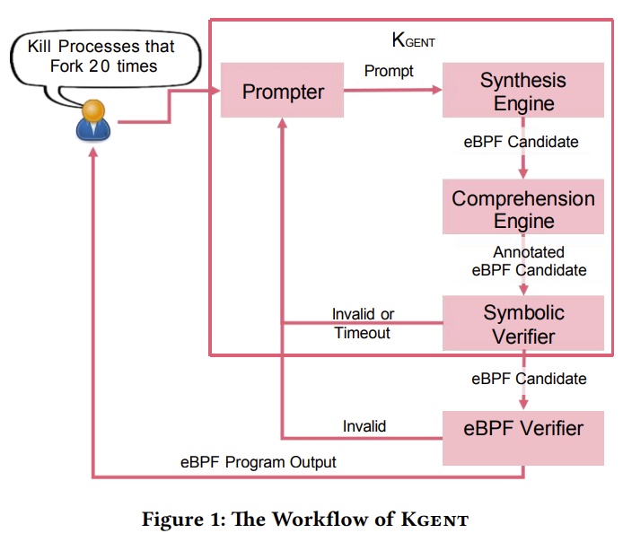

# Simplifying Kernel Programming: The LLM-Powered eBPF Tool

Kernel programming can be intimidating, requiring deep knowledge of operating system internals and programming constraints. Our latest tool, Kgent, aims to change that by making it easier than ever to create extended Berkeley Packet Filters (eBPF) programs. Kgent leverages the power of large language models (LLMs) to translate natural language prompts into eBPF code, opening up kernel programming to a wider audience.

Our paper, "[Kgent: Kernel Extensions Large Language Model Agent](https://dl.acm.org/doi/10.1145/3672197.3673434)," was recently presented at eBPF '24: Proceedings of the ACM SIGCOMM 2024 Workshop on eBPF and Kernel Extensions. Let's dive into what makes Kgent a game-changer for kernel programming.
<!-- more -->

## The Key Idea Behind Kgent

Kgent simplifies the traditionally complex process of writing eBPF programs. By translating user prompts in natural language to eBPF code, it eliminates the need for deep OS kernel knowledge. This tool combines program comprehension, symbolic execution, and feedback loops to ensure the synthesized program is accurate and aligns with the user's intent.

## Highlights

- **Natural Language to eBPF**: Kgent can take user prompts in plain English and convert them into functional eBPF programs.
- **Combination of Techniques**: It employs a mix of program comprehension, symbolic execution, and feedback loops to ensure high accuracy.
- **Evaluation**: Our tests show that Kgent achieves a 2.67x improvement over GPT-4 in producing correct eBPF programs, with a high accuracy rate and minimal false positives.

## Potential Use Cases

Kgent can be utilized in various scenarios to facilitate kernel development and management:

1. **System Administrators**: Helps junior sys admins create and maintain eBPF programs without needing extensive OS kernel knowledge.
2. **DevOps Personnel**: Assists in writing and deploying kernel extensions for monitoring and tracing applications, enhancing system performance and security.
3. **Patch Makers**: Simplifies the creation of patches by translating natural language descriptions of issues and fixes into eBPF programs.
4. **Kernel Developers**: Speeds up the prototyping and validation of kernel extensions, saving time and reducing errors.
5. **Educational Purposes**: Serves as a learning aid for students and new developers to understand eBPF programming through natural language interactions.
6. **Research and Experimentation**: Provides a platform for researchers to explore new eBPF applications and test hypotheses without diving into complex coding.
7. **Network Tools Development**: Eases the creation of custom network monitoring, security, and performance analysis tools by translating high-level requirements into efficient eBPF programs.

## Why we need kgent instead of just ask GPT?

While large language models (LLMs) like GPT-4 can suggest code, they often recommend incorrect helpers or non-existent APIs—a phenomenon known as hallucination. Given the small and limited set of helpers and kfuncs in eBPF, these issues can be fixed relatively easily. Another common issue is incorrect attach points. In eBPF, programs must attach to specific kernel events, such as kprobes, tracepoints, and perf events. Incorrect attach events can either be rejected by the kernel or, worse, pass the verifier and load incorrectly, leading to wrong results.

The eBPF verifier adds another layer of complexity. For instance, loop code often cannot pass the verifier due to safety checks. Although the verifier prevents harmful code, it cannot always prevent incorrect code. For example, when asked to write a program to trace TCP connect events, GPT-4's generated code failed to read the port number correctly and didn't consider IPv6.

To help the LLM learn about new knowledge like eBPF, common approaches include fine-tuning or Retrieval-Augmented Generation (RAG). However, publicly available examples of eBPF are insufficient, and eBPF abilities can change across kernel versions. RAG is a promising solution, as it allows the model to retrieve the most up-to-date and relevant information from external sources. This method combines language model generation with relevant information retrieval from a vector database.

## The LLM Agent Framework

To address these issues, we built an LLM agent with three core components: planning, tools, and memory.

**Plan Component**
The agent follows a predefined workflow:

1. **Prompter**: Retrieves related examples, attach points, and specs based on user input.
2. **Synthesis Engine**: Creates eBPF candidates from the prompt.
3. **Comprehension Engine**: Annotates the eBPF candidate, adding necessary assumptions and assertions for verification.
4. **Symbolic Verifier**: Verifies the candidate's behavior. If invalid, the process iterates until a valid program is produced, forming a feedback loop.
For some cases, it can also use ReAct mode for decision-making.

**Tools Component**
The agent can use various tools like clang to compile eBPF programs, Seahorn for verification, and bpftrace for obtaining attach points and running eBPF programs.

**Memory Component**
The agent uses short-term in-context memory to remember past actions, errors, and decisions, ensuring the feedback loop is successful.

**Example Workflow**
Let’s take a simple bpftrace program as an example. Suppose a user requests: "Trace tcp_connect events for both IPv4 and IPv6 connection attempts, and display the source and destination IP addresses." The agent forms a prompt based on a predefined template and asks the LLM to generate the program. We use in-context learning and few-shot techniques, including examples in the template's context. The examples vector database contains samples from BCC, bpftrace, and our own collection. The agent searches for similar examples based on user input and includes these examples in the prompt.

We also built a pipeline to generate specifications and descriptions for each hook point and helper function from the kernel source code. For instance, when building the spec database, we generate the spec for the tcp_connect_init function in the kernel using the LLM. During the synthesis step, the agent can search for related function specs with user input in the vector database.

## Limitations and Future Work

While Kgent is a significant step forward, it has some limitations. Currently, our implementation focuses on small programs under 100 lines due to the LLM's context window limit. Additionally, our eBPF program dataset is relatively small, which restricts the tool's ability to handle more complex and varied tasks. Right now, Kgent's use cases are mostly limited to simple trace programs and network functions.

We are exploring ways to extend Kgent's capabilities. For example, we know that tools like ChatGPT can handle many tasks using its Python code interpreter. This raises exciting possibilities: can we automate larger tasks like auto-monitoring and auto-performance tuning? Could an LLM help analyze results from different tools and even find these tools automatically? Could it play a role in rapidly developing solutions for urgent problems?

To tackle these challenges, we are considering splitting larger tasks into smaller, manageable parts, similar to the approach used by AutoGPT. This would allow the LLM to plan the overall structure of the program, generate each component, and then merge them together. Additionally, involving users in the iteration process could provide interactive feedback, improving the quality of the generated programs.

We also acknowledge that writing correct Hoare contracts is challenging for LLMs, and current verification methods may not cover all behaviors of the generated eBPF programs. To improve this, we need better background descriptions and more robust Hoare expressions. Incorporating more software engineering practices, such as counterexample generation and test-driven development, could help ensure comprehensive verification.

Another critical concern is security. Since eBPF runs in the kernel, any flaws could lead to significant issues. We plan to involve users more in the review process to mitigate these risks and ensure the safety of the generated programs.

## Conclusion

Kgent is revolutionizing the way we approach kernel programming by making eBPF program creation accessible to a broader audience. By translating natural language into functional eBPF code, it opens up kernel extension development to system administrators, DevOps personnel, patch makers, and more. Our paper, presented at eBPF '24, highlights the potential of this tool to democratize kernel programming and foster innovation.

We invite you to explore Kgent and see how it can transform your approach to kernel development. For more details, check out our [eBPF'24 paper](https://dl.acm.org/doi/10.1145/3672197.3673434) and visit our [GitHub repository](https://github.com/eunomia-bpf/KEN). For additional details, refer to the earlier Arxiv version: [KEN: Kernel Extensions using Natural Language](https://arxiv.org/abs/2312.05531). For a more usable and simplified tool, check out [GPTtrace](https://github.com/eunomia-bpf/GPTtrace). You can also try the GPTtrace simplified web demo [here](https://github.com/eunomia-bpf/GPTtrace-web).

By lowering the barrier to entry for writing eBPF programs, Kgent is promoting innovation and enhancing system capabilities, one natural language prompt at a time.
