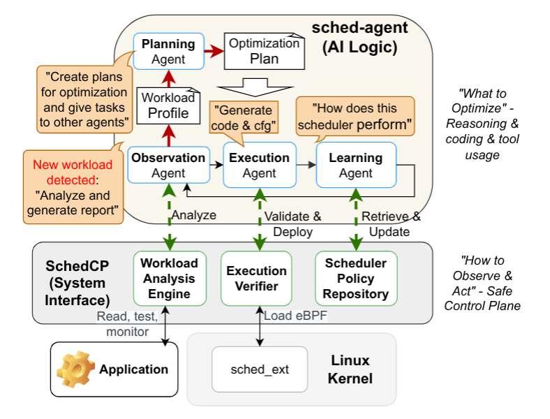

# Can an AI Agent Tune the Linux Scheduler? Inside SchedCP

An AI agent can write scheduler code, but that alone is a long way from tuning a scheduler. The Linux scheduler sits on a hard boundary: applications express intent through processes, threads, priorities, wakeups, and resource use, while the kernel chooses what runs next without knowing whether a workload cares most about tail latency, makespan, throughput, or fairness. A generated policy that compiles can still make the wrong tradeoff, add overhead, starve work, or crash a test machine.

The SchedCP paper reframes this as a control-plane problem. Its proposal is to let an AI agent reason about workload goals while a separate system interface controls observation, policy reuse, code validation, and deployment through Linux `sched_ext`. The preliminary results are worth attention because they include failures alongside wins: the agent improves kernel builds, recovers from a bad first scheduler choice on `schbench`, and lowers generation cost, but the evaluation is small and explicitly incomplete.

<!-- more -->

## Scheduler Tuning Needs Intent

Linux's EEVDF scheduler provides a general policy for sharing CPU time across diverse workloads. That generality is useful, but it also leaves a semantic gap. A parallel kernel build, an RPC service under bursty load, and a batch pipeline with one long task hidden among many short tasks can all look like runnable work to the kernel, yet they reward different scheduling decisions.

Prior reinforcement-learning schedulers have usually stayed inside a problem shape already chosen by humans: someone picks the features, knobs, and objective function before training begins. LLM agents appear attractive because they can inspect source code, run tools, read profiles, infer workload structure, and synthesize code. The paper's motivating experiment shows why asking the agent to write a scheduler is insufficient.

The authors tested Claude Code from an empty folder with the prompt "write a FIFO scheduler in eBPF." Across three attempts, only one produced a working scheduler. One attempt yielded pseudo-code after six minutes; another built a scheduler tracer after eight minutes. The successful run took 33 minutes, 221 LLM API calls, more than 15 iterations, and about $6. Even then, the generated scheduler performed worse than EEVDF for some workloads, required root access, could crash the system during testing, and had no fallback mechanism.

This experiment separates code synthesis from scheduler optimization. A scheduler-tuning agent needs to know what to optimize, observe whether the change helped, and operate behind a safety boundary. Without that scaffolding, the agent is doing kernel development with a shell and a guess.

## SchedCP as the Control Plane

SchedCP separates the AI part of the loop from the system part. In the paper's terms, the agent owns "what to optimize": workload interpretation, strategy choice, and code or configuration generation. SchedCP owns "how to observe and act": profiling access, scheduler policy retrieval, validation, and deployment.

The system exposes these capabilities through a Model Context Protocol (MCP) server. The choice matters less as branding than as interface discipline: the agent receives structured tools for the parts of the machine it is allowed to inspect or change, rather than unrestricted root access just to experiment with scheduling.

SchedCP's design centers on three services:

- **Workload Analysis Engine** gives agents tiered access to performance information, from cheaper summaries such as CPU and memory use to deeper profiling with tools such as `perf`, `top`, and dynamically attached eBPF probes.
- **Scheduler Policy Repository** stores executable eBPF scheduler programs with metadata, including natural language descriptions, target workloads, and historical performance measurements. Agents can search for existing schedulers or reusable primitives before generating new code.
- **Execution Verifier** validates AI-generated code and configurations before deployment. The paper describes a pipeline that combines the kernel eBPF verifier, scheduler-specific static checks for issues such as starvation or unfairness, and dynamic validation in secure micro-VMs. Successful validation can produce signed deployment tokens for monitored canary deployments with circuit breakers.

This is the main architectural claim: the agent should be useful because the system gives it narrow, measurable, reversible ways to act, rather than being trusted because it is smart.

## What sched-agent Adds

SchedCP is the control plane. `sched-agent` is the paper's demonstration of an autonomous optimizer built on that control plane. It uses Claude Code subagents and splits the loop into four roles: Observation, Planning, Execution, and Learning.

The Observation Agent builds a workload profile. It starts with cheap signals such as process names and commands, then asks for deeper profiling when needed. For a kernel compilation workload, the paper gives a profile like "CPU-intensive parallel compilation with short-lived processes, inter-process dependencies, targeting makespan minimization." This step translates raw system activity into an optimization target.

The Planning Agent turns the profile into a scheduling strategy. It first looks for existing scheduler configurations, then considers patches or composed policies from the repository. The Execution Agent generates code or configuration artifacts and sends them through the verifier. The Learning Agent closes the loop by reading deployment results, recording what changed, and updating repository metadata with refined performance data and antipatterns.

The shape resembles reinforcement learning, but the paper calls it in-context reinforcement learning. The loop improves behavior within the agent session and repository context rather than by retraining a scheduler model for each workload.

## What the Preliminary Evidence Shows

The evaluation is small but concrete. The authors used two machines: an 86-core Intel Xeon 6787P system with 758 GB RAM running Linux 6.14, and an 8-core Intel Core Ultra 7 258V system with 30 GB RAM running Linux 6.13. The agents used Claude Code with Opus 4, and each case was tested three times with averaged results. The paper states that all experiments produced working custom scheduler configurations or eBPF programs, while noting that future evaluation needs a complete benchmark.

For Linux kernel compilation with `tinyconfig` and `make -j 172`, the first SchedCP-selected configuration used `scx_rusty` and reached a 1.63x speedup over EEVDF. After iterative refinement, the agent selected `scx_layered`, reducing average build time from 13.57 seconds to 7.60 seconds and reaching a 1.79x total improvement. A basic RL scheduler in the same figure slightly underperformed EEVDF at 0.98x.

The `schbench` result is more revealing because the first attempt was bad. The initial AI configuration used `scx_bpfland` and performed worse than EEVDF: throughput dropped from 910 requests per second to 741, and P99 latency rose from 40.3 ms to 46.1 ms. After three refinement iterations, the agent identified `scx_rusty` as the better choice, reaching 1452 requests per second and 19.1 ms P99 latency. The paper reports this as 1.60x higher throughput and 2.11x better P99 latency than EEVDF.

For new scheduler synthesis, the paper uses eight batch workloads such as file compression, video transcoding, software testing, and data analytics. Each workload has a long-tail pattern: 40 parallel tasks, with 39 short tasks and one long task. `sched-agent` identified the pattern and generated a Longest Job First scheduler, reducing average latency by 20%. The paper also reports that Claude Opus classified all eight workloads at about $0.15 per analysis, while Claude Sonnet failed, and that synthesis cost fell to about 2.5 minutes and $0.45 per workload, a 13x improvement over the earlier naive generation baseline.

## What Remains Unestablished

The results support a narrower claim than "AI can tune the Linux scheduler" in general. They show that a structured agent loop can find useful scheduler configurations, recover from at least one poor first choice, and synthesize a simple workload-specific policy under controlled conditions. They do not demonstrate broad production reliability across many kernels, hardware generations, workload mixes, failure modes, or long-running multi-tenant deployments.

The preliminary setup also ties the results to a specific agent stack. The paper used Claude Code with Opus 4, and one synthesis experiment reports a difference between Opus and Sonnet on workload classification. That makes the control-plane boundary more important: if model behavior varies, the system interface has to keep validation, measurement, and rollback outside the model.

The most durable idea in SchedCP is therefore a reframing. Scheduler tuning can be treated as a closed loop over workload intent, policy reuse, verification, deployment, and measured feedback. For systems engineers and AI infrastructure teams, that is the part worth watching: a safer path from "this workload is different" to "this scheduling tradeoff actually helped."

## References

- Yusheng Zheng, Yanpeng Hu, Wei Zhang, and Andi Quinn. "Towards Agentic OS: An LLM Agent Framework for Linux Schedulers." arXiv:2509.01245, 2025. <https://arxiv.org/abs/2509.01245>
- SchedCP official repository. <https://github.com/eunomia-bpf/schedcp>
