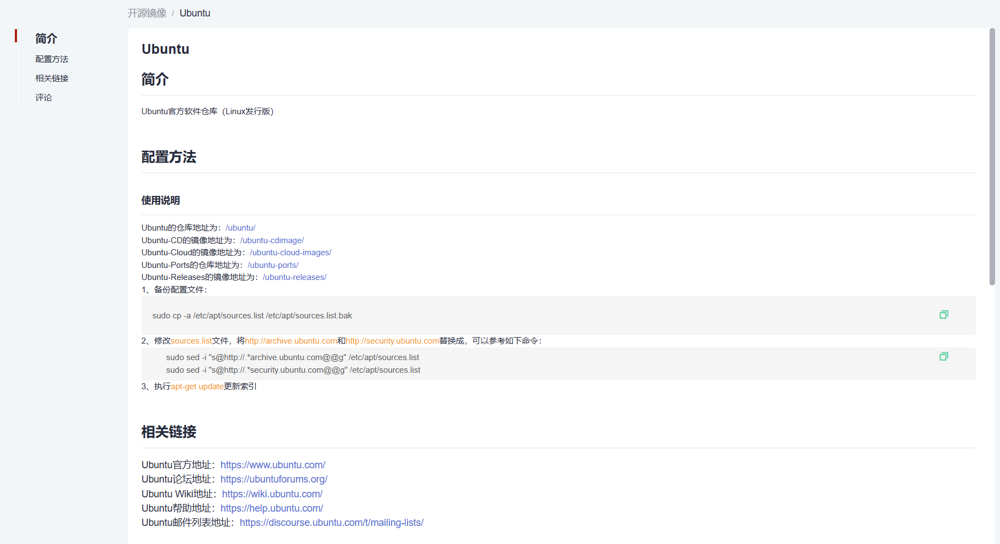
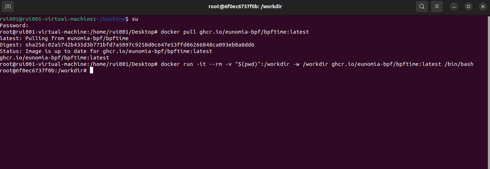
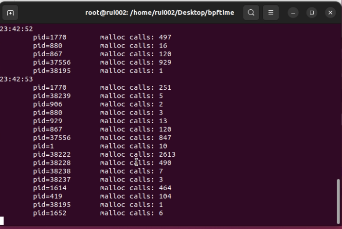

#  BPFtime工具的使用介绍与快速上手

## 一.快速开始

#### 1. 快速入门概述

##### 1.1 工具介绍

- 关于BPFtime工具：是由eunomia-bpf实验室孵化及运营的开源项目，BPFtime是一个用户空间 eBPF 运行时，提供比内核 uprobes 快 10 倍的快速 uprobes与内核兼容 eBPF 和现有工具链。是用于快速Uprobe & Syscall hook & Extensions的用户空间eBPF运行时的工具。

##### 1.2 技术地图

- 使用前需要掌握的技术：
  1. 对C语言，C++语言的熟悉。
  2. 对Ubuntu操作系统环境的熟悉。
  3. 对eBPF工具链的熟悉（如clang与libbpf等）。
  4. 对eBPF技术的熟悉与可以使用工具构建eBPF程序并在用户空间执行他们。
- 主要特性：
  1. **基于二进制重写的Uprobe和Syscall hooks：**在用户空间运行eBPF程序，将它们附加到Uprobes和Syscall tracepoints，无需手动插入或重启！它可以安全、高效地使用eBPF用户空间运行时追踪函数的执行或进程中的所有系统调用。
  2. **性能：**与内核 uprobe 和 uretprobe 相比，Uprobe 开销得到了加速。
  3. **进程间 eBPF 映射：**在共享用户空间内存中实现用户空间，以进行摘要聚合或控制平面通信。
  4. **兼容性：**使用clang和libbpf等来开发用户空间eBPF，无需任何修改。 通过BTF支持CO-RE，并提供用户空间主机功能访问。
  5. **JIT 支持：**受益于跨平台 eBPF 解释器和由 LLVM 支持的高速编译器。 它还包括一个用 C 语言手工制作的 x86 JIT，用于有限的资源。 虚拟机可以像 ubpf 一样构建。
  6. **无需检测：**可以将 eBPF 运行时注入任何正在运行的进程，而无需重新启动或手动重新编译。
  7. **与内核 eBPF 一起运行：**可以从内核加载用户空间 eBPF，并使用内核 eBPF 映射与 kprobes 和网络过滤器等内核 eBPF 程序配合。

##### 1.3 组件

1. **BPFtime vm：支持 JIT/AOT 的用户空间 eBPF vm**

   链接：https://github.com/eunomia-bpf/bpftime/tree/master/vm

   eBPF VM 和 eBPF 的 JIT，您可以从 bpftime LLVM JIT 和基于 ubpf 的简单 JIT/解释器中进行选择。 它可以构建为独立库并集成到其他项目中。 API 与 ubpf 类似。

2. **rumtime：**

   链接：https://github.com/eunomia-bpf/bpftime/tree/master/runtime

   eBPF 的用户空间运行时，包括系统调用服务器和代理，将 eBPF 程序附加到 Uprobes 和 Syscall 跟踪点，以及共享内存中的 eBPF 映射。

3. **daemon：运行时用户空间 eBPF 与内核 eBPF**

   链接：https://github.com/eunomia-bpf/bpftime/tree/master/daemon

   一个守护进程，使用户空间 eBPF 与内核一起工作并与内核 uprobe 兼容。 监视和修改内核 eBPF 事件和系统调用，从内核将 eBPF 加载到用户空间。

##### 1.4 相关链接

- eunomia-bpf实验室：https://eunomia.dev/en/
- BPFtime文档：https://eunomia.dev/bpftime/
- BPFtime的代码仓库：https://github.com/eunomia-bpf/bpftime?tab=readme-ov-file
- 构建和测试：https://eunomia.dev/bpftime/documents/build-and-test/#detailed-things-about-building 

## 二.开发环境

#### 2. 环境搭建

##### 2.1 换源：

使用华为云镜像站的Ubuntu源（https://mirrors.huaweicloud.com/home）

换源可以解决下载开发环境过慢或无法访问与下载目标开发环境的问题。


点击Ubuntu即可查看换源的命令



打开Ubuntu虚拟机，右键桌面选择Open in Termainal打开终端命令框，然后输入su后回车输入密码，即可获得root权限。成功进入root后按照顺序复制华为云镜像站提供的换源命令。

##### 2.2 安装docker环境

项目组为开发者提供了Docker环境（运行平台为Ubuntu），帮助开发者快速完成复杂的开发环境准备工作。下面是Docker环境安装与进入开发环境的步骤：

更新apt包索引

```
sudo apt update
```

安装依赖包

```
sudo apt install apt-transport-https ca-certificates curl gnupg2 software-properties-common
```

添加docker的GPG密钥

```
curl -fsSL https://download.docker.com/linux/ubuntu/gpg | sudo apt-key add -
```

安装

```
sudo add-apt-repository \
"deb [arch=amd64] https://download.docker.com/linux/ubuntu \
$(lsb_release -cs) \
stable"
```

最新版的Docker Engine-Community

```
sudo apt install docker-ce
```

验证是否成功

```
sudo docker --version
```

拉取提供的用于构建和测试 bpftime 的 docker 镜像（需要先输入su进入root权限）

```
docker pull ghcr.io/eunomia-bpf/bpftime:latest
```

进入容器

```
docker run -it --rm -v "$(pwd)":/workdir -w /workdir ghcr.io/eunomia-bpf/bpftime:latest /bin/bash
```



## 三.环境实例

##### 3.1 不使用Docker环境

1. 进入命令行后检查gcc版本与clang版本（需要gcc >= 12.0.0 或 clang >= 16.0.0）

```
gcc -v
```

```
clang -v 
```

如果没有检测到，请安装

```
apt install gcc
```

```
apt install clang
```

2. 执行命令

```
apt update
apt upgrade
```

3. 安装git与clone仓库

```
apt install git
git clone https://gitee.com/tshl185/bpftime.git
```

4. cd到那个目录

```
cd bpftime
```

5. 初始化与更新git

```
git submodule update --init --recursive
```

6. 安装提示中缺少的环境

```
apt install libelf-dev zliblg-dev
```

7. make release 后如何按照提示安装缺少的环境

```
make release
apt install cmake
apt install cargo
apt install pkg-config
apt install libboost-all-dev
apt install libelf-dev
```

8. make install 后会提示环境缺少 llvm ，安装好此环境后再执行一遍 make install

```
make install
apt-get install llvm
make install
```

9. cd到那个目录

```
cd tools/cli-rs
```

10. 编译构建

```
cargo build --release
```

11. 继续执行以下命令

```
mkdir -p ~/.bpftime  //新建目录

cp ./target/release/bpftime ~/.bpftime 
//将当前目录下的"target/release/bpftime"文件复制到用户主目录下的".bpftime"目录中

export PATH=$PATH:~/.bpftime         
//PATH环境变量设置为当前的PATH值加上用户主目录下的".bpftime"目录

cargo build --release
```

12. 注意：下面的命令要另起窗口

```
make -C example/malloc
bpftime load ./example/malloc/malloc

bpftime load ./example/malloc/malloc
sudo example/malloc/malloc
```




##### 3.2 在docker环境下

1. 进入提供的docker后直接输入下面的命令

   ```
   make release  //在这里会发现下面的命令是需要用到的
   
   apt update
   
   apt install libelf1 libelf-dev zlib1g-dev make cmake git libboost1.74-all-dev binutils-dev libyaml-cpp-dev ca-certificates clang llvm pkg-config
   
   git submodule update --init --recursive
   
   make release
   ```

