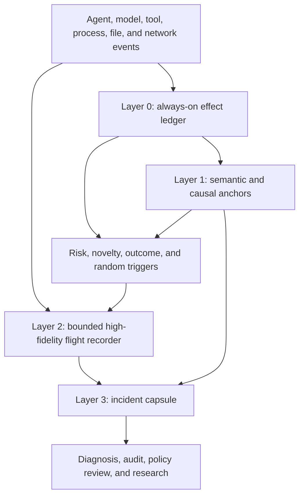

# What Should an AI Agent Trace Keep? Observability Under a Fixed Evidence Budget

An AI agent trace can be nearly complete and still fail to answer the question that matters. A timeline may contain every model call, tool invocation, subprocess, file operation, and network connection, yet omit the authority under which an action ran, the workspace state it changed, the earlier observation that motivated it, or the evidence needed to distinguish a harmless retry from a policy violation. Collecting more events does not automatically create a better explanation.

The scale problem arrives before that semantic problem is solved. In one repository snapshot captured by AgentSight, two sessions lasting about 148 minutes produced 11,647 system-view events, 207 audit events, and 31 LLM calls. That is roughly 376 view events per model call and 79 view events per minute. This single capture is not a workload-wide benchmark, but it exposes the representation mismatch: model interactions are sparse, while the system effects surrounding them are dense. A production deployment covering many agents, workspaces, and days cannot treat every raw event as equally valuable evidence.

<!-- more -->

This brief argues that trace retention for agents should be treated as an **evidence-allocation problem**, not a storage-compression problem. The retention policy must serve three different jobs at once:

1. estimate what the population of agent runs normally does;
2. preserve rare or high-consequence incidents;
3. retain enough causal context to decide among competing explanations.

No single sampling rule serves all three. Representative sampling can estimate population behavior but miss a one-off destructive trajectory. Trigger-based retention catches known anomalies but creates biased data and often fires after the decisive precondition has disappeared. Statistical compression works well when executions repeat a stable structure, as large training jobs do, but agent trajectories vary in tools, repositories, intermediate state, and intent. Full retention avoids some losses, but it increases overhead, privacy exposure, review cost, and the probability that the decisive evidence is buried rather than absent.

The proposed design is an **evidence portfolio**: an always-on effect ledger, explicit semantic and causal anchors, a bounded high-fidelity flight recorder, and an escalation policy that combines random exploration with risk, novelty, and outcome triggers. The objective is not to reconstruct every nanosecond. It is to preserve enough information to make the important operational decision correctly.

> **Research question.** Under a fixed overhead, storage, and analyst-attention budget, which evidence should an agent observability system retain so that it can measure normal behavior, detect rare failures, and reconstruct cross-step causes?
>
> **Central claim.** Agent observability needs a portfolio of complementary retention policies. A system optimized around only request sampling, only anomaly triggers, or only raw event coverage will systematically fail one of the three jobs above.

## The budget is spent on inference, not bytes

Distributed tracing traditionally starts from an economic observation: most requests are healthy, so a representative fraction can preserve useful visibility while controlling cost. [Dapper](https://research.google/pubs/dapper-a-large-scale-distributed-systems-tracing-infrastructure/) made sampling and small common-library instrumentation central to production-scale tracing. [OpenTelemetry's sampling guidance](https://opentelemetry.io/docs/concepts/sampling/) makes the same distinction operationally. Head sampling decides early and cheaply, while tail sampling can inspect most or all spans before deciding whether a trace is interesting.

That framing assumes a relatively clear unit of observation. An RPC begins, crosses services, and ends. Latency and error status are imperfect but useful signals. A sampled request also belongs to a population for which aggregate estimates can be corrected and uncertainty quantified. Google's work on [aggregate estimates from sampled Dapper traces](https://research.google/pubs/uncertainty-in-aggregate-estimates-from-sampled-distributed-traces/) explicitly models the sampling layers so operators can reason about variance rather than treating sampled data as exact.

An agent trajectory is less cooperative. Its boundary may span hours, restarts, delegated processes, human approvals, repository revisions, and external side effects. A nominally successful run can leave the wrong file modified or a secret copied to the wrong destination. A failed run may be operationally harmless. Two identical tool calls can mean different things because the workspace, authority, or preceding evidence changed. The useful unit is therefore not simply an event or a request. It is a **decision-relevant causal fragment** inside a stateful trajectory.

This changes the optimization target. Let a trajectory produce raw evidence \(T\), and let a retention policy \(\pi\) transform it into a stored representation \(R_\pi(T)\). Suppose operators care about a family of future questions \(q\), such as diagnosing a failure, proving policy compliance, estimating common behavior, or explaining an unexpected cost. Under budget \(B\), the policy should maximize the expected value of the decisions supported by the retained evidence:

\[
\pi^* = \arg\max_\pi \; \mathbb{E}_{q \sim P(Q)}[V_q(R_\pi(T))]
\quad \text{subject to} \quad
\mathbb{E}[C(R_\pi(T))] \le B.
\]

The equation is deliberately broader than compression ratio. \(C\) includes runtime overhead, bytes, privacy exposure, indexing cost, and human or model review effort. \(V_q\) measures whether the retained evidence lets the investigator reach the right conclusion, not whether an event counter is high. The difficult term is \(P(Q)\): tomorrow's incident classes are not known today. A policy that spends the entire budget on known triggers will become efficient at rediscovering known problems and blind to new ones.

That uncertainty requires an exploration reserve. Some budget must remain statistically representative even when nothing looks suspicious. The rest can be concentrated on trajectories with high expected diagnostic value. This is the first reason a single sampler is insufficient.

## Four successful tracing ideas that do not compose automatically

Several production systems offer strong mechanisms for controlling trace cost. Their success is real, but the assumptions behind each mechanism differ. Applying them to agents requires identifying those assumptions rather than copying the surface technique.

### Representative sampling preserves population questions

Dapper and later tracing systems sample requests because repeated traffic supplies a population. [Fathom](https://research.google/pubs/fathom-understanding-datacenter-application-network-performance/) samples RPCs, records detailed host, network, and transport state for each sampled RPC, then aggregates the samples into distributions with multidimensional breakdowns. This gives operators both individual examples and a macroscopic view over billions of connections.

This is the right lens for questions such as:

- What fraction of coding-agent runs invoke a compiler?
- Which tools dominate wall-clock time across the fleet?
- How often do agents contact an unrecognized domain?
- Did a release change subprocess or network behavior?

A trigger-only dataset cannot answer these questions without bias. If the system retains only slow, failed, or policy-sensitive trajectories, it will overestimate how often those behaviors occur. Representative sampling is therefore not an optional fallback. It is the population lens of the evidence portfolio.

Its weakness is incident recall. A one-in-a-million destructive sequence remains one-in-a-million. Increasing the sample rate helps only linearly and may consume the entire budget before it provides acceptable coverage of rare events.

### Tail decisions preserve known anomalies

Tail sampling waits until enough of a trace is visible to decide whether it contains an error, high latency, or another interesting property. This is useful when the terminal symptom is observable and the trace completes soon enough for the sampler to hold state.

Long-running agents stress both conditions. First, a damaging trajectory may end with a successful status. Second, retaining an entire multi-hour trajectory in a tail-sampling buffer shifts cost from storage to volatile memory and sampler state. Third, waiting for completion delays intervention. A policy engine may need to preserve and inspect evidence while the agent is still running.

Tail sampling remains valuable, but an agent system needs intermediate commitment points: tool completion, repository mutation, policy-state transition, network egress, privilege change, checkpoint, and externally visible result. These points let the system make partial retention decisions without pretending that the agent's whole task has ended.

### Flight recorders preserve the past before a trigger

[Hubble](https://www.usenix.org/conference/osdi22/presentation/luo) demonstrates a different strategy. It records every non-inlined Android method entry and exit into an in-memory ring buffer, overwrites old data, and persists the buffer only when a performance detector fires. The design preserves detailed execution immediately before an intermittent anomaly without paying the cost of storing every trace. A 32 MB buffer was enough for the application-startup and intermittent-performance cases reported in its deployment.

The flight-recorder idea matters for agents because evidence debt is irreversible. Once a trigger fires, a backend can collect more future detail, but it cannot recover an unrecorded precondition. If a suspicious upload follows a read performed twenty minutes earlier, post-trigger instrumentation sees the upload and misses the data origin. A rolling buffer provides temporal insurance.

Hubble also exposes the limit. Its paper notes that a cause too far from its symptom can fall outside the buffer. Agent trajectories make this more likely because the causal distance may be measured in tool calls or workspace transitions rather than milliseconds. A useful agent flight recorder therefore cannot be only a time window. It must preserve selected causal anchors beyond the raw buffer's expiry.

### Statistical summaries exploit repeated execution structure

Recent production AI-infrastructure systems show how much compression becomes possible when the workload has a stable execution grammar. [ARGUS](https://arxiv.org/abs/2606.20374) observes CPU stacks, framework phases, and GPU kernels continuously in 10,000-plus-GPU training clusters. It reports less than 2% combined overhead and compresses about 10 MB of kernel events to 2.7 KB per rank per step, approximately 3,700 times, before progressively narrowing diagnosis from anomalous iterations to ranks and kernels.

[EROICA](https://www.usenix.org/conference/nsdi26/presentation/guan-yu) summarizes runtime behavior patterns for functions rather than aggregating every raw profile event. Its production deployment compares concise patterns across workers and reports a 97.5% diagnosis success rate across roughly 100,000 GPUs. [StriaTrace](https://www.usenix.org/conference/osdi26/presentation/wu-haonan) similarly narrows instrumentation to synchronization points, critical paths, and abnormal periods for online LLM inference, reporting a 97.8% reduction in tracing overhead relative to alternatives. [SysOM-AI](https://arxiv.org/abs/2603.29235) uses continuous cross-layer collection with in-kernel stack aggregation and differential diagnosis across ranks and historical baselines; it reports less than 0.4% overhead across an 80,000-plus-GPU deployment.

The common mechanism is not merely aggregation. These systems exploit **comparability**. Training ranks execute corresponding iterations and kernels. Inference engines repeatedly traverse known scheduling and synchronization paths. A concise distribution for one rank or phase can be compared against peers or history because the semantic position is stable.

Agent trajectories have weaker positional regularity. One coding task invokes tests, another edits configuration, another browses documentation, and a fourth delegates to a subprocess that mutates a repository. A histogram of syscall names or tool durations may detect gross anomalies, but it cannot assume that event number 400 in two runs has the same meaning. Statistical compression remains useful for local regularities, such as repeated tool types or process families, but it needs semantic anchors before cross-trajectory comparison becomes valid.

### Cross-step reasoning needs evidence that collection may already have discarded

Agent-monitoring research exposes a separate difficulty. [TRACE](https://arxiv.org/abs/2606.07054) studies sabotage distributed across individually plausible actions. Its Triage-Inspect-Judge loop locates suspect windows, selectively inspects them, and maintains evidence across distant steps. The largest gains appear on tasks that require linking temporally separated evidence. [HINTBench](https://arxiv.org/abs/2604.13954) and [AgentRx](https://arxiv.org/abs/2602.02475) likewise treat trajectory-level risk localization and failure diagnosis as harder than assigning one label to a completed run.

These systems reason over a trajectory that is already available. Production observability faces an earlier decision: which parts of the trajectory will still exist when the reasoner arrives? Adaptive analysis cannot recover a discarded file origin, prior policy version, or pre-trigger subprocess tree. Collection and reasoning therefore need a shared evidence model. The analysis layer should be able to request expansion around a causal anchor, while the collection layer must retain enough anchors to make that request meaningful.

## A first-party scale check

The AgentSight sample mentioned earlier offers a small but concrete view of the mismatch. The capture contains:

| Quantity | Value |
| --- | ---: |
| Sessions | 2 |
| Capture duration | about 148 minutes |
| LLM calls | 31 |
| System-view events | 11,647 |
| Audit events | 207 |
| System-view events per LLM call | about 376 |
| System-view events per minute | about 79 |

The source snapshot is available in the [eunomia.dev repository](https://github.com/eunomia-bpf/eunomia.dev/blob/main/docs/agentsight/sample-snapshot.json). It represents one development capture, so its ratios should not be generalized to all agents. The useful observation is structural: the system produces orders of magnitude more potential evidence items than model-level decisions.

A flat event store handles this by indexing everything and asking the investigator to search later. That transfers the retention problem into a query and attention problem. The investigator must already know which process, path, time interval, or domain is relevant. An LLM-based investigator faces the same limit in a different currency: context length and inference cost. A million retained events are not useful if the analysis layer can inspect only a small fraction and the system offers no principled way to choose them.

The evidence budget therefore exists even when storage is cheap. It reappears as indexing latency, retrieval precision, privacy review, model tokens, and analyst time.

## The three lenses of an agent evidence portfolio

A practical design should divide the budget according to the questions it must support. The exact allocation is workload-specific, but the roles are stable.

### 1. The population lens

The population lens retains an unbiased or probability-known sample of complete-enough trajectories and low-cardinality aggregates for all runs. Its purpose is estimation, regression detection, capacity planning, and discovery of behaviors that no trigger recognizes yet.

It should include:

- deterministic probability sampling with the sampling probability recorded;
- fleet-wide counters and distributions over tool classes, durations, exits, network destinations, file-operation classes, and resource use;
- a small random sample of high-fidelity windows, including healthy runs;
- version, workload class, and environment strata so estimates do not collapse unlike populations.

The exploration reserve is important. A random healthy-looking trace may reveal a new incident class and later become the basis of a trigger. Without it, the monitoring system learns only from its existing suspicions.

### 2. The incident lens

The incident lens concentrates detail on trajectories likely to have high operational consequence. It uses multiple signals because agents often lack a single reliable error bit:

- policy violations or near misses;
- unusual authority, privilege, or credential use;
- novel process, file, or network behavior relative to an appropriate cohort;
- resource or latency anomalies;
- outcome mismatches, such as tests passing while protected files changed;
- repeated recovery, rollback, or retry patterns;
- low-confidence semantic classification;
- human escalation or explicit audit requests.

The incident lens deliberately produces a biased dataset. That is acceptable because its job is recall, not population estimation. The bias becomes dangerous only when analysts forget which lens produced the data. Every retained capsule should therefore record the policy, trigger, threshold, model, and sampling probability that selected it.

### 3. The causal lens

The causal lens preserves relationships that neither random sampling nor local anomaly triggers guarantee. It records a sparse graph of commitments and dependencies across time:

- which observation or input justified an action;
- which agent, delegated process, or human principal held authority;
- which policy and configuration versions applied;
- which workspace or external object version was read and later modified;
- which output became an input to a later tool;
- which checkpoint, branch, container, or sandbox boundary was crossed;
- which outcome oracle evaluated the final state.

These are not necessarily raw contents. A content hash, stable object identifier, version tuple, label, or redacted summary can preserve the causal edge while reducing exposure. The purpose is to prevent an earlier decisive fact from expiring merely because its raw events fell outside a ring buffer.

## A four-layer architecture

The three lenses can be implemented as a four-layer evidence architecture. Each layer answers a different class of query and has a different retention lifetime.

### Layer 0: an always-on effect ledger

The effect ledger records low-cost, low-cardinality facts for every trajectory. It should be compact enough to retain broadly and stable enough to compare across versions:

- task and work-unit identifiers;
- model, agent runtime, policy, tool, and environment versions;
- phase boundaries and wall-clock/resource summaries;
- process-tree changes;
- file reads, writes, renames, and deletions summarized by path class, repository object, or protected-resource label;
- network destinations and transfer classes;
- tool status, retry count, and externally visible effects;
- sampling and trigger metadata.

OpenTelemetry's [semantic-convention guidance](https://opentelemetry.io/docs/specs/semconv/how-to-write-conventions/) offers a useful discipline: capture important operation details, keep span names and common attributes low-cardinality, and make sensitive, expensive, or verbose fields opt-in. An agent schema should follow the same rule while adding the state and authority fields that request tracing usually omits.

### Layer 1: semantic and causal anchors

Anchors are durable, sparse records created at decision-relevant boundaries. Examples include:

- `observed artifact A@v3`;
- `derived plan P from evidence set {A@v3, B@v8}`;
- `executed tool X under policy Y@v4 and credential permissions Z`;
- `changed repository tree from H1 to H2`;
- `published result R after oracle O passed`.

The anchor does not need the full prompt, file, or tool output by default. It needs enough identity and provenance to retrieve authorized content later or prove that the content is no longer available. This separates **causal continuity** from **content retention**.

A useful design test is counterfactual sufficiency: can the retained anchors distinguish the two most plausible explanations of an incident? If a build failed, can they distinguish a source edit from an environment change? If data leaked, can they distinguish a permitted public artifact from a secret read earlier in the trajectory? If not, another anchor is required.

### Layer 2: a bounded high-fidelity flight recorder

Each active agent or work unit maintains a local, encrypted, access-controlled buffer containing detailed recent evidence. Depending on the platform, this may include:

- full tool arguments and structured results;
- process lifecycle and selected syscall events;
- file-operation details;
- network-flow metadata;
- model request/response metadata and optionally content;
- local state transitions and errors.

The buffer is overwritten continuously. When a trigger fires, the system freezes an interval before and after the trigger and follows causal anchors to retrieve related intervals even when they are temporally distant. This extends Hubble's temporal flight recorder into a **causal flight recorder**.

The distinction matters. A fixed ten-minute buffer preserves nearby history. A causal flight recorder may also preserve the earlier read that supplied data to a later upload, the checkpoint from which a corrupted state was restored, or the policy version that authorized a delegated subprocess.

### Layer 3: an incident capsule

The persisted output is not an indiscriminate raw dump. It is an incident capsule containing:

- the triggering signals and selection policy;
- the relevant causal subgraph;
- high-fidelity windows around suspect steps;
- an unbiased background sample for comparison;
- summaries of omitted regions and their retention status;
- policy, model, tool, environment, and workspace versions;
- privacy transformations and access requirements;
- confidence, alternative explanations, and missing evidence.

The capsule is the unit delivered to a human investigator or reasoning model. It should be small enough to inspect, but explicit about what was excluded. Silence must not be confused with absence.

## Why the triggers must be plural

A single anomaly score creates a monoculture. It encodes one definition of unusual behavior, then steadily optimizes the retained dataset around that definition. A robust system uses several trigger families whose errors are only partially correlated.

| Trigger family | Detects well | Systematic blind spot |
| --- | --- | --- |
| Error and latency | explicit failures, slow tools, resource stalls | successful but wrong or unsafe actions |
| Policy and authority | known forbidden effects, privilege changes | novel harmful behavior outside current policy |
| Statistical novelty | new process, destination, path, or sequence patterns | familiar-looking attacks and legitimate rare work |
| Outcome mismatch | inconsistent final state, failed oracle, unexpected diff | damage that the oracle does not model |
| Cross-step risk | weak signals that become meaningful together | expensive analysis and dependence on retained anchors |
| Random exploration | unknown incident classes and unbiased population estimates | low recall for any particular rare incident |
| Human request | incidents with external context unavailable to the monitor | events nobody notices or reports |

The retention policy can treat these triggers as a budgeted ensemble. High-confidence policy violations freeze evidence immediately. Statistical novelty may retain a narrower window unless combined with another signal. Random exploration receives a fixed minimum allocation that other triggers cannot consume. Low-confidence cross-step risk can extend the ring-buffer horizon while a reasoning process decides whether to persist a capsule.

This design also supports graceful degradation. Under pressure, the system can reduce raw-window size or content capture while retaining anchors and selection probabilities. Dropping the population sample or causal anchors first would save bytes at the cost of corrupting future inference.

## What should be recorded by default?

The answer depends on the question, but the following split is a reasonable starting point for tool-using agents.

| Evidence class | Default representation | Escalated representation | Reason |
| --- | --- | --- | --- |
| Model interaction | model/version, token/resource summary, content digest, policy labels | authorized prompt and response content | content is useful but sensitive and expensive |
| Tool call | tool identity, schema version, status, duration, argument/result digest | structured arguments, results, stdout/stderr | tool boundaries are semantic commitments |
| Process activity | process tree, executable identity, exit status, resource summary | argv, environment subset, selected syscall sequence | subprocesses carry effects below the harness |
| File activity | operation, repository/object identity, path class, before/after digest | exact path and authorized content diff | state change matters more than every read event |
| Network activity | destination identity, protocol, transfer class, byte counts | request metadata or authorized payload | destination and provenance often establish risk |
| Authority | principal, credential permissions, sandbox/policy version | approval evidence and delegated capability chain | identical actions differ under different authority |
| Environment | image, package, repository, and configuration versions | selected manifests and state snapshots | reproducibility requires binding behavior to state |
| Outcome | oracle identity, result, final-state digest | logs, tests, reviewer evidence | a successful tool exit is not task correctness |

Three principles constrain this table.

First, content and metadata need separate retention policies. Full prompt, file, and network payloads may be necessary for some investigations, but storing them everywhere creates a security archive more dangerous than the incidents it diagnoses.

Second, digests are useful only when the underlying object can be retrieved under an authorized retention policy. A hash of deleted content proves identity but cannot explain semantics. The system should record whether the referenced object remains available and for how long.

Third, summaries should preserve uncertainty. A classifier that labels a file operation “source code” or “secret-like” should retain its model/version and confidence. Otherwise a later investigator cannot tell whether the summary was reliable.

## The architecture decisions this changes

Treating retention as an evidence portfolio leads to several concrete design choices.

### The observability unit should follow the work unit, not only the request

The flight recorder, causal anchors, and budget should follow a durable agent work unit that survives individual model calls and tool invocations. This does not require one giant trace object. It requires a stable identity and explicit parent/delegation relations across requests, processes, sandboxes, checkpoints, and human interventions.

### Sampling state becomes policy state

Sampling is no longer a backend optimization hidden from the application. The selected policy affects whether a future audit is possible. Its version, trigger decisions, probability, and degradation mode belong in the evidence itself. Changes to sampling policy should be reviewed like changes to a security or recovery policy.

### Collection and analysis need a feedback channel

A reasoning system should be able to request temporary expansion for an active trajectory: retain the next network payload metadata, extend a causal predecessor, increase process detail, or freeze a buffer while cross-step evidence is evaluated. The request must itself be authorized, bounded, and recorded. Otherwise adaptive monitoring silently becomes unrestricted surveillance.

### Outcome oracles belong in observability

A trace that ends at the last tool call cannot determine whether the repository, deployment, ticket, or user-visible artifact is correct. Outcome checks provide both triggers and semantic boundaries. They also prevent the system from equating “no exception” with success.

### Privacy is part of the budget objective

Runtime overhead and storage are easy to quantify, while privacy loss is often treated as a separate compliance step. For agents, the most diagnostically rich fields are frequently the most sensitive: prompts, file contents, tool results, credentials, and network payloads. The retention optimizer must price exposure directly through opt-in capture, redaction, encryption, locality, access controls, and deletion guarantees.

## How to evaluate an evidence-retention policy

A convincing evaluation must compare policies at equal budget. Comparing a compact proposed system with an unconstrained baseline says little about whether the retained evidence is better chosen.

A useful experiment would collect a consented, high-fidelity ground truth for a bounded corpus of real agent tasks, then replay retention policies offline. The corpus should contain normal runs, naturally occurring failures, injected system faults, policy violations, subtle outcome errors, and hidden incident classes that no trigger was designed to recognize.

At a fixed runtime and storage budget, measure:

1. **Population-estimation error.** How accurately can the retained sample estimate tool use, latency, resource cost, network behavior, and other fleet distributions?
2. **Incident recall.** What fraction of consequential trajectories produce a usable capsule?
3. **Critical-step localization.** Can an investigator identify the action and precondition that caused the outcome?
4. **Explanation discriminability.** Can the evidence distinguish plausible alternative root causes?
5. **Time to diagnosis.** How much human or model effort is required to reach a supported conclusion?
6. **Evidence completeness.** Which required facts were never collected, overwritten, redacted, or no longer retrievable?
7. **Privacy exposure.** How much sensitive content is retained, for how long, and accessible to whom?
8. **Bias transparency.** Can aggregate analyses account for the selection probabilities and trigger policies that produced the dataset?
9. **Operational cost.** CPU, memory, I/O, network, indexing, model-token, and analyst costs per work unit.

The important baselines are not only “retain everything” and “retain 1%.” They should include probability head sampling, outcome/error tail sampling, time-window ring buffers, anomaly-only retention, low-cardinality summaries, and the proposed portfolio. The test should also remove each lens in turn. If eliminating the random exploration reserve does not hurt discovery or population estimates, it is unnecessary. If causal anchors do not improve critical-step localization, their schema is probably too weak or redundant.

## What would change this conclusion?

This proposal targets long-running, tool-using agents that interact with mutable workspaces and external systems. It does not require collecting hidden chain-of-thought. The relevant evidence is observable execution, declared intent, authority, state transitions, and outcomes. Chat-only interactions with no external effects have a much simpler retention problem.

Several assumptions may fail.

First, agent workloads may become regular enough that phase-aligned statistical summaries capture most useful variation. Standardized agent protocols, constrained workflows, or repetitive enterprise tasks could make ARGUS-style comparison more effective than this brief expects.

Second, strong outcome oracles may make detailed causal retention unnecessary for many tasks. If every relevant error is detected promptly and the system can safely rerun under heavyweight tracing, a small flight recorder may suffice.

Third, semantic anchors can be wrong. An agent framework may mislabel phases, omit delegated processes, or bind an action to the wrong input. System-level observation reduces dependence on framework claims but cannot infer every semantic relation without uncertainty.

Fourth, the proposed feedback loop can amplify cost and privacy risk. A weak anomaly model may repeatedly escalate benign rare behavior. Budget enforcement and independent random sampling help, but they do not remove the need to audit the monitor itself.

The central claim would be weakened or falsified by any of the following results:

- At equal cost, ordinary tail sampling matches the portfolio on incident recall, critical-step localization, and diagnosis time across long-horizon agent workloads.
- Causal anchors do not improve an investigator's ability to distinguish competing explanations once recent raw windows and final outcomes are available.
- Triggered and random high-fidelity samples discover the same incident classes, showing that the exploration reserve adds no practical information.
- Agent trajectories exhibit enough stable positional regularity that function, tool, or event distributions can be compressed and compared without state, authority, or provenance anchors.
- The additional collection and reasoning cost exceeds the operational loss avoided by better diagnosis or auditability.

These are testable conditions, not rhetorical caveats. A research program around agent observability should report where the simpler policies win.

## A practical starting point

A deployable first version does not need an elaborate learned retention controller. It can begin with five mechanisms:

1. retain a low-cardinality effect ledger for every work unit;
2. create anchors at tool, authority, repository-state, checkpoint, and outcome boundaries;
3. maintain a bounded local high-fidelity ring buffer;
4. freeze evidence on policy, novelty, resource, outcome, and human triggers;
5. reserve a fixed probability sample of otherwise healthy trajectories and record the selection probability.

The first iteration should keep the trigger set simple and make omissions visible. A capsule should say, for example, that prompt content was not collected, the relevant file version expired, or a subprocess began before system-level monitoring attached. Explicit absence is more useful than a seamless but false narrative.

The next step is not a larger trace viewer. It is an evaluation showing which retained evidence changes diagnosis and architectural decisions under a fixed budget. That experiment would turn the evidence portfolio from a plausible systems design into a measurable observability contract.

## Conclusion

The central scarcity in agent observability is not disk space. It is the capacity to preserve and inspect the evidence that will matter for a question not yet known. Representative sampling, anomaly triggers, flight recorders, statistical summaries, and adaptive trajectory reasoning each solve part of that problem. Their assumptions conflict when a long-running agent produces heterogeneous, stateful, cross-step effects.

An evidence portfolio makes those conflicts explicit. It preserves an unbiased view of normal behavior, spends extra fidelity on consequential incidents, and carries sparse causal anchors beyond the life of a raw buffer. The result is intentionally incomplete, but its incompleteness is budgeted, recorded, and aligned with decisions.

For AI agents, that is a more defensible target than “collect everything.” A useful trace is not the largest record of what happened. It is the smallest accountable body of evidence that lets an investigator decide what happened, why it happened, and whether the conclusion should change when new evidence arrives.

## References

1. Sigelman et al., [Dapper, a Large-Scale Distributed Systems Tracing Infrastructure](https://research.google/pubs/dapper-a-large-scale-distributed-systems-tracing-infrastructure/), 2010.
2. Coehlo, Merchant, and Stokely, [Uncertainty in Aggregate Estimates from Sampled Distributed Traces](https://research.google/pubs/uncertainty-in-aggregate-estimates-from-sampled-distributed-traces/), 2012.
3. Vahdat et al., [Fathom: Understanding Datacenter Application Network Performance](https://research.google/pubs/fathom-understanding-datacenter-application-network-performance/), SIGCOMM 2023.
4. OpenTelemetry, [Sampling](https://opentelemetry.io/docs/concepts/sampling/) and [How to Write Semantic Conventions](https://opentelemetry.io/docs/specs/semconv/how-to-write-conventions/).
5. Luo et al., [Hubble: Performance Debugging with In-Production, Just-In-Time Method Tracing on Android](https://www.usenix.org/conference/osdi22/presentation/luo), OSDI 2022.
6. Guan et al., [EROICA: Online Performance Troubleshooting for Large-scale Model Training](https://www.usenix.org/conference/nsdi26/presentation/guan-yu), NSDI 2026.
7. Wu et al., [StriaTrace: Efficient Tracing and Diagnosis for Online LLM Inference](https://www.usenix.org/conference/osdi26/presentation/wu-haonan), OSDI 2026.
8. Zhou et al., [ARGUS: Production-Scale Tracing and Performance Diagnosis for over 10,000-GPU Clusters](https://arxiv.org/abs/2606.20374), arXiv 2026.
9. Zheng et al., [SysOM-AI: Continuous Cross-Layer Performance Diagnosis for Production AI Training](https://arxiv.org/abs/2603.29235), arXiv 2026.
10. Mittapalli et al., [TRACE: Trajectory Reasoning through Adaptive Cross-Step Evidence Aggregation for LLM Agents](https://arxiv.org/abs/2606.07054), arXiv 2026.
11. [HINTBench: Horizon-agent Intrinsic Non-attack Trajectory Benchmark](https://arxiv.org/abs/2604.13954), arXiv 2026.
12. [AgentRx: Diagnosing AI Agent Failures from Execution Trajectories](https://arxiv.org/abs/2602.02475), arXiv 2026.
13. Eunomia, [AgentSight sample snapshot](https://github.com/eunomia-bpf/eunomia.dev/blob/main/docs/agentsight/sample-snapshot.json), captured 2026-06-05.
