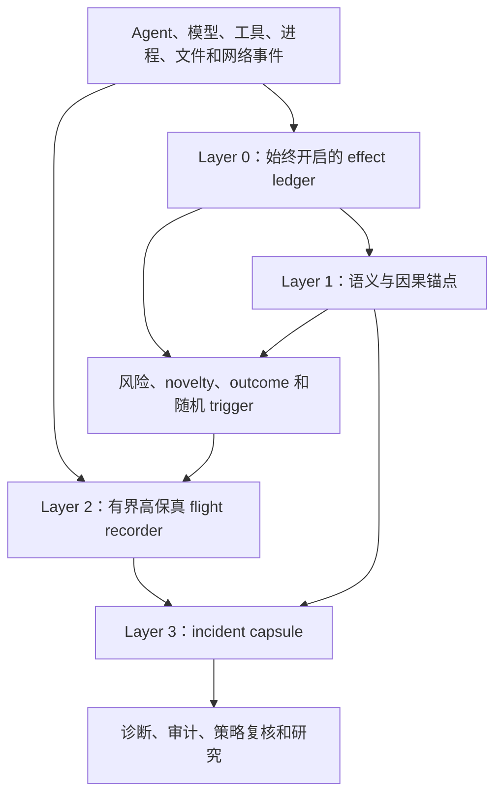

# AI Agent 轨迹到底该保留什么：固定证据预算下的可观测性设计

一条 AI Agent 轨迹可以记录得相当完整，却仍然回答不了真正重要的问题。时间线里也许包含全部模型调用、工具调用、子进程、文件操作和网络连接，但没有记录这次动作拥有什么权限、修改前的 workspace 是什么状态、此前哪条观察促成了这次决策，或者怎样区分一次无害重试与一次策略违规。事件越多，不等于解释越可靠。

在语义问题解决以前，规模问题已经出现。AgentSight 仓库中的一份样例快照覆盖两个 session，持续约 148 分钟，包含 31 次 LLM 调用、11,647 个 system-view event 和 207 个 audit event。平均每次模型调用周围约有 376 个 system-view event，每分钟约 79 个。这只是一份开发期样例，不能代表所有 Agent 工作负载，但它清楚展示了表示层的不对称：模型交互相对稀疏，围绕模型交互发生的系统效果却非常密集。生产系统面对许多 Agent、workspace 和长时间运行任务时，不能把每个原始事件都当作同等重要的证据。

<!-- more -->

本文的核心判断是：Agent 轨迹保留应该被视为一个**证据分配问题**，而不只是存储压缩问题。保留策略至少要同时完成三类不同任务：

1. 估计大量 Agent 运行通常会做什么；
2. 保住罕见但后果严重的事故；
3. 保留足够的因果上下文，区分互相竞争的解释。

没有一种采样规则能够同时做好三件事。代表性采样可以估计总体行为，却可能漏掉一次性的破坏性轨迹。触发式保留可以捕获已知异常，却会制造偏置，而且经常在关键前因已经消失以后才触发。统计压缩在执行结构高度重复时很有效，大规模训练任务正是这种情况；Agent 轨迹则会随工具、仓库、环境状态和目标而变化。完整保留可以减少一部分信息损失，但会增加运行开销、隐私暴露、索引成本和审查负担，最后还可能让决定性证据淹没在数据里。

本文提出一种**证据组合**：始终开启的 effect ledger、明确的语义与因果锚点、有界的高保真 flight recorder，以及同时包含随机探索、风险、novelty 和结果异常的升级策略。目标不是复原每一纳秒的执行，而是在预算内保留足够证据，让重要的工程判断能够被正确做出。

> **研究问题：**在固定运行开销、存储和分析注意力预算下，Agent 可观测系统应该保留哪些证据，才能测量正常行为、捕获罕见失败并重建跨步骤原因？
>
> **中心论点：**Agent 可观测性需要由多种互补保留策略组成的证据组合。只围绕 request sampling、异常触发或原始事件覆盖率优化的系统，必然系统性地牺牲上述三类任务中的至少一类。

## 预算真正花在推断上，而不是字节上

分布式 tracing 的传统出发点很直接：绝大多数请求是健康的，因此只保留有代表性的样本，就能在控制成本的同时维持可见性。[Dapper](https://research.google/pubs/dapper-a-large-scale-distributed-systems-tracing-infrastructure/) 把采样和少量公共库插桩作为大规模生产 tracing 的核心设计。[OpenTelemetry 的采样文档](https://opentelemetry.io/docs/concepts/sampling/)也采用类似区分：head sampling 在轨迹开始时快速做决定，tail sampling 则可以在看到大部分或全部 span 后，再判断一条 trace 是否值得保留。

这套方法隐含了一个相对清楚的观察单位。一次 RPC 有开始、有跨服务传播、有结束；延迟和 error status 虽然不完美，但通常是有用信号。被采样的请求也属于一个可以统计建模的总体。Google 关于 [Dapper 采样轨迹总体估计不确定性](https://research.google/pubs/uncertainty-in-aggregate-estimates-from-sampled-distributed-traces/)的工作会显式考虑多层采样，计算估计方差，而不是把采样数据当成精确事实。

Agent 轨迹没有这么规整。它可能跨越数小时、重启、委派进程、人工审批、仓库版本和外部副作用。一次状态为 success 的运行也可能修改了错误文件，或者把数据发往错误目的地；一次状态为 failure 的运行则可能完全没有外部后果。两个表面相同的工具调用，也可能因为 workspace、权限和此前证据不同而具有完全不同的含义。因此，真正有用的单位不只是 event 或 request，而是状态化轨迹中的**决策相关因果片段**。

这会改变优化目标。设一条轨迹产生原始证据 \(T\)，保留策略 \(\pi\) 把它转换成持久化表示 \(R_\pi(T)\)。未来的调查问题 \(q\) 可能是失败诊断、合规证明、总体行为估计或成本解释。在预算 \(B\) 下，策略应该最大化被保留证据对这些决策的预期价值：

\[
\pi^* = \arg\max_\pi \; \mathbb{E}_{q \sim P(Q)}[V_q(R_\pi(T))]
\quad \text{subject to} \quad
\mathbb{E}[C(R_\pi(T))] \le B.
\]

这里的 \(C\) 不只是存储字节，也包括运行时开销、内存、索引、隐私暴露、模型 token 和人工审查时间。\(V_q\) 衡量的不是事件数量，而是调查者能否据此得到正确结论。最难的是 \(P(Q)\)：今天无法提前知道明天会出现哪些事故类型。如果全部预算都投入已知 trigger，系统会越来越擅长重复发现旧问题，却看不见新的问题类型。

因此必须保留一部分探索预算。即使轨迹看起来完全正常，也要随机保留少量高保真样本；其余预算再集中到高预期诊断价值的轨迹上。这是单一 sampler 不够用的第一个原因。

## 四种已经成功的 tracing 思路，不能直接拼起来

生产系统已经发展出多种控制 tracing 成本的有效机制。它们的成功是真实的，但依赖的工作负载假设并不相同。把这些方法用于 Agent，首先需要识别假设，而不是复制表面技巧。

### 代表性采样解决总体问题

Dapper 及后续系统可以采样 request，是因为重复流量形成了总体。[Fathom](https://research.google/pubs/fathom-understanding-datacenter-application-network-performance/) 被动采样 RPC，为每个样本记录详细的 host、network 和 transport 状态，再把样本聚合成带多维分解的分布。这样既能检查单个实例，也能从数十亿连接中得到宏观视图。

这类证据适合回答：

- 有多少 coding-agent 任务调用了编译器？
- 哪些工具消耗了最多 wall-clock time？
- Agent 联系未知域名的频率是多少？
- 新版本是否改变了 subprocess 或网络行为？

只保留异常的系统无法无偏地回答这些问题。假如数据集中只有慢任务、失败任务和 policy-sensitive 任务，分析得到的异常比例一定会被高估。因此，代表性采样不是可有可无的 fallback，而是证据组合中的总体视角。

它的缺点是事故召回率。一次百万分之一的破坏性序列仍然只有百万分之一概率被抽中。提高采样率只能线性改善召回，很可能在达到可接受覆盖以前就耗尽预算。

### Tail decision 适合已知异常

Tail sampling 等待足够多的 span 出现，再根据 error、延迟或其他属性决定是否保留。这在终止症状可观察、trace 能较快完成时很有效。

长时间运行 Agent 会同时破坏这两个条件。首先，造成损害的轨迹可能以 success 结束；其次，把数小时轨迹一直留在 tail sampler 的内存中，只是把成本从持久存储转移到 sampler state；再次，等待任务结束意味着干预过晚。Policy engine 往往需要在 Agent 仍运行时保留和分析证据。

Tail sampling 仍然重要，但 Agent 系统需要中间 commitment point，例如工具完成、仓库变更、策略状态切换、网络外发、权限变化、checkpoint 和外部结果发布。系统可以在这些边界上做局部保留决定，而不需要假装整项任务已经结束。

### Flight recorder 保住触发前的过去

[Hubble](https://www.usenix.org/conference/osdi22/presentation/luo) 展示了另一类方法。它把 Android 中每个未内联 bytecode method 的 entry 和 exit 写入内存 ring buffer，持续覆盖旧数据，只在性能异常 detector 触发时持久化 buffer。这样既能保留间歇性问题出现前的详细执行，也不必永久保存所有 trace。论文报告的应用启动和间歇性能问题中，32 MB buffer 已经足够。

Flight recorder 对 Agent 很重要，因为证据债务无法事后偿还。Trigger 触发以后，backend 可以收集更多未来数据，却无法找回从未记录的前因。一次可疑上传可能依赖二十分钟前的文件读取。如果系统只在上传时开启详细 tracing，它会看到外发行为，却看不到数据来源。

Hubble 同时暴露了一个边界。论文指出，根因和症状距离太远时，前因可能已经被 ring buffer 覆盖。Agent 更容易遇到这种情况，因为因果距离可能跨越许多工具调用和 workspace transition，而不是几毫秒。因此，Agent flight recorder 不能只保留固定时间窗口，还必须让部分因果锚点活得比原始 buffer 更久。

### 统计摘要依赖重复执行结构

近期 AI 基础设施系统说明，当工作负载具有稳定执行语法时，压缩可以非常激进。[ARGUS](https://arxiv.org/abs/2606.20374) 在万卡以上训练集群中持续观察 CPU stack、framework phase 和 GPU kernel，报告总开销低于 2%，并把每 rank 每 step 约 10 MB kernel event 压缩到 2.7 KB，约 3,700 倍。随后它从异常 iteration 逐层缩小到 rank 和具体 kernel。

[EROICA](https://www.usenix.org/conference/nsdi26/presentation/guan-yu) 不聚合所有原始 profiling event，而是总结每个函数的 runtime behavior pattern，再跨 worker 比较。它在约十万张 GPU 的生产部署中报告 97.5% 的诊断成功率。[StriaTrace](https://www.usenix.org/conference/osdi26/presentation/wu-haonan) 则把在线 LLM inference 的插桩限制在 synchronization point、critical path 和异常时段，报告相对替代方案降低 97.8% tracing overhead。[SysOM-AI](https://arxiv.org/abs/2603.29235) 通过持续跨层采集、内核内 stack aggregation、跨 rank 和历史 baseline 的 differential diagnosis，在八万张以上 GPU 的部署中报告低于 0.4% 开销。

这些系统的共同机制不只是 aggregation，而是**可比较性**。训练 rank 会执行对应 iteration 和 kernel，inference engine 会反复经过已知调度与同步路径。一个 rank 或 phase 的紧凑分布可以和 peer 或历史比较，因为语义位置相对稳定。

Agent 轨迹缺乏同样强的位置规律。一个 coding task 跑测试，另一个修改配置，第三个浏览文档，第四个委派子进程修改仓库。Syscall 或工具耗时直方图可以发现粗粒度异常，却不能假设两条轨迹的第 400 个 event 具有相同含义。统计压缩仍然适合局部规律，例如同类工具和进程族，但只有先建立语义锚点，跨轨迹比较才可靠。

### 跨步骤推理依赖采集层尚未丢弃的证据

Agent monitoring 研究揭示了另一个困难。[TRACE](https://arxiv.org/abs/2606.07054) 研究由许多单步看似合理的动作共同组成的 sabotage。它的 Triage-Inspect-Judge loop 先找 suspect window，再选择性检查，并跨远距离步骤累积证据。提升最大的任务恰好需要把时间上分离的弱信号连接起来。[HINTBench](https://arxiv.org/abs/2604.13954) 和 [AgentRx](https://arxiv.org/abs/2602.02475) 也说明，trajectory-level 风险定位和失败诊断远比给完整运行贴一个标签更难。

这些方法假设轨迹已经存在。生产可观测系统面对的是更早的问题：当 reasoner 到来时，哪些片段还没有被删除？Adaptive analysis 无法恢复已经丢弃的文件来源、旧 policy version 或 trigger 以前的 subprocess tree。因此采集层与推理层需要共享同一套 evidence model。分析层应该可以围绕 causal anchor 请求展开，而采集层必须先保留足够锚点，让这种展开有对象可找。

## 一份一手数据的规模检查

前文的 AgentSight 样例可以给这个问题一个具体数量级：

| 指标 | 数值 |
| --- | ---: |
| Session 数 | 2 |
| Capture 时长 | 约 148 分钟 |
| LLM 调用 | 31 |
| System-view event | 11,647 |
| Audit event | 207 |
| 每次 LLM 调用对应的 system-view event | 约 376 |
| 每分钟 system-view event | 约 79 |

原始样例位于 [eunomia.dev 仓库](https://github.com/eunomia-bpf/eunomia.dev/blob/main/docs/agentsight/sample-snapshot.json)。它只代表一次开发期 capture，不能把这些比率推广到所有 Agent。这里真正有意义的是结构：系统层候选证据项远多于模型层决策。

Flat event store 的处理方式是先索引一切，之后再让调查者搜索。这只是把 retention 问题转换成 query 和 attention 问题。调查者必须提前知道哪个进程、路径、时间窗口或域名值得查。基于 LLM 的调查者也受同样限制，只是成本换成 context length 和 inference token。假如分析层只能看百万事件中的一小部分，而系统没有原则化 retrieval 方法，百万事件仍然没有形成可用证据。

即使磁盘很便宜，证据预算也不会消失。它会以索引延迟、检索精度、隐私审查、模型 token 和人工时间的形式重新出现。

## Agent 证据组合的三种视角

实际系统应该按照要回答的问题分配预算。具体比例依赖工作负载，但三种角色相对稳定。

### 1. 总体视角

总体视角保留无偏或采样概率已知的轨迹样本，同时为所有运行维护低基数 aggregate。它服务于总体估计、regression detection、capacity planning，以及发现 trigger 尚不认识的新行为。

应当包括：

- 记录采样概率的确定性概率采样；
- 覆盖工具类型、耗时、退出状态、网络目的地、文件操作类别和资源使用的 fleet-wide 分布；
- 少量随机高保真窗口，其中也包括健康运行；
- version、workload class 和环境分层，避免把不同总体混在一起。

随机保留健康轨迹不是浪费。它可能揭示新的 incident class，之后才有机会转化为 trigger。如果没有探索样本，monitor 只能从已有怀疑中学习。

### 2. 事故视角

事故视角把高保真预算集中到预期后果较大的轨迹。Agent 往往没有一个可靠的 error bit，所以 trigger 需要来自多个来源：

- policy violation 或 near miss；
- 非常规 authority、privilege 或 credential 使用；
- 相对合适 cohort 出现的新进程、文件或网络行为；
- 资源和延迟异常；
- outcome mismatch，例如测试通过但 protected file 发生改变；
- 反复 recovery、rollback 或 retry；
- 低置信度语义判断；
- 人工升级和显式 audit 请求。

事故数据集天然有偏，这并不是问题，因为它的目标是 recall，而不是总体估计。真正危险的是后续分析忘记数据是怎样被选择的。因此每个 incident capsule 都应该记录选择它的 policy、trigger、threshold、模型版本和 sampling probability。

### 3. 因果视角

因果视角保留代表性采样和局部 trigger 都无法保证的长期关系。它维护一个稀疏的 commitment 与 dependency graph：

- 哪条观察或输入支撑了某次动作；
- 哪个 Agent、委派进程或人工主体拥有 authority；
- 哪个 policy 和配置版本生效；
- 哪个 workspace 或外部对象版本先被读取、后被修改；
- 哪个输出成为后续工具的输入；
- 轨迹跨越了哪个 checkpoint、branch、container 或 sandbox boundary；
- 哪个 outcome oracle 对最终状态进行了判断。

这里不一定要保存全部内容。Content hash、稳定对象 ID、version tuple、label 或脱敏摘要可以在减少暴露的同时保留因果边。目标是防止早期关键事实只因为 raw event 离开 ring buffer 就彻底消失。

## 四层证据架构

三种视角可以实现为四层架构。每一层回答不同问题，也采用不同保留周期。

### Layer 0：始终开启的 effect ledger

Effect ledger 为每个 trajectory 记录低成本、低基数事实。它应该足够紧凑，可以广泛保留；也应该足够稳定，可以跨版本比较：

- task 和 work-unit ID；
- model、agent runtime、policy、tool 和环境版本；
- phase boundary 与 wall-clock/resource summary；
- process tree 变化；
- 按 path class、repository object 或 protected-resource label 总结的文件读写、rename 和 delete；
- network destination 与 transfer class；
- tool status、retry count 和外部可见 effect；
- sampling 与 trigger metadata。

OpenTelemetry 的 [semantic convention 编写指南](https://opentelemetry.io/docs/specs/semconv/how-to-write-conventions/)提供了一条合适原则：只捕获对 operation 真正重要的细节，让 span name 和公共 attribute 保持低基数，并把敏感、昂贵和冗长字段设为 opt-in。Agent schema 应延续这条原则，同时增加普通 request tracing 缺少的 state 和 authority 字段。

### Layer 1：语义与因果锚点

Anchor 是在决策相关边界产生的稀疏持久记录，例如：

- `观察到 artifact A@v3`；
- `根据证据集合 {A@v3, B@v8} 形成计划 P`；
- `在 policy Y@v4 和 credential permissions Z 下执行工具 X`；
- `repository tree 从 H1 变为 H2`；
- `oracle O 通过后发布结果 R`。

默认情况下，anchor 不需要完整 prompt、文件或工具输出。它需要足够的 identity 和 provenance，让系统之后可以在授权范围内取回内容，或者证明内容已经不可用。这会把**因果连续性**与**内容保留**分开。

一个有用的设计测试是 counterfactual sufficiency：被保留的 anchor 能否区分事故最可能的两个解释？Build 失败时，能否区分 source edit 与环境变化？数据泄漏时，能否区分允许公开的 artifact 与此前读取的 secret？如果不能，就说明缺少一种 anchor。

### Layer 2：有界高保真 flight recorder

每个活跃 Agent 或 work unit 维护一个本地、加密、受访问控制的近期详细证据 buffer。它可以包含：

- 完整工具参数和结构化结果；
- process lifecycle 与选定 syscall event；
- 文件操作细节；
- network flow metadata；
- 模型请求与响应 metadata，以及按需保存的内容；
- 本地状态切换和 error。

Buffer 会持续覆盖旧内容。Trigger 触发时，系统冻结 trigger 前后窗口，并沿 causal anchor 取回即使在时间上很远的相关窗口。这会把 Hubble 的时间型 flight recorder 扩展成一种**因果 flight recorder**。

区别很重要。固定十分钟 buffer 只能保存最近历史；因果 flight recorder 还可能保存此前为后来上传提供数据的 read、恢复出错误状态的 checkpoint，或者授权委派进程的旧 policy version。

### Layer 3：incident capsule

最终持久化的输出不应该是无差别 raw dump，而是一个 incident capsule：

- trigger signal 和 selection policy；
- 相关 causal subgraph；
- suspect step 周围的高保真窗口；
- 用于比较的无偏背景样本；
- 被省略区域的摘要和 retention status；
- policy、model、tool、environment 和 workspace version；
- 隐私变换与访问要求；
- confidence、alternative explanation 和 missing evidence。

Capsule 是交给人工调查者或 reasoning model 的单位。它要小到可检查，同时明确说明什么没有被保存。没有记录不能被误解成没有发生。

## 为什么 trigger 必须是复数

单一 anomaly score 会形成监控单一文化。它定义一种“异常”，之后保留数据会不断围绕这一定义自我强化。更稳健的系统需要多个错误并不完全相关的 trigger family。

| Trigger family | 擅长捕获 | 系统性盲点 |
| --- | --- | --- |
| Error 与 latency | 显式失败、慢工具、资源 stall | 成功但错误或不安全的动作 |
| Policy 与 authority | 已知禁止 effect、权限变化 | 当前 policy 没描述的新型伤害 |
| Statistical novelty | 新进程、目的地、路径和序列 | 看似熟悉的攻击与合理的罕见任务 |
| Outcome mismatch | 最终状态不一致、oracle 失败、异常 diff | oracle 没覆盖的损害 |
| Cross-step risk | 多个弱信号共同形成的风险 | 分析昂贵且依赖 anchor 完整性 |
| Random exploration | 未知 incident class 与无偏总体估计 | 对具体罕见事故召回率低 |
| Human request | monitor 缺少外部上下文的事故 | 无人注意或报告的问题 |

保留策略可以把这些 trigger 当作一个受预算约束的 ensemble。高置信度 policy violation 立即冻结证据；statistical novelty 可能只保留较窄窗口，除非与其他信号共同出现；random exploration 拥有不能被其他 trigger 挤占的最低预算；低置信度 cross-step risk 可以先延长 ring-buffer horizon，等待 reasoning process 判断是否需要持久化 capsule。

这种设计也支持 graceful degradation。资源紧张时，可以缩短 raw window 或关闭部分 content capture，同时保留 anchor 和 selection probability。如果先丢掉总体样本或因果锚点，节省的是字节，破坏的却是未来推断正确性。

## 默认应该记录什么？

具体答案取决于问题，但下面是一套适用于 tool-using Agent 的起点。

| 证据类别 | 默认表示 | 升级后表示 | 原因 |
| --- | --- | --- | --- |
| 模型交互 | model/version、token/resource summary、content digest、policy label | 授权范围内的 prompt 与 response content | 内容很有用，也最敏感和昂贵 |
| 工具调用 | tool identity、schema version、status、duration、参数与结果 digest | 结构化参数、结果、stdout/stderr | 工具边界是语义 commitment |
| 进程行为 | process tree、executable identity、exit status、resource summary | argv、部分 environment、选定 syscall sequence | subprocess 承载 harness 以下的真实 effect |
| 文件行为 | operation、repository/object identity、path class、before/after digest | 精确路径与授权内容 diff | 状态改变通常比每次 read 更重要 |
| 网络行为 | destination identity、protocol、transfer class、byte count | request metadata 或授权 payload | 目的地和 provenance 经常决定风险 |
| Authority | principal、credential permissions、sandbox/policy version | approval evidence 与 delegated capability chain | 相同动作在不同权限下含义不同 |
| Environment | image、package、repository 和配置版本 | 选定 manifest 与 state snapshot | 可复现性要求行为绑定到状态 |
| Outcome | oracle identity、result、final-state digest | log、test 和 reviewer evidence | tool exit success 不等于任务正确 |

这张表受到三条原则约束。

第一，content 与 metadata 必须使用不同 retention policy。完整 prompt、文件和网络 payload 对部分事故非常重要，但普遍保存会创造一个比事故本身更危险的敏感数据档案。

第二，digest 只有在原始对象仍能根据授权策略取回时才真正有用。已经删除内容的 hash 可以证明 identity，却无法解释语义。系统应该记录被引用对象是否仍可用，以及保留到什么时候。

第三，摘要必须保留不确定性。如果 classifier 把某次文件操作标成 “source code” 或 “secret-like”，应该同时保留模型版本和 confidence。否则后续调查者无法判断摘要是否可信。

## 这会改变哪些架构选择

把 retention 视为证据组合，会直接影响系统设计。

### 可观测单位应该跟随 work unit，而不只是 request

Flight recorder、causal anchor 和 budget 应该绑定到能够跨模型调用与工具调用存活的 durable agent work unit。它不要求把所有内容塞进一个巨型 trace object，但要求稳定 identity，以及跨 request、process、sandbox、checkpoint 和人工干预的 parent/delegation relation。

### Sampling state 本身就是 policy state

Sampling 不再只是 backend 隐藏优化。它直接决定未来 audit 是否可能。因此 selection policy version、trigger decision、probability 和 degradation mode 都应该写进证据。Sampling policy 的修改应当像 security policy 或 recovery policy 一样接受审查。

### 采集与分析之间需要反馈通道

Reasoning system 应该可以请求正在运行的 trajectory 临时展开：保留下一个 network payload metadata、延长某个 causal predecessor、提高进程细节，或者在跨步骤证据评估期间冻结 buffer。这个请求本身也必须被授权、限额和记录，否则 adaptive monitoring 会悄然变成无限制 surveillance。

### Outcome oracle 属于可观测性

只追到最后一次工具调用的 trace 无法判断仓库、deployment、ticket 或用户可见 artifact 是否正确。Outcome check 同时提供 trigger 和语义边界，也避免系统把 “没有 exception” 当作 success。

### 隐私应该进入预算目标函数

运行开销和存储容易量化，privacy loss 往往被留给独立 compliance 流程。对 Agent 来说，最有诊断价值的字段往往也最敏感，包括 prompt、file content、tool result、credential 和 network payload。Retention optimizer 必须通过 opt-in capture、redaction、encryption、locality、access control 和 deletion guarantee 直接给隐私暴露定价。

## 怎样评价一套证据保留策略

有说服力的评估必须在相同预算下比较策略。拿一个紧凑系统和完全不受限制的 baseline 比较，不能说明证据是否选得更好。

一种可行实验是：在明确授权和边界内，为一组真实 Agent 任务采集高保真 ground truth，然后离线 replay 不同 retention policy。Corpus 应同时包含正常运行、自然失败、注入系统 fault、policy violation、细微 outcome error，以及 trigger 设计者事先不知道的 hidden incident class。

在固定运行与存储预算下，至少测量：

1. **总体估计误差：**对工具使用、延迟、资源成本、网络行为等 fleet distribution 的估计是否准确？
2. **事故召回：**多少高后果 trajectory 最终形成可用 capsule？
3. **关键步骤定位：**调查者能否定位造成结果的动作及其前因？
4. **解释区分度：**证据能否区分几个合理 alternative root cause？
5. **诊断时间：**人工或模型需要多少工作才能得到有支持的结论？
6. **证据完整性：**哪些必要事实从未采集、已被覆盖、已脱敏或已经无法取回？
7. **隐私暴露：**敏感内容保存多少、保存多久、谁可以访问？
8. **偏置透明度：**总体分析能否考虑产生数据集的 selection probability 与 trigger policy？
9. **运行成本：**每个 work unit 消耗多少 CPU、内存、I/O、网络、索引、模型 token 和分析时间？

Baseline 不能只有“保存全部”和“保存 1%”。还应该包括 probability head sampling、error/outcome tail sampling、固定时间 ring buffer、anomaly-only retention、低基数 summary 和本文证据组合。评估还要逐一移除三个视角。如果删除随机探索预算不影响新问题发现和总体估计，它就没有必要；如果 causal anchor 不改善关键步骤定位，说明 schema 过弱或信息重复。

## 哪些结果会改变这个判断？

本文针对会调用工具、操作可变 workspace 并与外部系统交互的长期 Agent。它不要求采集隐藏 chain-of-thought。真正相关的是可观察执行、声明意图、authority、state transition 和 outcome。没有外部 effect 的 chat-only interaction 面临的 retention 问题简单得多。

这套设计依赖的几项假设可能不成立。

第一，Agent 工作负载可能逐渐变得足够规则。标准化协议、受限工作流或重复企业任务也许会让 phase-aligned statistical summary 比本文预期更有效。

第二，强 outcome oracle 可能让许多任务不再需要详细因果保留。如果每个相关错误都能及时检测，而且系统可以安全重跑并开启 heavyweight tracing，小型 flight recorder 就可能足够。

第三，semantic anchor 可能本身错误。Agent framework 可能错误标记 phase、漏掉 delegated process，或者把动作绑定到错误输入。System-level observation 可以减少对 framework 声明的依赖，却无法无不确定性地推断所有语义关系。

第四，feedback loop 会放大成本和隐私风险。弱 anomaly model 可能频繁升级合理的罕见行为。预算 enforcement 与独立随机采样能缓解问题，却不能替代对 monitor 本身的审计。

以下任何结果都会削弱或推翻本文中心论点：

- 在相同成本下，普通 tail sampling 在长时 Agent 工作负载中达到与证据组合相同的事故召回、关键步骤定位和诊断时间；
- 在拥有近期 raw window 与最终 outcome 后，causal anchor 不能提高调查者区分 alternative explanation 的能力；
- trigger sample 与 random high-fidelity sample 发现完全相同的 incident class，说明探索预算没有提供实用新信息；
- Agent 轨迹具有足够稳定的位置规律，不需要 state、authority 和 provenance anchor，就能直接压缩并比较函数、工具或事件分布；
- 新增采集与推理成本高于更好诊断和 auditability 所避免的实际损失。

这些是可以实验验证的条件，不是礼貌性 caveat。Agent observability 的研究应该诚实报告简单策略在哪些地方更好。

## 一个可落地的起点

第一版系统不需要复杂 learned retention controller，可以从五个机制开始：

1. 为每个 work unit 保留低基数 effect ledger；
2. 在 tool、authority、repository state、checkpoint 和 outcome boundary 建立 anchor；
3. 维护有界的本地高保真 ring buffer；
4. 根据 policy、novelty、resource、outcome 和 human trigger 冻结证据；
5. 固定概率随机保留一部分看似健康的 trajectory，并记录 selection probability。

初始 trigger 应保持简单，同时让遗漏显式可见。Capsule 应明确写出 prompt content 未采集、相关文件版本已经过期，或者 subprocess 在 system-level monitor attach 以前已经启动。明确的缺失信息，远比一条连贯但错误的叙事有价值。

下一步不应该只是做一个更大的 trace viewer，而应该在固定预算下验证：哪些证据会真实改变诊断结果和架构判断。这项实验会把 evidence portfolio 从一套合理系统设计，推进为一个可以测量的 observability contract。

## 结论

Agent 可观测性最稀缺的资源不是磁盘，而是为尚不知道的问题保留和检查正确证据的能力。代表性采样、异常 trigger、flight recorder、统计摘要和 adaptive trajectory reasoning 都解决了问题的一部分。当长期 Agent 产生异构、状态化、跨步骤 effect 时，这些机制依赖的假设会发生冲突。

证据组合把冲突显式化。它保留正常行为的无偏视图，把额外 fidelity 投向高后果事故，并让稀疏 causal anchor 活得比 raw buffer 更久。最终表示必然不完整，但不完整性是被预算约束、被明确记录并与实际决策对齐的。

对 AI Agent 来说，这比“全部采集”更可辩护。一条有用轨迹不是发生过什么的最大记录，而是一个最小且可问责的证据集合，让调查者能够判断发生了什么、为什么发生，以及出现新证据时结论是否应该改变。

## 参考资料

1. Sigelman 等，[Dapper, a Large-Scale Distributed Systems Tracing Infrastructure](https://research.google/pubs/dapper-a-large-scale-distributed-systems-tracing-infrastructure/)，2010。
2. Coehlo、Merchant 与 Stokely，[Uncertainty in Aggregate Estimates from Sampled Distributed Traces](https://research.google/pubs/uncertainty-in-aggregate-estimates-from-sampled-distributed-traces/)，2012。
3. Vahdat 等，[Fathom: Understanding Datacenter Application Network Performance](https://research.google/pubs/fathom-understanding-datacenter-application-network-performance/)，SIGCOMM 2023。
4. OpenTelemetry，[Sampling](https://opentelemetry.io/docs/concepts/sampling/) 与 [How to Write Semantic Conventions](https://opentelemetry.io/docs/specs/semconv/how-to-write-conventions/)。
5. Luo 等，[Hubble: Performance Debugging with In-Production, Just-In-Time Method Tracing on Android](https://www.usenix.org/conference/osdi22/presentation/luo)，OSDI 2022。
6. Guan 等，[EROICA: Online Performance Troubleshooting for Large-scale Model Training](https://www.usenix.org/conference/nsdi26/presentation/guan-yu)，NSDI 2026。
7. Wu 等，[StriaTrace: Efficient Tracing and Diagnosis for Online LLM Inference](https://www.usenix.org/conference/osdi26/presentation/wu-haonan)，OSDI 2026。
8. Zhou 等，[ARGUS: Production-Scale Tracing and Performance Diagnosis for over 10,000-GPU Clusters](https://arxiv.org/abs/2606.20374)，arXiv 2026。
9. Zheng 等，[SysOM-AI: Continuous Cross-Layer Performance Diagnosis for Production AI Training](https://arxiv.org/abs/2603.29235)，arXiv 2026。
10. Mittapalli 等，[TRACE: Trajectory Reasoning through Adaptive Cross-Step Evidence Aggregation for LLM Agents](https://arxiv.org/abs/2606.07054)，arXiv 2026。
11. [HINTBench: Horizon-agent Intrinsic Non-attack Trajectory Benchmark](https://arxiv.org/abs/2604.13954)，arXiv 2026。
12. [AgentRx: Diagnosing AI Agent Failures from Execution Trajectories](https://arxiv.org/abs/2602.02475)，arXiv 2026。
13. Eunomia，[AgentSight sample snapshot](https://github.com/eunomia-bpf/eunomia.dev/blob/main/docs/agentsight/sample-snapshot.json)，采集于 2026-06-05。
