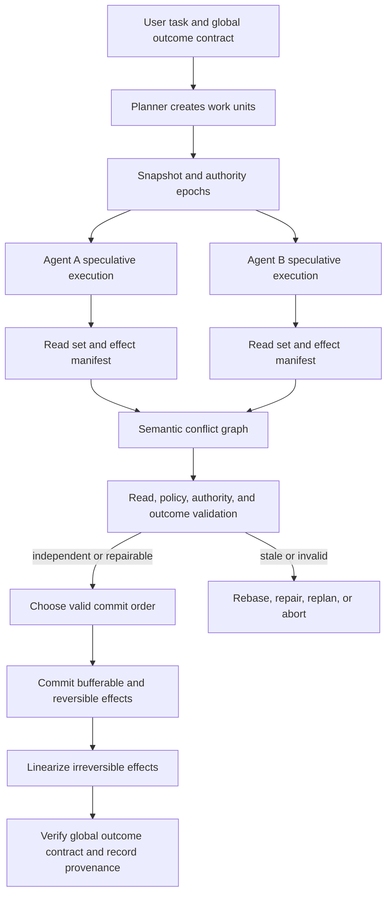

# Parallel Agents Need a Commit Protocol: From Effect Serializability to Contract-Valid Execution

Parallelism is becoming the default behavior of agent runtimes. A model can emit several tool calls in one turn. An orchestrator can launch multiple specialists against the same repository. A graph can fan out into concurrent nodes. A coding platform can give every worker a separate worktree and merge their patches later.

These mechanisms reduce latency when tasks are independent. They also create a familiar systems problem in an unfamiliar place. Two agents can read the same old state, make locally reasonable plans, and commit a globally wrong result. They may edit different files while violating the same API invariant, independently spend the same remaining budget, publish contradictory messages, consume one approval twice, or perform external actions whose order cannot be repaired by a Git merge.

The usual safeguards each cover only part of this problem. A sandbox separates processes. A worktree separates file writes. A reducer combines graph state. A CRDT guarantees convergence. A database transaction protects rows. A policy engine checks whether an action is allowed. None of these, by itself, states what it means for a complete set of concurrent agent effects to be correct.

<!-- more -->

This brief develops that missing contract. The starting point is classical serializability: a concurrent history is acceptable when its observable effect is equivalent to some serial execution of the same transactions. For tool-using agents, even this is not enough. The selected serial order must also remain valid under the intent, authority, state assumptions, and outcome conditions that justified each agent's work.

The proposed property is **contract-valid effect serializability**. A concurrent agent run is acceptable only if there exists a serial order of committed work units such that:

1. the order respects explicit causality, delegation, approval, and real-time constraints;
2. every work unit's relevant reads are still valid, or the work unit has repaired its plan against the state that precedes its commit;
3. its authority and policy predicates hold at commit time;
4. its local outcome contract and the workflow's global outcome contract hold after commit; and
5. externally visible effects are observationally equivalent to that valid serial execution.

This is a stronger target than "the branches merged" or "the tools did not write the same key." It lets independent reasoning proceed in parallel while forcing conflicting effects through an explicit validation and commit boundary.

> **Research question.** What correctness contract lets tool-using AI agents execute concurrently against shared mutable state without silently violating user intent?
>
> **Central claim.** Parallel agent systems need a commit protocol over semantic effects. Workspace isolation, state convergence, ordinary serializability, and policy checks are useful components, but the full execution is safe only when the committed history is both effect-serializable and valid under task, authority, and outcome contracts at commit time.

## Concurrency arrived before its correctness contract

A manual audit of current official runtime documentation shows that parallel execution is already a normal capability, while the safety semantics of side effects remain largely an application decision.

| Runtime or protocol | Documented concurrent behavior | Protection it explicitly provides | Boundary left to the application |
| --- | --- | --- | --- |
| [OpenAI Agents SDK](https://openai.github.io/openai-agents-python/running_agents/) | By default, all local function calls emitted in one turn are started; a concurrency cap is available | Tool input guardrails can be revalidated immediately before execution; sandbox agents provide workspace-scoped execution | No cross-tool atomic commit or isolation contract is implied by the concurrency setting |
| [Claude tool use](https://platform.claude.com/docs/en/agents-and-tools/tool-use/parallel-tool-use) | A response may contain several tool calls; the application chooses concurrent, sequential, or mixed execution | The documentation distinguishes independent read-only calls from calls with side effects or ordering requirements | Execution order, interference control, and rollback are explicitly left to the application |
| [AutoGen](https://microsoft.github.io/autogen/stable/user-guide/agentchat-user-guide/tutorial/agents.html) | Multiple tool calls execute in parallel by default | Parallelism can be disabled | The documentation warns that side effects may interfere and requires parallel calls to be disabled for stateful agent and team tools |
| [Google ADK ParallelAgent](https://adk.dev/agents/workflow-agents/parallel-agents/) | Subagents run concurrently in independent branches | Conversation history and branch state are not automatically shared | Shared context requires locks; other shared state needs an external coordination mechanism |
| [LangGraph](https://docs.langchain.com/oss/python/langgraph/use-graph-api) | Nodes in a fan-out run concurrently in the same superstep | Reducers define how graph-state updates combine; a failing superstep does not apply its graph-state updates | The transactional statement concerns graph state. Side effects already performed inside a node need their own semantics |
| [MCP sampling with tools](https://modelcontextprotocol.io/specification/2025-11-25/client/sampling) | A model may return an array of tool requests for parallel use | A common representation for tool calls and results | The protocol representation does not itself define a multi-tool transaction, isolation level, commit point, or compensation rule |

This is not a defect in any one SDK. These interfaces expose execution mechanisms. A Python function, shell command, MCP server, database operation, browser action, and cloud API have different effect models, so a general runtime cannot infer a safe transaction boundary from a tool name alone.

The gap becomes dangerous when a developer interprets "parallel tool use is supported" as "parallel effects are correct." Support means that calls can overlap. Correctness needs a separate contract.

## Four layers that are often confused

Agent concurrency discussions commonly collapse four different properties into one word: isolation. Separating them explains why apparently safe systems still produce wrong outcomes.

### 1. Execution parallelism

Execution parallelism answers a scheduling question: can several model calls, tools, nodes, or subagents run at the same time?

A concurrency limit, task group, worker pool, or graph fan-out belongs here. This layer determines throughput and latency. It says nothing about whether two operations interfere.

### 2. State separation or convergence

State separation answers whether workers overwrite each other's intermediate representation.

Worktrees, containers, copy-on-write filesystems, separate graph branches, reducers, and CRDTs belong here. They can prevent physical write corruption or guarantee that replicas converge to one representation.

Convergence is weaker than semantic correctness. Two patches can merge without a textual conflict and still disagree about a function contract. Two document edits can converge while retaining contradictory claims. Two append-only logs can preserve every update and still violate a budget or uniqueness invariant.

### 3. Effect serializability

Effect serializability asks whether the combined, externally visible history is equivalent to some serial order of the same work units.

This layer detects anomalies such as lost updates, stale-read decisions, write skew, duplicate consumption, and order-dependent external actions. It spans more than files. The relevant resources may include database rows, API objects, deployment state, messages, quotas, approvals, and user-visible artifacts.

### 4. Contract validity

Contract validity asks whether the serial explanation is one the user would accept.

Classical serializability assumes each transaction is correct when run serially. Agent work weakens that assumption. A work unit's plan is synthesized from a snapshot, a task interpretation, a set of permissions, and intermediate observations. Even if the runtime can place its effects in a serial order, the work may no longer be justified in the state at which it commits.

Consider two procurement agents. Both read that $1,000 remains. Each plans an $800 purchase. A serializable system can order the purchases, but the second transaction must recheck the budget and abort. Now add a policy that permits one purchase only after a manager approves a particular vendor. A database-serializable history is still insufficient if the approval is stale, vendor-scoped, consumed, or revoked. Finally, the two purchases may individually satisfy policy but jointly fail the user's task, for example because the user asked for one redundant supplier, not two copies of the same component.

The upper layers therefore constrain the lower ones:

```text
contract-valid execution
    requires effect serializability
        requires meaningful effect and dependency tracking
            while allowing execution parallelism where safe
```

## Why familiar mechanisms stop short

The missing contract is easier to see by examining mechanisms that are often presented as complete solutions.

### Worktrees isolate bytes, then defer the hard question

A worktree gives each coding agent a stable filesystem view. It prevents one worker from observing half-written files from another and lets each branch produce a coherent patch. That is valuable.

The hard part moves to merge time. A clean Git merge only proves that line-oriented merge rules found no textual collision. It does not prove that both agents used compatible assumptions. One agent may rename an internal concept while another adds a caller using the old behavior. They can edit different files, pass their local tests, and produce a combined build that fails or, worse, passes incomplete tests with a latent invariant violation.

Recent systems make this gap measurable. [STORM](https://arxiv.org/abs/2605.20563) argues that per-agent worktrees defer conflicts until recovery is expensive and reports better benchmark results from write-time state mediation. [AgenticFlict](https://arxiv.org/abs/2604.03551) finds textual conflicts in 27.67% of more than 107,000 merge-simulated agent pull requests, although its sample and textual-conflict method do not measure higher-level semantic conflicts. The evidence does not imply that worktrees are bad. It shows that isolation and integration are separate stages.

### Reducers and CRDTs define combination, not intent

LangGraph requires reducers for graph keys updated by parallel nodes. This prevents an ambiguous last writer from silently winning. A CRDT goes further by guaranteeing deterministic convergence without locking.

A reducer answers "how should these values combine?" It does not answer "should both values be accepted?" Appending two proposed deployment targets is deterministic even when only one target is valid. Unioning two permission sets converges even when privilege should not expand. Merging two lists of factual claims preserves both sides, including contradictions.

[CodeCRDT](https://arxiv.org/abs/2510.18893) demonstrates both sides of this trade-off. It reports deterministic convergence and zero merge failures, but still observes semantic conflicts and finds that parallel execution ranges from speedup to substantial slowdown depending on task structure. [S-Bus](https://arxiv.org/abs/2605.17076) reconstructs agent read sets and prevents structural races in shared shards, yet its own evaluation reports that the same preservation behavior is harmful in single-shard collaborative writing because concurrent contradictions propagate. Stronger structural consistency can faithfully preserve a semantically invalid combination.

### Locks and optimistic validation inherit agent-specific costs

Classical concurrency control offers two broad strategies.

Pessimistic control acquires locks before conflicting access. This avoids wasted work but is poorly matched to agents that spend minutes reasoning between reads and writes. Locking a repository, budget, or cloud resource across model inference and human approval can remove most useful parallelism and create deadlocks across heterogeneous tools.

Optimistic control lets work proceed, then validates before commit. The foundational [optimistic concurrency-control work](https://db.cs.cmu.edu/publications/) assumes conflicts are uncommon enough that abort and retry are cheaper than blocking. Agent aborts are expensive in a new currency: model tokens, tool calls, external rate limits, and human review. [ATCC](https://arxiv.org/abs/2603.13906) studies this problem for long, irregular SQL transactions generated by data agents and adaptively switches between optimistic and pessimistic strategies while accounting for abort cost.

Neither strategy solves resource identification automatically. A database knows the rows or predicates a transaction touches. An agent runtime sees a shell command, an HTTP request, or a browser action. The logical resource may be "the public API contract," "the remaining project budget," or "the right to send the launch announcement," none of which maps cleanly to one path or key.

### Compensation cannot make every effect disappear

Long-running transactions often use [Sagas](https://www.cs.princeton.edu/research/techreps/598): commit smaller steps and run compensating actions when later work fails. Compensation is practical, but it is not equivalent to rollback.

A deleted cloud instance can sometimes be recreated, but its identity and attached state may differ. A sent email can be followed by a correction, not unsent. A payment can be refunded, but the original transfer, fees, and audit events remain. A public release can be withdrawn, but copies and notifications may persist.

Agent systems therefore need to classify effects before speculative execution:

- **bufferable:** can remain private until commit, such as a file patch in an isolated workspace;
- **reversible:** has a reliable inverse that restores the relevant contract;
- **compensatable:** can be amended but leaves observable history;
- **irreversible:** cannot be safely undone or repeated.

A system that discovers this classification only after an abort is already too late.

## A formal model: from tool calls to work-unit contracts

The unit of concurrency should not be an individual model call. It should be a durable **work unit** whose state includes the task, evidence, authority, effects, and acceptance conditions needed to decide whether its result may commit.

Let work unit \(W_i\) be:

\[
W_i = \langle I_i, S_i, A_i, R_i, E_i, O_i \rangle
\]

where:

- \(I_i\) is the task intent and its declared scope;
- \(S_i\) is the snapshot or authority epoch from which planning began;
- \(A_i\) is the authority contract, including principal, capability, target, limits, and expiry;
- \(R_i\) is the observed read set, including versions and semantic dependencies;
- \(E_i\) is a proposed set of effects over logical resources;
- \(O_i\) is an outcome predicate that defines acceptable completion.

An effect is more than a write:

\[
e = \langle resource, operation, value, visibility, reversibility, authority \rangle
\]

The `resource` field may be physical, such as a file inode or database row, or semantic, such as an API invariant, a shared quota, a release channel, or a one-time approval. `visibility` says whether other actors can observe the effect before commit. `reversibility` determines which abort paths are honest.

For a concurrent history \(H\) of committed work units, ordinary effect serializability requires a serial permutation \(\pi\) such that:

\[
Obs_Q(H) \equiv Obs_Q(W_{\pi(1)}; W_{\pi(2)}; \ldots; W_{\pi(n)})
\]

Here, \(Obs_Q\) is an observation contract. For buffered file changes, final-state equivalence may be enough. For messages, payments, or audit events, the visible effect trace and real-time order may matter.

Contract-valid effect serializability adds four requirements. For every \(W_{\pi(k)}\):

\[
ValidRead(R_{\pi(k)}, state_{k-1}) \lor Repaired(W_{\pi(k)}, state_{k-1})
\]

\[
Authorized(A_{\pi(k)}, E_{\pi(k)}, state_{k-1})
\]

\[
O_{\pi(k)}(state_{k-1}, state_k, E_{\pi(k)}) = true
\]

and, for the full workflow:

\[
G(state_0, state_n, H) = true
\]

The first condition rejects stale reasoning unless the agent repairs the affected part of its plan. The second revalidates authority immediately before effects become visible. The third checks the work unit's own result. The fourth checks a global task contract that cannot be reduced to independent local successes.

This distinction matters because **serializable does not mean desirable**. A runtime may find a legal serial order for two deployments, two purchases, or two announcements while the user's request permits only one. The global contract selects the acceptable serial histories.

### Conflict classes

A practical implementation needs a conflict graph richer than path overlap.

| Conflict class | Example | Why file or key overlap misses it |
| --- | --- | --- |
| Physical write-write | Two agents edit the same function | Directly detectable |
| Stale read-write | One agent reads a schema while another changes it | The reader may write a different file |
| Semantic invariant | Two patches modify different modules but violate one API contract | No shared physical write |
| Aggregate constraint | Two agents each spend the same remaining budget | Writes may target different purchase records |
| Authority conflict | Two branches consume or extend one approval | The protected object is a capability, not only data |
| External-order conflict | Two announcements, deployments, or tickets must occur in order | Both effects can be individually valid |
| Irreversible duplicate | Two branches send the same payment or email | Deduplication may require semantic identity |
| Outcome conflict | Two locally successful subtasks make the overall result invalid | The conflict exists only at workflow level |

The graph may contain false positives. That is acceptable if the system exposes why it believes two work units conflict and allows deterministic validation to discharge the edge. What is unsafe is silently assuming independence because paths differ.

## What recent systems collectively show

No single project supplies the full contract above, but recent work makes its components concrete.

Several systems discussed in this section are recent 2026 preprints rather than established production standards. Their reported results are evidence about promising mechanisms, not independent confirmation that the mechanisms generalize. The synthesis below relies more on the boundaries exposed across the papers than on any single headline number.

[Atomix](https://arxiv.org/abs/2602.14849) is the closest tool-effect transaction system. It tags calls with epochs, tracks per-resource frontiers, buffers effects where possible, and compensates externalized effects on abort. Its results show that progress-aware commit can prevent contamination from losing speculative branches and preserve correctness under contention. Atomix establishes that tool calls can be mediated as transactional effects rather than accepted immediately.

[CoAgent](https://arxiv.org/abs/2606.15376) directly targets multi-agent concurrency. It observes that long inference intervals make both locks and full optimistic retry expensive, then uses a predetermined serialization order, order-filtered reads, effect repair, and undoable tools. Its reported results suggest that agent-assisted repair can recover concurrency that classical schemes lose. The important design lesson is that a runtime can ask an agent to repair a dependency without discarding the whole trajectory, but the runtime still needs mechanical effect tracking and undo semantics.

[Provenact](https://arxiv.org/abs/2608.02764) isolates another missing dimension: authorization can become stale while shared budgets, inventory, approvals, or risk state change. It defines policy-state serializability, requiring committed effects to be authorized against the policy state immediately before they occur. This is stronger than passing policy state as ordinary prompt context. It also shows why concurrency control and governance cannot be separate control planes.

[STORM](https://arxiv.org/abs/2605.20563), [S-Bus](https://arxiv.org/abs/2605.17076), and [CodeCRDT](https://arxiv.org/abs/2510.18893) address workspace and shared-state coordination from different directions. Together they show that write-time mediation, observable read sets, and deterministic convergence are all useful, but their value depends on workload topology and semantic invariants.

[Semisolates and `try`](https://www.usenix.org/conference/osdi26/presentation/lamprou) and [`hS`](https://www.usenix.org/conference/osdi26/presentation/liargkovas) demonstrate that a runtime can capture, inspect, defer, and selectively apply effects from opaque processes without rewriting every component. These mechanisms matter for agents because many tools are shell commands or third-party binaries that cannot be instrumented with an agent SDK. System-level effect capture is feasible; attaching task semantics and authority remains the next layer.

Two empirical studies explain why a commit protocol matters even when agents communicate. [CooperBench](https://arxiv.org/abs/2601.13295) reports an average 30% success reduction when two coding agents collaborate compared with one agent performing both tasks, attributing failures to poor communication, broken commitments, and incorrect expectations. AgenticFlict reports frequent textual merge conflict at ecosystem scale. Neither study proves that contract-valid serializability is the only solution. They show that coordination cannot be assumed to emerge reliably from more messages or more capable models.

The synthesis is therefore not "put every tool call in one database transaction." The emerging systems divide the problem into effect capture, read-set reconstruction, state coordination, adaptive scheduling, policy validation, repair, and compensation. A general agent runtime needs a contract that tells these mechanisms what successful composition means.

## A commit architecture for parallel agents

The architecture below lets reasoning and read-only exploration remain parallel while making effect visibility an explicit protocol decision.



### 1. Declare the work unit before execution

The orchestrator creates a stable work-unit identity with:

- parent task and delegation path;
- intent and target objects;
- snapshot epoch;
- authority epoch and capability scope;
- expected output and outcome checks;
- risk class and maximum effect class;
- estimated reasoning and abort cost.

The declaration can be incomplete. Agents discover dependencies dynamically. Its purpose is to establish what must be updated when the task changes and what the commit coordinator is allowed to accept.

### 2. Run in an effect-aware speculative environment

Each work unit receives an isolated or semisolated execution view:

- a worktree, copy-on-write filesystem, container, browser profile, or database snapshot;
- intercepted tool adapters for known APIs;
- system-level observation for opaque subprocesses;
- a local effect buffer where possible;
- explicit barriers before compensatable or irreversible actions.

Read-only network and search operations can execute immediately. File writes can remain private. Cloud mutation, messaging, payment, publication, and credential use require a stronger gate.

### 3. Reconstruct physical and semantic footprints

Tool schemas should declare resource templates when possible:

```text
read:  repo:{id}:symbol:{name}
write: repo:{id}:api-contract:{service}
use:   budget:{project}
send:  channel:{launch-announcement}
consume: approval:{approval-id}
```

Declarations will be incomplete, so the runtime augments them with:

- file, process, database, and network observations;
- versioned tool inputs and outputs;
- repository dependency graphs and test coverage;
- policy labels and capability identifiers;
- application invariants;
- agent-produced dependency explanations with confidence.

An LLM may help propose semantic edges, but it should not be the sole commit oracle. Deterministic schemas, version checks, tests, policies, and resource keys should discharge most high-consequence decisions. Model judgments are most useful for locating possible conflicts and requesting targeted validation.

### 4. Build a conflict graph, not a global lock

The coordinator adds an edge when one work unit may invalidate another. Edges carry a reason and a validation method:

```text
A -> B
reason: B read API schema v12; A proposes v13
discharge: rerun B's compatibility test against v13
```

The graph identifies independent components that can commit concurrently. It also lets the system serialize only the effects that actually conflict, instead of locking an entire repository or task for the duration of reasoning.

### 5. Validate at commit time

Commit-time validation has four parts.

**Read validation.** Have the state versions or assumptions used by the plan changed? If so, can the affected suffix be repaired without rerunning the whole work unit?

**Policy and authority validation.** Is the principal still authorized for this exact effect, target, amount, environment, and time? Has the capability been consumed, revoked, narrowed, or delegated?

**Outcome validation.** Do tests, deployment probes, ledger predicates, document consistency checks, or other task-specific oracles still pass after earlier commits?

**Global validation.** Does the proposed combined result satisfy the original task? A collection of locally successful outputs is not automatically one successful workflow.

Approval should not freeze these checks. A human may approve a proposal at time \(t\), but state can change before execution at \(t+\Delta\). Approval records intent and authority; the runtime still needs a commit-time state predicate.

### 6. Commit effects in risk order

A safe default order is:

1. metadata and provenance;
2. bufferable local state;
3. reversible external effects;
4. compensatable effects;
5. irreversible effects.

Irreversible effects receive an explicit linearization point and semantic idempotency identity. If a later step fails, the record must say that compensation occurred rather than pretending the original effect vanished.

### 7. Repair the affected suffix

Aborting an entire long trajectory wastes reasoning that may remain valid. CoAgent's direction suggests a more agent-native mechanism: notify the work unit of the changed dependency, identify the part of the plan that used it, undo or discard only dependent effects, and ask the agent to repair that suffix.

The runtime, not the model, must decide which effects were visible and whether their inverse succeeded. The model may repair intent-dependent reasoning; it should not be trusted to narrate an effect away.

## Isolation levels for agent runtimes

A single strongest mode will be too expensive for every task. Runtimes should expose named levels with explicit anomalies, much as databases do.

| Level | Guarantee | Appropriate workloads | Remaining risk |
| --- | --- | --- | --- |
| Parallel read | Concurrent read-only calls; no shared mutation | Search, retrieval, independent analysis | External sources can still change between reads |
| Workspace snapshot | Each worker sees an isolated file or environment snapshot | Independent code generation and artifact production | Clean merge can hide semantic and global conflicts |
| Effect snapshot isolation | Track effect sets and validate write-write conflicts at commit | Low-contention code and data tasks | Write skew, stale semantic reads, authority drift |
| Effect serializable | Committed effects equal some serial work-unit order | Shared repositories, databases, cloud resources | The selected serial history may violate task or authority contracts |
| Contract-valid effect serializable | Serial order plus read repair, commit-time authority, local and global outcome predicates | Consequential multi-agent workflows | Depends on the completeness of contracts and effect mapping |
| Strict contract-valid | Also preserves real-time constraints for completed approvals and visible effects | Payments, deployment control, security, publication | Highest coordination cost |

The important product decision is not "parallel on or off." It is which anomalies the workload can tolerate.

## Scheduling should be adaptive and effect-aware

The best concurrency policy depends on conflict probability, abort cost, effect reversibility, and consequence.

A practical scheduler can classify each work unit along four dimensions:

\[
score(W) = f(P_{conflict}, C_{abort}, C_{block}, R_{effect})
\]

- \(P_{conflict}\): estimated probability of conflict from historical traces, declared resources, and current activity;
- \(C_{abort}\): tokens, tool time, human review, and external work lost on repair;
- \(C_{block}\): latency and resource cost of waiting;
- \(R_{effect}\): consequence and reversibility of proposed effects.

Low-conflict read-heavy work should run optimistically. High-contention, short mutations can use locks. Long reasoning with repairable outputs should run speculatively with suffix repair. Irreversible effects should be serialized at a narrow commit gate even if their preparation is parallel.

This produces a useful principle:

> Parallelize evidence gathering and proposal construction aggressively. Serialize only the smallest effect boundary needed to preserve the contract.

That boundary may be one API call, a set of related repository changes, a budget allocation, or the publication of a final artifact.

## How to evaluate the proposal

A convincing evaluation must compare strategies at equal task quality and include conflicts that textual merges cannot detect.

### Workload corpus

The corpus should include:

1. independent read-only research;
2. disjoint file edits with no shared invariant;
3. same-file write conflicts;
4. cross-file API or schema conflicts;
5. stale-read configuration changes;
6. aggregate budget, quota, and inventory write skew;
7. one-time approval and delegated-authority conflicts;
8. ordered external actions such as deploy-then-announce;
9. duplicate irreversible effects;
10. document tasks where facts and conclusions can contradict without textual overlap.

The ground truth should specify allowed serial orders, global outcome predicates, and which effects are reversible.

### Baselines

Compare:

- sequential single-agent execution;
- naive parallel tool execution;
- isolated worktrees or sandboxes with post-hoc merge;
- reducer or CRDT-based state convergence;
- pessimistic resource locking;
- optimistic effect validation with full retry;
- effect serializability without task or authority contracts;
- contract-valid effect serializability with targeted repair.

### Metrics

Measure:

- final task success;
- serializability violations;
- contract violations despite serializable state;
- semantic conflict recall and false-positive rate;
- irreversible-effect leakage;
- wall-clock speedup;
- model and tool cost;
- full aborts versus suffix repairs;
- blocked time and deadlocks;
- human review time;
- commit-protocol overhead;
- percentage of effects with unknown or incorrect reversibility.

Ablations should remove semantic resource mapping, authority revalidation, global outcome predicates, and random post-commit audits separately. If these components do not change correctness or diagnosis, the stronger contract is unnecessary.

## Scope and alternative explanations

This proposal targets tool-using agents that mutate shared or externally visible state. Read-only fan-out, independent simulation, and embarrassingly parallel retrieval do not need a heavy commit protocol.

Several alternative explanations could weaken the case.

First, better task decomposition may eliminate most conflicts. If a planner can reliably assign disjoint resources and invariants, workspace isolation plus tests may be enough. Current evidence from coding benchmarks suggests decomposition is imperfect, but the result may improve with better models and project metadata.

Second, service APIs may absorb the problem. A database can provide serializable transactions, a payment API can enforce idempotency, and a deployment service can expose compare-and-swap. This reduces runtime responsibility. It does not remove cross-service contracts, such as coordinating a repository change, a feature flag, a message, and an approval.

Third, stronger automatic tests may make semantic dependency tracking redundant for code. Tests are excellent outcome predicates. They are usually incomplete, run after expensive work, and cannot undo effects already exposed outside the test environment.

Fourth, model-based repair may be less reliable than rerunning. A repair request can preserve an invalid hidden assumption or introduce new changes. The runtime should therefore compare targeted repair with full replay and fall back when the dependency slice is uncertain.

Fifth, the contract-authoring burden may exceed the benefit. Hand-writing every resource and invariant would not scale. The architecture depends on progressive adoption: strong defaults for common effects, automatic physical footprints, reusable policy schemas, and explicit contracts only at high-consequence boundaries.

## Falsification conditions

The central claim should be rejected or narrowed if evidence shows any of the following:

- At equal cost, worktree isolation plus ordinary tests matches contract-valid effect serializability on semantic conflicts, external effects, and authority changes.
- Real production workloads have conflict rates low enough that naive parallelism plus human review yields lower total cost without materially worse outcomes.
- Dynamic effect and dependency reconstruction cannot reach useful recall without so many false positives that the system serializes most work.
- Commit-time authority and global outcome predicates add no violations beyond resource-level serializability.
- Targeted repair is less reliable or more expensive than full retry across long-running agent tasks.
- Service-level transactions and idempotency cover nearly all cross-tool workflows in practice.
- The coordination overhead and latency of the commit protocol exceed the operational loss from the anomalies it prevents.

These conditions are measurable. A research program should report where the weaker mechanism wins, not assume the strongest level everywhere.

## What builders can do now

A complete runtime is not required to improve current systems.

1. **Classify tools.** Mark each tool read-only, bufferable, reversible, compensatable, or irreversible. Disable parallel execution for unknown high-consequence tools.
2. **Give work units stable identities.** Carry task, branch, snapshot, policy, and authority epochs across model calls and subprocesses.
3. **Record read versions as well as writes.** A patch can be stale even when it writes a unique file.
4. **Make effects private before commit.** Use worktrees, semisolates, staging APIs, dry runs, and preview modes.
5. **Revalidate approvals.** Bind approval to target, amount, state predicate, and expiry; check it immediately before the effect.
6. **Define one global outcome predicate.** Tests for each branch are not enough when the combined result has a higher-level goal.
7. **Linearize irreversible actions.** Prepare in parallel, then execute once through a narrow coordinator with semantic idempotency.
8. **Expose the isolation level.** A user should know whether "parallel" means only concurrent execution, isolated workspaces, or a serializable commit contract.
9. **Keep provenance.** Record why a work unit was committed, repaired, reordered, or aborted, including the conflict edges and validation results.
10. **Measure wasted reasoning.** Abort cost is part of concurrency control for agents, not a separate model-serving metric.

## Conclusion

Parallel agents are not simply a faster version of sequential agents. Once they read and mutate shared state, they become a distributed transaction system with unusual transactions: plans are generated online, read sets are opaque, execution lasts minutes, authority changes, effects cross unrelated services, and some actions cannot be undone.

The industry already has mechanisms for each layer. Agent SDKs schedule parallel calls. Worktrees and sandboxes isolate intermediate state. Reducers and CRDTs converge updates. Databases serialize rows. Atomix mediates transactional tool effects. CoAgent repairs concurrent trajectories. Provenact revalidates policy state. Semisolates capture opaque process effects.

The missing piece is the composition contract. A correct run needs more than one converged state and more than some serial explanation. It needs a serial explanation that remains valid under the task, authority, and outcome conditions that justified the work.

Contract-valid effect serializability provides that target. It does not require serial reasoning. It lets agents search, plan, generate, and test in parallel, then forces only the conflicting and consequential effects through a commit protocol. The resulting system can explain not only that its branches merged, but why the combined result was still authorized, current, and correct.

## References

1. OpenAI, [Running agents: function-tool concurrency](https://openai.github.io/openai-agents-python/running_agents/).
2. Anthropic, [Parallel tool use](https://platform.claude.com/docs/en/agents-and-tools/tool-use/parallel-tool-use).
3. Microsoft, [AutoGen agents and parallel tool calls](https://microsoft.github.io/autogen/stable/user-guide/agentchat-user-guide/tutorial/agents.html).
4. Google, [ADK ParallelAgent](https://adk.dev/agents/workflow-agents/parallel-agents/).
5. LangChain, [LangGraph Graph API](https://docs.langchain.com/oss/python/langgraph/use-graph-api) and [concurrent update errors](https://docs.langchain.com/oss/python/langgraph/errors/INVALID_CONCURRENT_GRAPH_UPDATE).
6. Model Context Protocol, [Sampling with tools and parallel tool use](https://modelcontextprotocol.io/specification/2025-11-25/client/sampling).
7. Kung and Robinson, [On Optimistic Methods for Concurrency Control](https://db.cs.cmu.edu/papers/1981/kung-tods1981.pdf), ACM TODS 1981.
8. Garcia-Molina and Salem, [Sagas](https://www.cs.princeton.edu/research/techreps/598), 1987.
9. Mohammadi et al., [Atomix: Timely, Transactional Tool Use for Reliable Agentic Workflows](https://arxiv.org/abs/2602.14849), 2026.
10. Lyu et al., [CoAgent: Concurrency Control for Multi-Agent Systems](https://arxiv.org/abs/2606.15376), 2026.
11. Peng and Wu, [Stateful Governance for Concurrent Agentic Systems](https://arxiv.org/abs/2608.02764), 2026.
12. Zhou et al., [ATCC: Adaptive Concurrency Control for Unforeseen Agentic Transactions](https://arxiv.org/abs/2603.13906), 2026.
13. Liu et al., [Multi-agent Collaboration with State Management](https://arxiv.org/abs/2605.20563), 2026.
14. Khan, [S-Bus: Automatic Read-Set Reconstruction for Multi-Agent LLM State Coordination](https://arxiv.org/abs/2605.17076), 2026.
15. Pugachev, [CodeCRDT: Observation-Driven Coordination for Multi-Agent LLM Code Generation](https://arxiv.org/abs/2510.18893), 2025.
16. Khatua et al., [CooperBench: Why Coding Agents Cannot be Your Teammates Yet](https://arxiv.org/abs/2601.13295), 2026.
17. Ogenrwot and Businge, [AgenticFlict](https://arxiv.org/abs/2604.03551), 2026.
18. Lamprou et al., [Controlling Opaque-Component Effects with Semisolates and Try](https://www.usenix.org/conference/osdi26/presentation/lamprou), OSDI 2026.
19. Liargkovas et al., [hS: Speculative Script Reordering at Subprocess Granularity](https://www.usenix.org/conference/osdi26/presentation/liargkovas), OSDI 2026.
