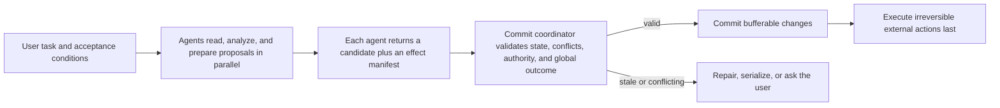

# When Several AI Agents Work at Once, Who Makes Sure the Final Result Is Right?

Consider a common parallel coding workflow.

A user asks an agent system to upgrade a service's authentication scheme. The orchestrator gives one worker the token-validation code and another worker the deployment configuration. They work in separate Git worktrees, never overwrite each other's files, pass their local tests, and produce patches that merge cleanly.

The deployed service is still wrong. One worker changed the expected token audience, while the other kept the old value in production configuration. There was no line-level conflict and no traditional data race. Two locally reasonable changes composed into a globally invalid system.

The same pattern appears outside source code. Two purchasing agents can each read that a project has $1,000 left and independently place an $800 order. Two communications agents can publish contradictory announcements. Two subagents can consume the same one-time approval. Two tool calls can send the same email, trigger the same deployment, or make the same payment twice.

Sandboxes, worktrees, reducers, locks, and database transactions each prevent some failures. None of them automatically knows whether several successful local results still satisfy the user's overall task.

<!-- more -->

The central argument of this brief is simple:

> **Treat each agent as a worker that prepares a proposal, not as an independent owner that may publish effects whenever it finishes. Let reasoning run in parallel, but put shared and irreversible effects through one validation and commit step.**

That commit step needs to answer five questions:

1. Are the facts and versions the agent relied on still current?
2. Do several results violate one hidden constraint even when they touch different files or records?
3. Are the required permissions and approvals still valid at commit time?
4. Does the combined result satisfy the workflow's end-to-end acceptance conditions?
5. Will externally visible actions occur in the right order and exactly the intended number of times?

This does not mean that every agent must run sequentially. Search, analysis, read-only inspection, and candidate generation can remain highly parallel. The coordination boundary belongs where work becomes shared state, consumed authority, or an externally visible effect.

## Parallel execution and correct composition are different properties

Parallel tool use is already a normal feature of agent runtimes. The OpenAI Agents SDK can start multiple local function tools emitted in one model turn and lets applications cap that concurrency. Anthropic's tool-use documentation says that a response may contain several tool calls, while the application decides whether to execute them concurrently, sequentially, or in a mixed strategy based on side effects, shared state, and ordering requirements. Google ADK runs `ParallelAgent` subagents in isolated branches and points developers to additional coordination for shared state. LangGraph reducers can combine graph-state updates from parallel nodes, but external effects performed inside those nodes need their own semantics.

These mechanisms answer scheduling questions: can work overlap, and how should intermediate state be combined? They do not, by themselves, define correctness for the final outcome.

For read-only work, the distinction may be minor. Two agents can search different documents at the same time, and the main risk is duplicated compute. Once tools create side effects, the distinction becomes fundamental:

- "Both tools returned successfully" does not imply that the combined outcome is correct.
- "Both branches merge cleanly" does not imply that they used compatible assumptions.
- "Both database transactions can commit" does not imply that a shared budget, approval, or business rule still holds.
- "Each action is individually allowed" does not imply that the set of actions is allowed.

The most dangerous failure in a parallel agent system is often not a crash or merge conflict. It is a run in which every component reports success while the final artifact quietly violates the user's intent.

## Three failure modes that ordinary isolation misses

### Different files can share one invariant

Many repository conflicts are semantic rather than textual.

One agent changes an API input contract while another adds a caller in a different package. One agent renames a configuration field while another updates a deployment template using the old name. One agent changes retry semantics while another writes error handling against the previous behavior. The agents can edit disjoint files and pass local tests.

A worktree is useful because it gives each worker a stable filesystem view. It does not prove that the workers' assumptions are compatible. Git detects overlapping lines, not a shared API invariant. The integration step must rebuild the combined tree, run cross-module tests, and determine whether important premises changed while the workers were running.

### Different records can consume one budget or approval

Many constraints apply across objects rather than to one file or database row.

Two purchasing agents may create different order records while drawing from one budget. Two cloud agents may create different instances while exceeding one quota. Two data agents may query different tables while relying on one approval that permits a single export.

Locks and transactions work well once the system knows the protected resource. Agent tools often expose only a shell command, HTTP request, browser action, or generic MCP call. The logical resource may instead be "the remaining launch budget," "a one-time approval," "the release window," or "the API contract that several files must preserve."

A conflict detector that watches only paths and keys will miss these aggregate constraints.

### External actions cannot be repaired by a merge

Source changes can usually remain private in a branch until validation succeeds. Email, payments, tickets, releases, and production deployments behave differently.

A sent email can be followed by a correction, but it cannot be unsent. A payment can be refunded, but the original transaction, fees, and audit history remain. A deployment can be rolled back after it has already served requests. A public release can be withdrawn without erasing copies or notifications.

A runtime therefore needs to classify effects before speculative execution:

- **Bufferable:** can remain private until commit, such as a patch in an isolated workspace.
- **Reversible:** has a reliable inverse that restores the relevant invariant.
- **Compensatable:** can be amended, but its history remains externally visible.
- **Irreversible:** cannot be safely undone, or repetition creates a new consequence.

The closer an action is to the irreversible end, the less freedom an individual parallel worker should have to execute it immediately.

## What current mechanisms do and do not guarantee

| Mechanism | What it handles well | What it does not automatically decide |
| --- | --- | --- |
| Sandboxes, containers, and worktrees | Process, filesystem, and intermediate-state isolation | Whether several results preserve one API, budget, approval, or business invariant |
| Reducers and CRDTs | Deterministic combination or convergence of updates | Whether all converged values should have been accepted |
| Database transactions and locks | Known rows, keys, predicates, and resources | How to identify logical resources behind shell, browser, and cross-service tools |
| Human approval | Permission for an action at a particular moment | Whether the approval remains applicable after state, target, or delegation changes |
| Per-agent tests | Local behavior of one branch or candidate | Cross-module and end-to-end behavior after composition |
| Compensation | Remediation for some partially failed effects | Erasing external history that has already become visible |

The conclusion is not that these mechanisms are weak. They operate at different layers. A complete parallel-agent system needs to place them inside one prepare, validate, and commit path.

## A practical model: prepare in parallel, commit together

A useful execution model has three stages.



### Stage 1: parallel preparation

Each agent works from a stable snapshot and prepares code, a plan, tool arguments, or another candidate artifact. The result should remain private where possible.

Alongside the artifact, the worker returns a small effect manifest:

- important versions and objects it read;
- resources it proposes to modify or consume;
- assumptions that justify the plan;
- authority or approval it expects to use;
- acceptance conditions it believes define success.

For example:

```yaml
work_unit: update-authentication
intent: migrate service authentication to the new audience value
reads:
  - resource: api/auth-contract
    version: git:8f31c2
  - resource: deployment/config
    version: git:27a9d0
proposed_effects:
  - modify: src/auth/validator.ts
  - modify: deploy/service.yaml
shared_constraints:
  - token audience must match across code and deployment
authority:
  scope: repository:eunomia/service-a
acceptance:
  - integration test passes
  - old audience is absent from production config
```

The manifest will never predict every effect perfectly. Its purpose is to give the commit layer more information than an unstructured answer and a zero exit code.

### Stage 2: shared validation

The commit coordinator collects candidate results and checks whether they can safely compose.

At minimum, it checks:

1. **Stale reads.** Did a relevant file, object, policy, or external resource change after the worker planned its action?
2. **Direct conflicts.** Do workers write the same resource or depend on incompatible versions?
3. **Shared constraints.** Do disjoint changes jointly exceed a budget, violate uniqueness, or break an API invariant?
4. **Authority.** Does the principal, scope, target, budget, approval, and delegation chain still cover the actual effects?
5. **Local and global acceptance.** Does each candidate work, and does the combined result complete the user's overall task?
6. **External ordering.** Which actions must happen exactly once, and which must wait until other changes have committed?

A failed validation does not always require restarting the whole task. The coordinator can ask only the affected worker to repair its plan against the latest state, serialize the conflicting portion, or present the user with a concrete decision instead of a generic "merge conflict."

### Stage 3: effect commit

After validation, the system commits bufferable changes first, such as files, database transactions, and staged configuration. It performs email, payment, deletion, release, and production deployment last.

This ordering avoids a common failure pattern: an agent performs the irreversible action, then discovers that the code, approval, or another branch cannot commit. Delaying high-consequence effects keeps more failure modes recoverable and makes the resulting history easier to explain.

## The commit layer must protect logical resources

Path-based conflict detection is straightforward. Logical conflict detection is harder and more important.

A logical resource can be:

- an API or data-format compatibility invariant;
- a shared budget or quota;
- a one-time approval;
- a release window;
- a user decision that permits only one of several alternatives;
- code and deployment configuration that must stay consistent;
- an information-flow boundary or sensitive-data policy.

No general runtime can infer all business semantics automatically. A practical design combines several sources:

- tools and applications explicitly declare resources, preconditions, and effects;
- system observation adds actual file, database, process, and network behavior;
- schemas, tests, policies, and invariant checkers provide deterministic validation;
- models help identify possible semantic conflicts where structured rules are incomplete;
- high-risk and irreversible actions retain an explicit human commit point.

A model can flag that two patches appear to change one interface in incompatible ways. It should not be the only authority deciding that a payment, deletion, or production release is safe. Wherever versions, types, tests, policy, and transaction semantics can prove a property, the system should prefer those deterministic mechanisms.

## Which work should remain fully parallel?

Coordination should be proportional to effect risk.

| Work type | Recommended strategy | Examples |
| --- | --- | --- |
| Independent read-only work | Run directly in parallel | Documentation search, reading separate logs, independent analysis |
| Bufferable work on clearly disjoint resources | Prepare in parallel, validate versions before commit | Patches in independent modules, candidate reports |
| Work with possible hidden shared constraints | Prepare in parallel, run shared integration and invariant checks | API changes, schemas, budgets, release plans |
| Known hot resources | Lock, partition, or serialize | One configuration object, one quota, one approval |
| Compensatable external effects | Commit centrally and record compensation semantics | Ticket creation, reversible infrastructure changes |
| Irreversible or high-consequence effects | Execute last with explicit approval where appropriate | Payments, messages, destructive deletion, production release |

This leads to an important performance rule: a commit protocol should not force every task through its heaviest path. Read-only and genuinely independent work can remain fully parallel. Extra coordination belongs only where workers touch shared state, authority, or externally visible effects.

## How this relates to database serializability

Database serializability asks whether a concurrent history is equivalent to running the same transactions one at a time in some order.

That is a useful starting point, but it is not enough for agents. A database typically assumes that each transaction is correct when run serially. An agent's plan may instead depend on an outdated repository, stale permission, incomplete observation, or mistaken interpretation of the task. The runtime may find a serial order that is internally consistent but still unacceptable to the user.

An agent commit therefore needs stronger conditions. For every work unit:

- important reads remain valid, or the plan is repaired against current state;
- authority still covers the effects at commit time;
- the work unit's own acceptance conditions pass;
- the combined workflow satisfies a global outcome condition;
- the externally visible history matches this valid serial explanation.

A precise research name for this property is **contract-valid effect serializability**. The name is less important than the distinction: the system needs not only a possible serial order, but a serial order that remains justified by current state, authority, and user intent.

## An implementable architecture

A general system can start with a small set of components rather than a complete "agent database":

1. **Stable work-unit identity.** Bind the model calls, tool calls, subprocesses, and delegated agents that belong to one piece of work.
2. **Effect adapters.** Record reads, writes, consumption, and externally visible actions at file, Git, database, cloud API, browser, and MCP boundaries.
3. **Versions and preconditions.** Track hashes, ETags, policy versions, object revisions, and other comparable state.
4. **Conflict detection.** Handle physical conflicts first, then use schemas, tests, policies, and semantic analysis for higher-level conflicts.
5. **Authority revalidation.** Recheck principal, scope, target, budget, approval, and delegation immediately before effects become visible.
6. **Global validation.** Run cross-branch tests, budget checks, release rules, and user-defined outcome checks.
7. **Commit log.** Record which candidates were accepted, rejected, repaired, or serialized, and when irreversible actions occurred.

System-level observation is useful because an agent may create undeclared effects through a shell script, Python subprocess, or third-party tool. File, process, and network observation can reveal that a supposedly read-only tool wrote data or contacted an external destination. Those events show what happened; they do not, on their own, determine whether the result satisfies the task. The commit layer still needs resource, authority, and outcome semantics.

## How to evaluate the design

A convincing evaluation must measure both correctness and coordination cost.

Useful workload families include:

- **Collaborative coding:** agents edit different files while sharing API, schema, configuration, or test invariants.
- **Data and budget tasks:** agents write separate records while sharing quotas, uniqueness rules, or approval.
- **Cloud operations:** agents prepare deployments, scaling, rollback, and release steps in parallel.
- **External communication:** agents create tickets, messages, announcements, or other visible effects.

Baselines should include:

- parallel execution without coordination;
- independent worktrees followed by ordinary merge;
- fully serial execution;
- locking on known resources;
- optimistic version validation only;
- shared commit with state, constraint, authority, and global-outcome checks.

Important metrics include:

- end-to-end task correctness rather than tool success rate;
- recall for direct and semantic conflicts;
- latency lost to unnecessary serialization;
- abort, repair, and model-token cost;
- duplicate or incorrect external effects;
- commits that succeed after authority has become stale;
- user interruptions and reapproval frequency;
- explanation quality when a commit is rejected.

Ablation should remove state validation, shared constraints, authority checks, and global acceptance one at a time. A layer that does not prevent real failures should not become a permanent default cost.

## Scope, limitations, and falsification

This design targets tool-using agents that modify shared state, use delegated authority, or create external effects. Chat, independent retrieval, and fully isolated candidate generation usually do not need such a protocol.

The design also has real limits:

- logical resources and global invariants cannot all be discovered automatically;
- semantic conflict detection may produce false positives and serialize safe work;
- aborting a long-running agent can waste substantial model and tool cost;
- external services without idempotency, conditional updates, or a prepare phase limit the guarantees a coordinator can provide;
- user intent may be too vague to express as a reliable acceptance condition;
- model judgment cannot replace deterministic authorization and transaction boundaries.

The central claim would be weakened by any of the following findings:

- at equal resource and review cost, ordinary worktrees, merge, and comprehensive tests reach the same final correctness;
- cross-file, cross-service, and aggregate-constraint conflicts are rare enough that coordination costs more than the failures it prevents;
- most high-risk tools already provide complete transaction semantics below the agent runtime;
- global validation does not find failures earlier or more accurately than per-agent checks;
- maintaining semantic resource declarations and conflict rules is impractical in production.

These are measurable conditions. A more complex commit protocol is justified only when it prevents real errors at an acceptable cost.

## A practical starting point

Developers can adopt several useful rules without waiting for a full system:

1. Run independent read-only tools in parallel by default. Require side-effecting tools to declare whether parallel execution is safe.
2. Let coding agents prepare patches in isolated workspaces, but treat merge, integration testing, and release as a separate commit stage.
3. Protect budgets, quotas, approvals, and versions with compare-and-set, ETags, one-time tokens, or server-side consumption records.
4. Place messages, payments, deletion, and production release after all bufferable changes have validated.
5. Define at least one global acceptance condition for the user's whole task instead of trusting each subagent's "success" status.
6. Record which work unit caused each external effect, which authority it used, and which resource versions justified it.

These practices do not solve every semantic conflict. They replace the most dangerous pattern, several agents independently succeeding and immediately publishing effects, with a clearer model: several agents prepare in parallel, and one explicit boundary decides what becomes real.

## Conclusion

The hard part of parallel agents is not running several models or tools at once. It is proving that their combined result still satisfies one user task.

Worktrees and sandboxes isolate execution. Reducers and CRDTs combine state. Database transactions protect known resources. Policy engines check individual actions. None of them alone can decide whether several local successes jointly violate an API, budget, approval, release order, or user objective.

A more reliable design lets agents prepare candidate results in parallel, then validates them before real effects occur. The commit step rechecks important reads, detects physical and semantic conflicts, confirms authority, runs local and global acceptance checks, and leaves irreversible actions until the end.

This does not remove uncertainty, and it should not serialize every task. It creates a clear responsibility boundary: parallel workers propose results; the commit layer decides which results may become part of the external world together.

## References

1. OpenAI Agents SDK, [Running agents](https://openai.github.io/openai-agents-python/running_agents/).
2. Anthropic, [Parallel tool use](https://platform.claude.com/docs/en/agents-and-tools/tool-use/parallel-tool-use).
3. Google Agent Development Kit, [Parallel agents](https://adk.dev/agents/workflow-agents/parallel-agents/).
4. Microsoft AutoGen, [Agents and tool execution](https://microsoft.github.io/autogen/stable/user-guide/agentchat-user-guide/tutorial/agents.html).
5. LangChain, [LangGraph Graph API](https://docs.langchain.com/oss/python/langgraph/use-graph-api).
6. Model Context Protocol, [Sampling with tools specification](https://modelcontextprotocol.io/specification/2025-11-25/client/sampling).
7. Philip A. Bernstein, Vassos Hadzilacos, and Nathan Goodman, [Concurrency Control and Recovery in Database Systems](https://www.microsoft.com/en-us/research/people/philbe/book/), 1987.
8. Hector Garcia-Molina and Kenneth Salem, [Sagas](https://www.cs.princeton.edu/research/techreps/598), 1987.
9. Marc Shapiro et al., [Conflict-Free Replicated Data Types](https://inria.hal.science/inria-00609399), 2011.
10. Eunomia Research, [What Should an AI Agent Trace Keep? Observability Under a Fixed Evidence Budget](https://eunomia.dev/research/agent-trace-evidence-budget/), 2026.
