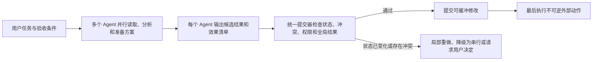

# 多个 AI Agent 同时工作时，谁来保证最终结果是对的？

想象一个很常见的并行 coding agent 工作流。

用户要求升级一个服务的认证机制。系统把任务拆给两个 Agent：第一个修改 token 校验逻辑，第二个更新部署配置。它们各自在独立 `worktree` 中工作，没有覆盖彼此的文件；各自的局部测试也都通过；Git 最后甚至可以无冲突合并。

结果上线后，服务仍然出错。第一个 Agent 把 token 的 audience 改成了新值，第二个 Agent 却沿用旧配置。它们没有写同一行代码，也没有发生传统意义上的数据竞争，但两个局部正确的修改组合成了一个全局错误的系统。

同样的问题不只出现在代码里。两个采购 Agent 可以分别看到“还剩 1,000 美元预算”，然后各自下单 800 美元；两个运营 Agent 可以同时发布互相矛盾的公告；两个子 Agent 可以分别使用同一份一次性审批；两个工具调用也可能把同一封邮件、付款或部署执行两次。`sandbox`、`worktree`、锁和数据库事务各自能挡住一部分错误，却没有一个机制天然知道“这些结果合在一起是否仍然完成了用户真正交代的任务”。

<!-- more -->

本文的核心判断很简单：

> **把每个 Agent 当成并行准备方案的 worker，而不是可以随时把结果写进真实世界的独立 owner。并行发生在准备阶段，真正的副作用应当经过一次统一的验证和提交。**

这个提交步骤需要回答五个问题：

1. Agent 做决定时读取的状态现在还有效吗？
2. 多个结果是否触碰了同一条隐藏约束，即使它们修改的是不同文件或对象？
3. 执行所需的权限和审批在提交时仍然有效吗？
4. 每个局部结果合在一起后，是否满足整项任务的验收条件？
5. 邮件、付款、部署等不可逆动作，是否以正确的次数和顺序发生？

这不是要把所有 Agent 都改成串行运行。真正的目标是把“可以并行思考”和“可以并行产生外部效果”分开：读取、搜索、分析和生成候选方案可以高度并行；修改共享状态、消耗预算、使用审批和触发不可逆操作，则需要明确的提交边界。

## 并行执行和正确结果是两件事

当前 Agent runtime 已经普遍支持并行工具调用。OpenAI Agents SDK 在模型一轮发出多个本地函数工具调用时，可以同时启动这些调用，并允许应用限制并发数；Anthropic 的文档也明确说明，一次响应可以包含多个工具调用，但这些调用究竟并行、串行还是混合执行，由应用根据副作用、共享状态和顺序要求决定。Google ADK 的 `ParallelAgent` 会让子 Agent 在隔离分支中运行，同时提醒共享状态需要额外协调。LangGraph 可以通过 reducer 合并并行节点的 graph state，但节点内部已经执行的外部操作并不会因此自动获得事务语义。

这些能力解决的是调度问题：多个工作能不能同时进行，以及中间状态怎样组合。它们没有自动回答最终正确性问题。

对只读任务来说，这个区别通常不重要。两个 Agent 同时搜索不同文档，最坏情况往往只是浪费一些计算。对有副作用的任务来说，区别会迅速放大：

- “两个工具都成功返回”不等于“组合结果正确”；
- “两个分支可以 clean merge”不等于“它们使用了兼容的设计假设”；
- “两个数据库事务都可提交”不等于“总预算、审批范围或用户目标仍然成立”；
- “每个动作单独被允许”不等于“这组动作整体被允许”。

并行系统最危险的失败，不一定是进程崩溃或 merge conflict，而是所有组件都报告成功，最终产物却悄悄偏离了用户目标。

## 三类常见失败

### 不同文件，破坏同一条系统约束

代码仓库中的冲突常常不是文本冲突，而是语义冲突。

一个 Agent 修改 API 的输入约定，另一个 Agent 在另一目录里新增调用者；一个 Agent 重命名配置项，另一个 Agent 更新部署模板时仍使用旧名字；一个 Agent 改变错误处理语义，另一个 Agent 根据旧语义编写重试逻辑。它们可以编辑完全不同的文件，也可以各自通过局部测试。

`worktree` 很适合隔离写入，但它只把冲突推迟到集成阶段。Git 能发现两段补丁是否修改同一行，却不知道两个补丁是否依赖互相矛盾的接口假设。最终的提交者仍然需要重新构建、运行跨模块测试，并检查两个 Agent 开始工作后是否有关键前提已经变化。

### 不同记录，共享同一个预算或审批

很多业务约束不是某个文件或数据库行的属性，而是多个动作共同消耗的资源。

两个采购 Agent 可能写入不同订单记录，却共享同一笔预算；两个 cloud Agent 可能创建不同实例，却一起突破项目配额；两个数据处理 Agent 可能读取不同表，却共同使用一份只允许一次导出的审批。

传统锁可以保护已知对象，但前提是系统已经知道应该锁什么。Agent 工具往往只暴露一个 shell 命令、HTTP 请求或浏览器动作，真正需要保护的逻辑资源却可能是“本周剩余预算”“一次性审批”“发布窗口”或“不能同时变更的 API 契约”。

如果运行时只按物理路径和 key 检测冲突，它会漏掉这类聚合约束。

### 外部动作无法靠 merge 或 rollback 修复

文件修改通常可以暂存在分支里，等验证通过再合并。邮件、付款、工单、发布和部署则不同。

一封邮件发出后，后续“补偿”只能再发一封更正邮件；一次付款可以退款，但原交易、手续费和审计记录仍然存在；一个生产部署可以回滚，却已经影响过请求；一个公开发布可以撤回，却无法保证没有人看到或复制。

因此，Agent runtime 必须在执行前区分四类效果：

- **可缓冲：**可以在提交前保持私有，例如独立工作区里的代码补丁；
- **可逆：**存在可靠的反向操作，并能恢复关键系统约束；
- **可补偿：**可以追加修正，但历史效果仍然可见；
- **不可逆：**无法安全撤销，或者重复执行会产生新的后果。

越接近不可逆的一端，越不能让每个并行 Agent 自行决定何时“落地”。

## 现有机制分别解决了什么

| 机制 | 它擅长解决的问题 | 它没有自动解决的问题 |
| --- | --- | --- |
| `sandbox`、容器、独立 `worktree` | 隔离进程、文件和中间状态 | 多个结果是否满足同一条 API、预算或业务约束 |
| reducer、CRDT | 让并行更新以确定方式合并或收敛 | 合并后的值是否符合用户目标 |
| 数据库事务和锁 | 保护已知行、key、predicate 或资源 | shell、浏览器和跨服务工具背后的逻辑资源怎样识别 |
| 人工审批 | 在某个时刻批准一个动作 | 状态、目标或权限变化后，旧审批是否仍适用 |
| 单 Agent 局部测试 | 验证一个分支在局部环境中的行为 | 多个分支合并后的跨模块和全局结果 |
| 补偿操作 | 在部分失败后修正可补偿效果 | 让已经发生的外部历史真正消失 |

这些机制都值得保留。问题不是它们无效，而是它们位于不同层次。一个完整的并行 Agent 系统需要把它们放进同一条“准备、验证、提交”路径里。

## 一个更实用的执行模型：先准备，再提交

可以把并行 Agent 的工作分成三个阶段。



### 第一阶段：并行准备

每个 Agent 可以在稳定快照上进行分析、生成代码、构建候选计划或准备工具参数。此时尽量不要让结果对外可见。

除了补丁或工具调用，Agent 还应返回一份简短的“效果清单”，说明：

- 它读取了哪些关键版本和对象；
- 它计划修改或消费什么；
- 它依赖哪些假设；
- 它使用什么权限或审批；
- 它认为怎样才算完成。

例如：

```yaml
work_unit: update-authentication
intent: migrate service authentication to the new audience value
reads:
  - resource: api/auth-contract
    version: git:8f31c2
  - resource: deployment/config
    version: git:27a9d0
proposed_effects:
  - modify: src/auth/validator.ts
  - modify: deploy/service.yaml
shared_constraints:
  - token audience must match across code and deployment
authority:
  scope: repository:eunomia/service-a
acceptance:
  - integration test passes
  - old audience is absent from production config
```

这份清单不需要完美预测所有副作用。它首先让提交器拥有比“Agent 返回了一段文本或一个 exit code”更多的结构化信息。

### 第二阶段：统一验证

提交器收集多个候选结果后，检查它们是否可以安全组合。

它至少需要检查：

1. **关键读取是否过期。** Agent 开始工作后，相关文件、数据库对象、策略或外部资源是否已经变化？
2. **是否存在直接冲突。** 两个工作单元是否写同一对象，或依赖彼此的旧版本？
3. **是否违反共享约束。** 不同对象上的修改是否共同突破预算、配额、唯一性或 API invariant？
4. **权限是否仍有效。** 审批、凭据和委派关系在真正提交时是否仍覆盖这些效果？
5. **局部和全局验收是否通过。** 每个结果单独正确之外，合并后的系统是否完成用户的整项任务？
6. **外部动作的顺序是否正确。** 哪些动作必须只执行一次，哪些必须在其他修改成功后才能发生？

验证失败不一定意味着整项任务重做。提交器可以只让受影响的 Agent 在新状态上重新规划，也可以把冲突部分降级为串行执行，或者向用户呈现一个具体决策，而不是简单地说“merge conflict”。

### 第三阶段：提交真实效果

验证通过后，系统先提交可缓冲的修改，例如文件、数据库事务或暂存配置；最后再执行邮件、付款、生产部署等不可逆动作。

这个顺序能减少一种常见错误：Agent 先把外部动作做了，随后才发现代码、审批或其他分支无法提交。不可逆动作越晚发生，系统越容易在失败时保持一个诚实、可恢复的状态。

## 提交器真正需要保护的是“逻辑资源”

按文件路径检测冲突很容易，按逻辑资源检测冲突更难，但后者决定了系统是否真的可靠。

逻辑资源可以是：

- 一个 API 或数据格式的兼容性约束；
- 一笔共享预算或一个配额；
- 一份一次性审批；
- 一个发布窗口；
- 一项“只能选择一个方案”的用户决策；
- 一组必须保持一致的代码与部署配置；
- 一条信息流策略或敏感数据边界。

运行时不可能自动理解所有业务语义，因此需要组合几种方法：

- 工具和应用显式声明资源、前置条件和效果；
- 系统根据文件、数据库、进程和网络行为补充实际读写集合；
- 测试、schema、policy 和 invariant checker 提供确定性验证；
- 模型只在结构化规则无法覆盖时辅助识别可能的语义冲突；
- 高风险或不可逆动作保留明确的人工提交点。

模型可以帮助发现“两个补丁似乎修改了同一接口语义”，但最终安全边界不应只依赖模型一句“看起来没问题”。能用版本、类型、测试、策略和事务证明的部分，应尽量使用确定性机制。

## 哪些任务可以直接并行

并行不是越多越好。一个实用调度器可以按效果风险选择不同策略。

| 工作类型 | 推荐策略 | 例子 |
| --- | --- | --- |
| 独立只读任务 | 直接并行 | 搜索文档、读取不同日志、运行互不影响的分析 |
| 可缓冲且资源明确不同 | 并行准备，提交前做版本验证 | 在独立模块生成补丁、准备多个候选报告 |
| 可能共享隐藏约束 | 并行准备，统一运行集成测试和约束检查 | 修改 API、schema、预算、发布计划 |
| 已知热点资源 | 锁定、分片或直接串行 | 同一配置对象、同一额度、同一审批 |
| 可补偿外部动作 | 统一提交并记录补偿语义 | 创建工单、可回滚的基础设施修改 |
| 不可逆或高后果动作 | 最后执行，并保留明确审批 | 付款、发信、删除数据、生产发布 |

这也给出一个性能上的重要结论：提交协议不应该让所有工作都走最重的路径。大量只读和真正独立的任务可以保持完全并行；只有触碰共享状态、权限或外部效果的部分需要额外协调。

## 这和数据库的可串行化有什么关系

数据库中的可串行化要求：一段并发执行的结果，应当等价于这些事务按照某个顺序一个接一个执行。

这个思想对 Agent 很有用，但还不够。数据库通常假设每个 transaction 在串行执行时本身就是正确的；Agent 的计划却可能基于已经过时的仓库、旧权限、错误任务理解或不完整观察。即使系统能找到某个串行顺序，那个顺序也可能不是用户允许的结果。

因此，Agent 提交还需要更强的条件。对每个准备提交的工作单元，都要保证：

- 它依赖的关键读取仍然有效，或者已经针对新状态修复；
- 它的权限在提交时仍覆盖实际效果；
- 它自己的验收条件成立；
- 所有工作单元合在一起后，整项任务的全局验收条件成立；
- 外部可见历史与这个合法的串行解释一致。

如果需要一个研究术语，可以把这个性质称为“契约有效的效果可串行化”（contract-valid effect serializability）。名字不是重点。重点是串行顺序不仅要存在，还必须在当前状态、权限和用户目标下仍然成立。

## 一个可实现的系统架构

一个通用实现不需要先发明完整的“Agent 数据库”。可以从几个独立组件开始：

1. **工作单元标识。** 把跨多个 model call、tool call 和子进程的同一项工作绑定到稳定 ID。
2. **效果适配器。** 在文件、Git、数据库、cloud API、浏览器和 MCP 工具边界记录读、写、消费和外部可见动作。
3. **版本与前置条件。** 为关键资源保存版本、hash、ETag、policy version 或其他可比较状态。
4. **冲突检测器。** 先处理明确的物理冲突，再使用 schema、测试、policy 和语义分析发现更高层冲突。
5. **权限重新验证。** 在效果即将提交时，重新检查 principal、scope、目标、预算、审批和委派链。
6. **全局验收器。** 运行跨分支测试、预算约束、发布规则和用户定义的最终结果检查。
7. **提交日志。** 记录哪些候选结果被接受、拒绝、重做，以及不可逆动作何时发生。

系统级观测在这里有一个实际作用：Agent 可能通过 shell script、Python 子进程或第三方工具产生没有在 harness 中声明的效果。文件、进程和网络层的观察可以补全效果清单，并发现“工具声称只读，实际却写了文件或访问了外部网络”的情况。不过，系统事件只能告诉提交器发生了什么，不能单独判断这些效果是否符合用户任务；它仍需要上层的资源和验收语义。

## 怎样评估这个设计

一个可信的评测需要同时测正确性和协调成本，而不是只展示“成功阻止了几个冲突”。

可以构建四类工作负载：

- **代码协作：**多个 Agent 修改不同文件，但共享 API、schema、配置或测试约束；
- **数据与预算：**多个 Agent 写不同记录，却共享额度、唯一性和审批；
- **云与运维：**多个 Agent 并行准备部署、扩容、回滚和发布；
- **外部沟通：**多个 Agent 创建工单、邮件、公告或其他可见效果。

对比基线包括：

- 无协调的并行执行；
- 独立 `worktree` 加普通 merge；
- 全局串行；
- 已知资源上的锁；
- 仅做版本验证的 optimistic commit；
- 加入共享约束、权限和全局验收的统一提交。

核心指标应包括：

- 最终任务正确率，而不只是工具成功率；
- 直接冲突和语义冲突的召回率；
- 不必要串行化造成的延迟；
- abort、重做和模型 token 成本；
- 重复或错误外部效果的数量；
- 权限过期后仍成功提交的比例；
- 用户被打断和重新审批的次数；
- 提交失败后能否解释具体原因。

最重要的消融实验是逐项移除状态验证、共享约束、权限检查和全局验收。假如某一层对真实错误没有贡献，它就不应成为默认成本。

## 适用范围与可证伪条件

这个设计主要面向会修改共享状态、使用权限或产生外部效果的工具型 Agent。聊天、独立检索和完全隔离的候选生成任务，通常不需要这样的提交协议。

它也有明显局限：

- 逻辑资源和全局约束不可能全部自动发现；
- 语义冲突检测可能产生误报，使本可并行的任务被串行化；
- 长时间 Agent 被 abort 后，重做会消耗大量 token 和工具成本；
- 外部服务如果不提供幂等键、版本条件或准备阶段，提交器很难提供强保证；
- 用户目标本身可能模糊，无法转成可靠的验收条件；
- 模型辅助判断不能替代确定性的权限和事务边界。

本文的中心判断会在以下结果下被削弱：

- 在相同资源和人工成本下，普通 `worktree`、merge 和完整测试已经能达到同样的最终正确率；
- 真实并行 Agent 工作中，跨文件、跨服务和聚合约束冲突极少，协调成本长期高于避免的损失；
- 大多数高风险工具都能由底层数据库或 API 自己提供完整事务语义，Agent runtime 不需要跨工具提交；
- 全局验收无法比单 Agent 局部检查更早或更准确地发现错误；
- 语义资源声明和冲突检测的维护成本高到无法在生产中使用。

这些都是可以测量的条件。一个更复杂的提交协议只有在它能以可接受成本减少真实错误时才值得部署。

## 现在可以先做什么

不需要等待完整系统，开发者现在就可以采用几个简单规则：

1. 默认只并行执行独立只读工具；有副作用的工具需要显式声明是否可以并行。
2. 让 coding agent 在独立工作区生成补丁，但把合并、集成测试和发布视为单独的提交阶段。
3. 对预算、配额、审批和版本使用 compare-and-set、ETag、一次性 token 或服务端消费记录。
4. 把邮件、付款、删除和生产发布放在所有可缓冲修改验证成功之后。
5. 为整项用户任务定义至少一个全局验收条件，不要只依赖每个子 Agent 的“成功”状态。
6. 记录每个外部动作属于哪个工作单元、使用了什么权限、基于什么资源版本。

这些做法不能解决所有语义冲突，但能把最危险的模式从“多个 Agent 各自成功后直接落地”，改成“多个 Agent 并行准备，由一个明确边界决定哪些结果真正生效”。

## 结论

并行 Agent 的难点不是让几个模型或工具同时运行。真正困难的是，当它们都完成以后，系统怎样证明组合结果仍然符合用户任务。

`worktree` 和 `sandbox` 可以隔离执行，reducer 和 CRDT 可以合并状态，数据库事务可以保护已知资源，policy engine 可以检查单个动作。这些机制都不能单独判断多个局部结果是否共同破坏 API、预算、审批、发布顺序或用户目标。

更可靠的设计是让 Agent 并行准备候选结果，并在真实副作用出现前经过统一提交：重新验证关键读取，检查物理和语义冲突，确认权限，运行局部与全局验收，并把不可逆动作留到最后。

这样做不会消除 Agent 的不确定性，也不应该把所有任务都变成串行。它提供的是一个清楚的责任边界：并行 worker 负责提出方案，提交器负责决定哪些方案可以一起成为真实世界的一部分。

## 参考资料

1. OpenAI Agents SDK, [Running agents](https://openai.github.io/openai-agents-python/running_agents/).
2. Anthropic, [Parallel tool use](https://platform.claude.com/docs/en/agents-and-tools/tool-use/parallel-tool-use).
3. Google Agent Development Kit, [Parallel agents](https://adk.dev/agents/workflow-agents/parallel-agents/).
4. Microsoft AutoGen, [Agents and tool execution](https://microsoft.github.io/autogen/stable/user-guide/agentchat-user-guide/tutorial/agents.html).
5. LangChain, [LangGraph Graph API](https://docs.langchain.com/oss/python/langgraph/use-graph-api).
6. Model Context Protocol, [Sampling with tools specification](https://modelcontextprotocol.io/specification/2025-11-25/client/sampling).
7. Philip A. Bernstein, Vassos Hadzilacos, and Nathan Goodman, [Concurrency Control and Recovery in Database Systems](https://www.microsoft.com/en-us/research/people/philbe/book/), 1987.
8. Hector Garcia-Molina and Kenneth Salem, [Sagas](https://www.cs.princeton.edu/research/techreps/598), 1987.
9. Marc Shapiro et al., [Conflict-Free Replicated Data Types](https://inria.hal.science/inria-00609399), 2011.
10. Eunomia Research, [What Should an AI Agent Trace Keep? Observability Under a Fixed Evidence Budget](https://eunomia.dev/research/agent-trace-evidence-budget/), 2026.
