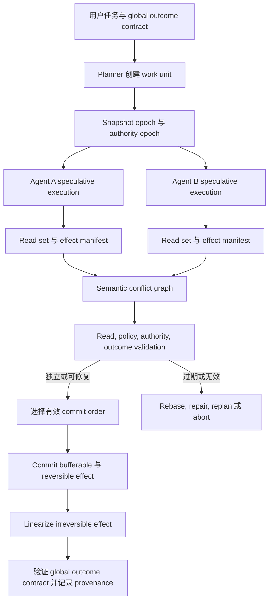

# 并行 Agent 需要 Commit Protocol：从 Effect Serializability 到契约有效执行

并行正在成为 Agent runtime 的默认能力。模型可以在一轮响应里发出多个工具调用，orchestrator 可以让几个 specialist 同时修改同一个仓库，图执行引擎可以把一个节点 fan-out 成多条并发分支，coding agent 平台也可以给每个 worker 创建独立 worktree，最后再合并补丁。

任务彼此独立时，这些机制可以直接缩短延迟。问题在于，一旦两个 Agent 读取同一份旧状态并产生外部效果，它们就进入了传统并发控制研究了几十年的领域。两个局部合理的计划可以组合成一个全局错误的结果：它们也许修改不同文件，却一起破坏同一条 API invariant；也许分别花掉同一笔剩余预算；也许发布互相矛盾的公告；也许重复消费一份审批；也许执行两个无法通过 Git merge 修复的外部动作。

常见保护机制都只覆盖其中一部分。Sandbox 隔离进程，worktree 隔离文件写入，reducer 合并 graph state，CRDT 保证副本收敛，数据库事务保护数据行，policy engine 判断动作是否允许。任何一个机制单独拿出来，都没有说明一组并发 Agent 效果在整体上什么时候才算正确。

<!-- more -->

本文讨论的正是这项缺失的契约。起点是数据库中的 serializability：如果一段并发历史与某种串行执行具有等价的可观察效果，那么这段历史可以被接受。对工具型 Agent 来说，仅有这一点仍然不够。被选中的串行顺序还必须符合每个 Agent 开始工作时依赖的任务意图、权限、状态假设和结果条件。

本文提出的目标是 **contract-valid effect serializability**，即“契约有效的效果可串行化”。一段并发 Agent 运行只有在存在某个 work unit 串行顺序，并同时满足以下条件时才可接受：

1. 顺序遵守明确的因果、委派、审批和实时约束；
2. 每个 work unit 的关键读取仍然有效，或者它已经针对 commit 前状态修复了受影响的计划；
3. 权限和策略谓词在 commit 时仍成立；
4. 局部 outcome contract 与整个 workflow 的 global outcome contract 都成立；
5. 对外可见的效果与这段有效串行执行在相应观察模型下等价。

这比“分支能够合并”或“两个工具没有写同一个 key”强得多。它允许独立的推理并行进行，只把真正冲突的效果送入显式 validation 和 commit 边界。

> **研究问题：**工具型 AI Agent 应该遵守什么正确性契约，才能并发操作共享可变状态而不悄悄违背用户意图？
>
> **中心论点：**并行 Agent 系统需要针对语义效果的 commit protocol。Workspace isolation、状态收敛、普通 serializability 和 policy check 都是有用组件，但完整执行只有在已 commit 历史同时满足 effect serializability，并且在 commit 时仍符合任务、权限和结果契约时才安全。

## 并发能力已经普及，正确性契约还没有跟上

对当前官方 runtime 文档做一次人工审计，可以看到一个一致趋势：并行执行已经是常规能力，side effect 的安全语义仍主要交给应用决定。

| Runtime 或协议 | 文档中的并发行为 | 明确提供的保护 | 留给应用的边界 |
| --- | --- | --- | --- |
| [OpenAI Agents SDK](https://openai.github.io/openai-agents-python/running_agents/) | 默认启动模型在一轮中发出的全部本地 function tool call，也可以限制并发数 | 工具输入 guardrail 可以在真正执行前重新验证；sandbox agent 提供 workspace-scoped execution | 并发设置本身不意味着跨工具 atomic commit 或 isolation contract |
| [Claude tool use](https://platform.claude.com/docs/en/agents-and-tools/tool-use/parallel-tool-use) | 一次响应可以包含多个工具调用，应用自行选择并发、串行或混合执行 | 文档明确区分独立只读工具和具有副作用、共享状态或顺序要求的工具 | 执行顺序、干扰控制和 rollback 明确由应用负责 |
| [AutoGen](https://microsoft.github.io/autogen/stable/user-guide/agentchat-user-guide/tutorial/agents.html) | 多个工具调用默认并行执行 | 可以关闭 parallel tool call | 文档警告 side effect 可能互相干扰，并要求 stateful AgentTool 和 TeamTool 禁用并行 |
| [Google ADK ParallelAgent](https://adk.dev/agents/workflow-agents/parallel-agents/) | Subagent 在独立分支中并发运行 | Conversation history 与分支状态不会自动共享 | 共享 context 需要锁，其他共享状态需要外部协调机制 |
| [LangGraph](https://docs.langchain.com/oss/python/langgraph/use-graph-api) | Fan-out 节点在同一 superstep 中并发执行 | Reducer 定义 graph-state update 怎样合并；失败 superstep 不应用其 graph state update | “Transactional”保证针对 graph state，节点内部已经产生的外部效果需要另一套语义 |
| [MCP sampling with tools](https://modelcontextprotocol.io/specification/2025-11-25/client/sampling) | 模型可以返回一组并行 tool request | 提供跨模型供应商的工具调用与结果表示 | 协议表示本身没有定义 multi-tool transaction、isolation level、commit point 或 compensation rule |

这不是某个 SDK 的 bug。接口暴露的是执行机制，而 Python 函数、shell 命令、MCP server、数据库操作、浏览器动作和 cloud API 具有完全不同的效果模型。通用 runtime 无法只看 tool name 就推导出安全事务边界。

真正危险的是把“支持 parallel tool use”理解成“parallel effect 是正确的”。支持只说明这些调用可以重叠，正确性需要另一份契约。

## 经常被混为一谈的四层性质

Agent 并发讨论里经常把四种不同性质都叫作 isolation。把它们分开以后，很多“看起来已经安全”的系统为什么仍会出错就清楚了。

### 第一层：execution parallelism

Execution parallelism 回答的是调度问题：多个 model call、tool、node 或 subagent 能不能同时运行？

Concurrency limit、task group、worker pool 和 graph fan-out 都属于这一层。它决定 throughput 与 latency，不说明两个操作会不会互相干扰。

### 第二层：state separation 或 convergence

这一层回答 worker 会不会覆盖彼此的中间表示，以及最终表示能不能收敛。

Worktree、container、copy-on-write filesystem、独立 graph branch、reducer 和 CRDT 都属于这里。它们可以避免物理写入破坏，也可以保证多个副本最终合并成一个确定表示。

收敛比语义正确弱得多。两个 patch 可以没有 textual conflict，却违反同一条函数契约；两段文档修改可以稳定合并，却同时保留互相矛盾的结论；两个 append-only log 可以完整保存所有 update，却一起突破预算或唯一性约束。

### 第三层：effect serializability

Effect serializability 询问一段并发、对外可见的历史，是否等价于相同 work unit 的某种串行顺序。

这一层处理 lost update、stale-read decision、write skew、重复消费和依赖顺序的外部动作。资源也不只是文件，还包括数据库行、API object、deployment state、消息、quota、approval 和用户可见 artifact。

### 第四层：contract validity

Contract validity 进一步问：这个串行解释是不是用户愿意接受的那个解释？

经典 serializability 假设每个 transaction 单独串行运行时本身是正确的。Agent work unit 削弱了这个前提。它的计划来自某个 snapshot、对任务的解释、一组权限以及中间观察。即使 runtime 能找到一个串行顺序，计划在真正 commit 时也可能已经没有依据。

考虑两个采购 Agent。它们都读取到项目还剩 1,000 美元，并各自计划采购 800 美元。Serializable system 可以确定先后顺序，但第二个 transaction 必须重新检查预算并 abort。现在再加入一条策略：采购只在经理批准特定 vendor 后允许。即使数据库历史可串行化，如果审批已经过期、只绑定另一个 vendor、已经被消费或已撤销，仍然不能执行。最后，即使两笔采购都符合 policy，它们也可能一起违背用户目标，例如用户要的是两个冗余供应商，而不是同一部件的两份副本。

因此，上层性质会约束下层性质：

```text
contract-valid execution
    需要 effect serializability
        需要有意义的 effect 与 dependency tracking
            同时尽量保留安全的 execution parallelism
```

## 为什么熟悉机制仍然停在半路

### Worktree 隔离字节，却把真正的问题推迟到 merge

Worktree 为每个 coding agent 提供稳定 filesystem view，避免 worker 看见另一个 worker 写到一半的文件，也能让每条分支独立形成 coherent patch。这很有价值。

困难被移到了 merge time。一次 clean Git merge 只证明基于文本行的 merge rule 没找到冲突，不证明两个 Agent 使用了兼容假设。一个 Agent 可能修改内部概念的含义，另一个 Agent 在另一文件里继续依赖旧行为。它们可以编辑不同文件，各自通过局部测试，合并后却 build failure，或者在测试覆盖不足时留下 latent invariant violation。

近期系统把这个差距变成了可测对象。[STORM](https://arxiv.org/abs/2605.20563) 认为 per-agent worktree 会把冲突推迟到恢复成本很高的阶段，并报告 write-time state mediation 在 benchmark 上优于 worktree baseline。[AgenticFlict](https://arxiv.org/abs/2604.03551) 对超过 107,000 个 Agent PR 做确定性 merge simulation，发现 27.67% 存在 textual conflict。这个数据集只覆盖特定样本与文本冲突，不能代表所有并发或 semantic conflict，但足以说明 isolation 和 integration 是两个不同阶段。

### Reducer 和 CRDT 定义怎样合并，不定义是否应该合并

LangGraph 要求并行节点更新同一个 graph key 时提供 reducer，以免某个不明确的 last writer 悄悄获胜。CRDT 更进一步，可以在无锁条件下保证确定性收敛。

Reducer 回答“这些值怎样组合”，不回答“这些值是否都应该被接受”。把两个 deployment target append 到列表里是确定的，即使只有一个 target 合法；把两个 permission set 做 union 会稳定收敛，即使权限本来不应该扩张；合并两组 factual claim 可以保留双方，包括互相冲突的事实。

[CodeCRDT](https://arxiv.org/abs/2510.18893) 同时展示了优势与边界。它实现确定性收敛和零 merge failure，但仍观察到 semantic conflict，而且并行执行会随着 task structure 从 speedup 变成明显 slowdown。[S-Bus](https://arxiv.org/abs/2605.17076) 重建 Agent read set，在 shared shard 中防止 structural race；其评测也报告，同一套 preservation 机制在 single-shard collaborative writing 中反而有害，因为它把并发矛盾一起传播。更强的结构一致性可以非常忠实地保存一个语义错误的组合。

### Lock 和 optimistic validation 会继承 Agent 特有成本

经典 concurrency control 大致有两类策略。

Pessimistic control 在冲突访问前拿锁。它避免浪费工作，却不适合在 read 与 write 之间进行几分钟推理的 Agent。如果在 model inference、tool call 和 human approval 整段期间锁住仓库、预算或 cloud resource，大部分有用并行度都会消失，还可能跨多个异构工具形成 deadlock。

Optimistic control 允许工作先进行，commit 前再验证。经典 [optimistic concurrency control](https://db.cs.cmu.edu/papers/1981/kung-tods1981.pdf) 假设冲突足够少，abort 和 retry 比等待更便宜。Agent abort 出现了一种新的成本单位：model token、tool call、external rate limit 和 human review。[ATCC](https://arxiv.org/abs/2603.13906) 针对 data agent 生成的长时间、不规则 SQL transaction，动态在 optimistic 与 pessimistic strategy 之间切换，并把 abort cost 纳入调度。

两种方法都不能自动解决 resource identification。数据库知道 transaction 触碰哪些 row 或 predicate，Agent runtime 看到的却可能只是 shell command、HTTP request 或 browser action。真实逻辑资源可能是“公开 API contract”“项目剩余预算”或“发布 launch announcement 的权利”，它们都无法直接映射成一个 path 或 key。

### Compensation 不能让所有效果消失

长事务经常使用 [Saga](https://www.cs.princeton.edu/research/techreps/598)：把流程拆成多个可 commit step，后续失败时运行 compensating action。这个方式实用，但 compensation 并不等于 rollback。

被删除的 cloud instance 有时可以重建，但 identity 和 attached state 可能已经不同；发出的邮件只能追加更正，不能“未发送”；支付可以退款，但原交易、手续费和 audit event 仍然存在；公开 release 可以撤回，通知和副本不会一起消失。

因此，Agent system 必须在 speculative execution 以前给 effect 分类：

- **bufferable**：可以在 commit 前保持私有，例如 isolated workspace 中的 file patch；
- **reversible**：存在可靠 inverse，可以恢复相关契约；
- **compensatable**：可以补救，但会留下可观察历史；
- **irreversible**：无法安全撤销或重复。

如果系统直到 abort 后才发现一个效果属于哪一类，已经太迟。

## 从 tool call 到 work-unit contract 的形式模型

并发单位不应是单个 model call，而应是持久的 **work unit**。它需要携带任务、证据、权限、效果和 acceptance condition，才能决定结果是否可以 commit。

定义 work unit \(W_i\)：

\[
W_i = \langle I_i, S_i, A_i, R_i, E_i, O_i \rangle
\]

其中：

- \(I_i\) 表示任务意图和声明的 scope；
- \(S_i\) 表示开始计划时使用的 snapshot 或 authority epoch；
- \(A_i\) 表示 authority contract，包括 principal、capability、target、limit 和 expiry；
- \(R_i\) 表示观察到的 read set，包括 version 与 semantic dependency；
- \(E_i\) 表示针对逻辑资源提出的 effect set；
- \(O_i\) 表示怎样才算完成的 outcome predicate。

Effect 也不只是 write：

\[
e = \langle resource, operation, value, visibility, reversibility, authority \rangle
\]

`resource` 可以是 file inode、database row 这样的 physical resource，也可以是 API invariant、共享 quota、release channel 或 one-time approval 这样的 semantic resource。`visibility` 决定其他 actor 是否会在 commit 前看到效果，`reversibility` 决定 abort path 是否真实可信。

对一段包含若干 committed work unit 的并发历史 \(H\)，普通 effect serializability 要求存在一个串行排列 \(\pi\)，使：

\[
Obs_Q(H) \equiv Obs_Q(W_{\pi(1)}; W_{\pi(2)}; \ldots; W_{\pi(n)})
\]

这里的 \(Obs_Q\) 是 observation contract。对 buffered file change，final-state equivalence 可能已经足够；对消息、支付和 audit event，可见 effect trace 与 real-time order 也可能属于正确性的一部分。

Contract-valid effect serializability 再增加四个要求。对每个 \(W_{\pi(k)}\)：

\[
ValidRead(R_{\pi(k)}, state_{k-1}) \lor Repaired(W_{\pi(k)}, state_{k-1})
\]

\[
Authorized(A_{\pi(k)}, E_{\pi(k)}, state_{k-1})
\]

\[
O_{\pi(k)}(state_{k-1}, state_k, E_{\pi(k)}) = true
\]

并且完整 workflow 满足：

\[
G(state_0, state_n, H) = true
\]

第一项拒绝 stale reasoning，除非 Agent 已修复受影响计划；第二项在 effect 变得可见以前重新验证 authority；第三项检查 work unit 自己的结果；第四项检查无法拆成独立局部成功的 global task contract。

这个区分很重要，因为 **serializable 不等于 desirable**。Runtime 也许能为两个 deployment、两笔采购或两条公告找到合法串行顺序，但用户只允许其中一个。Global contract 用来筛掉形式上可串行化、实质上不符合任务的历史。

### 冲突类型

实际系统需要的 conflict graph 不能只看 path overlap。

| 冲突类型 | 示例 | 为什么 file/key overlap 看不到 |
| --- | --- | --- |
| Physical write-write | 两个 Agent 修改同一函数 | 可以直接检测 |
| Stale read-write | 一个 Agent 读取 schema，另一个修改 schema | Reader 可能写另一个文件 |
| Semantic invariant | 两个 patch 修改不同 module，却一起破坏 API contract | 没有共享 physical write |
| Aggregate constraint | 两个 Agent 分别花掉同一笔剩余预算 | 写入可能落在不同 purchase record |
| Authority conflict | 两条分支消费或扩张同一份 approval | 被保护对象是 capability，不只是数据 |
| External-order conflict | Announcement、deployment 或 ticket 必须按顺序发生 | 单个 effect 都可能合法 |
| Irreversible duplicate | 两条分支重复发送付款或邮件 | Deduplication 需要 semantic identity |
| Outcome conflict | 两个局部成功 subtask 组成一个无效整体 | 冲突只存在于 workflow level |

Conflict graph 可以有 false positive。只要系统说明为什么认为两个 work unit 冲突，并允许 deterministic validation 消除 edge，这种保守性可以接受。真正不安全的是因为 path 不同，就默认任务彼此独立。

## 近期系统放在一起说明了什么

没有一个项目直接实现本文全部契约，但近期工作已经让各个组件变得具体。

这一节引用的若干系统是 2026 年刚发布的 preprint，还不是已经稳定下来的 production standard。文中的实验数字应被理解为作者报告的机制证据，而不是独立确认的普适结论。下面的综合主要依赖多篇工作共同暴露出的边界，而不是某一个 headline number。

[Atomix](https://arxiv.org/abs/2602.14849) 是最接近 tool-effect transaction 的系统。它给调用标记 epoch，维护 per-resource frontier，在可能时 buffer effect，并在 abort 时补偿已经 externalized 的效果。其实验说明，progress-aware commit 可以避免 losing speculative branch 污染外部环境，也能在 contention 下保持正确性。它证明 tool call 可以被当作 transaction effect 管理，而不是立即接受。

[CoAgent](https://arxiv.org/abs/2606.15376) 直接研究 multi-agent concurrency。它指出，长 inference interval 让 lock 和完整 optimistic retry 都很昂贵，于是使用预先确定的 serialization order、order-filtered read、effect repair 和 undoable tool。报告结果说明，Agent-assisted repair 有可能恢复经典方案丢掉的并行度。这里最重要的设计启示是：runtime 可以要求 Agent 修复受影响 dependency，而不必丢弃整条 trajectory；但 effect tracking 与 undo semantics 仍必须由机械机制保证。

[Provenact](https://arxiv.org/abs/2608.02764) 揭示另一个缺失维度：共享 budget、inventory、approval 和 risk state 在变化时，authorization 会过期。它定义 policy-state serializability，要求 effect 在真正 commit 以前，针对紧邻 commit 的 policy state 仍然被授权。这比把 policy state 当普通 prompt context 强得多，也说明 concurrency control 与 governance 不能放在两个互不知情的 control plane。

[STORM](https://arxiv.org/abs/2605.20563)、[S-Bus](https://arxiv.org/abs/2605.17076) 和 [CodeCRDT](https://arxiv.org/abs/2510.18893) 分别从 workspace state mediation、observable read set 和 deterministic convergence 处理协作。它们合起来说明，write-time mediation、read-set reconstruction 与收敛都很重要，但价值取决于 workload topology 和 semantic invariant。

[Semisolates 与 `try`](https://www.usenix.org/conference/osdi26/presentation/lamprou) 以及 [`hS`](https://www.usenix.org/conference/osdi26/presentation/liargkovas) 说明，即使组件是 opaque subprocess，runtime 也可以在不重写组件的情况下捕获、检查、延迟并选择性应用 effect。Agent 的许多工具正是 shell command 或第三方 binary，无法依赖 SDK 内插桩。这些系统说明 system-level effect capture 是可行的，下一层工作是把它和 task semantics、authority 连接起来。

两项经验研究说明，即使 Agent 会互相通信，也不能假设正确协调会自然出现。[CooperBench](https://arxiv.org/abs/2601.13295) 报告两个 coding agent 协作时，平均成功率比单个 Agent 完成两个任务低 30%，并把问题归因于模糊或错误通信、违背承诺和对对方计划的错误预期。AgenticFlict 则在生态尺度观察到频繁 textual conflict。它们都不能证明 contract-valid serializability 是唯一解法，但足以反驳“更强模型加更多消息就能自动解决并发”的假设。

因此，综合结论不是“把全部 tool call 塞进一个数据库 transaction”。正在出现的系统已经把问题拆成 effect capture、read-set reconstruction、state coordination、adaptive scheduling、policy validation、repair 和 compensation。通用 Agent runtime 还需要一份契约，告诉这些机制什么叫作成功组合。

## 面向并行 Agent 的 commit architecture

下面这套架构允许 reasoning 和 read-only exploration 保持并行，同时把 effect visibility 变成显式协议决定。



### 1. 执行前声明 work unit

Orchestrator 先创建稳定 work-unit identity，至少包含：

- parent task 与 delegation path；
- intent 和 target object；
- snapshot epoch；
- authority epoch 与 capability scope；
- expected output 与 outcome check；
- risk class 和允许的最高 effect class；
- 预计 reasoning cost 与 abort cost。

声明可以不完整，dependency 仍由 Agent 动态发现。它的作用是确定任务变化时哪些字段必须更新，以及 commit coordinator 有权接受什么。

### 2. 在 effect-aware speculative environment 中运行

每个 work unit 获得 isolated 或 semisolated execution view：

- worktree、copy-on-write filesystem、container、browser profile 或 database snapshot；
- 已知 API 的 intercepted tool adapter；
- opaque subprocess 的 system-level observation；
- 能够 buffer 的本地 effect；
- compensatable 或 irreversible action 前的明确 barrier。

Read-only network/search 可以立即执行，file write 可以保持私有。Cloud mutation、message、payment、publication 和 credential use 需要更强 gate。

### 3. 重建 physical 与 semantic footprint

Tool schema 应尽可能声明 resource template：

```text
read:    repo:{id}:symbol:{name}
write:   repo:{id}:api-contract:{service}
use:     budget:{project}
send:    channel:{launch-announcement}
consume: approval:{approval-id}
```

声明总会不完整，因此 runtime 还要补充：

- file、process、database 和 network observation；
- versioned tool input/output；
- repository dependency graph 与 test coverage；
- policy label 与 capability identifier；
- application invariant；
- Agent 产生的 dependency explanation 及 confidence。

LLM 可以帮助提出 semantic edge，但不应成为唯一 commit oracle。高后果决策应主要由 deterministic schema、version check、test、policy 和 resource key 决定。模型更适合高召回地定位潜在冲突，再请求针对性验证。

### 4. 构建 conflict graph，而不是拿一把 global lock

当一个 work unit 可能使另一个失效时，coordinator 建立 edge，并记录原因和消除方式：

```text
A -> B
reason: B 读取 API schema v12；A 提议 v13
discharge: 在 v13 上重新运行 B 的 compatibility test
```

Graph 可以找出仍能并行 commit 的独立 component，也可以只 serialize 真正冲突的 effect，而不是在整个 reasoning 期间锁住完整 repository 或 task。

### 5. Commit-time validation

Commit 前至少做四类验证。

**Read validation：**计划依赖的 state version 或假设有没有变化？如果变化，能否只修复受影响 suffix，而不是重跑整个 work unit？

**Policy and authority validation：**当前 principal 是否仍然可以对这个 target、amount、environment 和时间执行精确 effect？Capability 是否已消费、撤销、缩小或重新委派？

**Outcome validation：**Earlier commit 发生以后，test、deployment probe、ledger predicate、document consistency check 或其他 oracle 是否仍通过？

**Global validation：**组合结果是否满足原始用户任务？一组 locally successful output 不会自动构成成功 workflow。

Human approval 不能冻结这些检查。用户可以在时间 \(t\) 批准 proposal，但真正执行的 \(t+\Delta\) 时状态可能已经改变。Approval 记录 intent 与 authority，runtime 仍需检查 commit-time state predicate。

### 6. 按风险顺序 commit effect

一个安全的默认顺序是：

1. metadata 与 provenance；
2. bufferable local state；
3. reversible external effect；
4. compensatable effect；
5. irreversible effect。

Irreversible effect 需要明确 linearization point 和 semantic idempotency identity。后续失败时，记录必须说明发生了 compensation，而不是假装原 effect 从未存在。

### 7. 修复受影响 suffix

完整 abort 一条长 trajectory 会浪费大量仍然有效的 reasoning。CoAgent 展示了更符合 Agent 特征的方向：通知 work unit 哪个 dependency 已改变，定位 plan 中使用它的部分，只撤销或丢弃 dependent effect，再让 Agent 修复这个 suffix。

哪些 effect 已经可见、inverse 是否成功，必须由 runtime 判断，而不是让模型自行叙述。模型可以修复依赖 intent 的 reasoning，不能把已经发生的 effect 通过文字“解释掉”。

## Agent runtime 的 isolation level

对所有任务强制最强模式会很昂贵。Runtime 应像数据库一样暴露有名字、有明确 anomaly 的 level。

| Level | 保证 | 适合场景 | 剩余风险 |
| --- | --- | --- | --- |
| Parallel read | 并发只读调用，不共享 mutation | Search、retrieval、独立分析 | 外部 source 仍可能在两次 read 之间变化 |
| Workspace snapshot | 每个 worker 使用 isolated file/environment snapshot | 独立 code generation 与 artifact production | Clean merge 仍可能隐藏 semantic/global conflict |
| Effect snapshot isolation | 记录 effect set，commit 时验证 write-write conflict | 低 contention 的代码与数据任务 | Write skew、stale semantic read、authority drift |
| Effect serializable | Committed effect 等价于某个串行 work-unit order | 共享 repository、database、cloud resource | 被选中的串行历史仍可能违背 task/authority contract |
| Contract-valid effect serializable | 串行顺序加 read repair、commit-time authority、local/global outcome predicate | 有后果的 multi-agent workflow | 正确性依赖 contract 和 effect mapping 的完整度 |
| Strict contract-valid | 还保留已完成 approval 与 visible effect 的 real-time constraint | Payment、deployment control、security、publication | 协调成本最高 |

真正的产品决策不是“parallel on/off”，而是 workload 能容忍哪些 anomaly。

## 调度需要 adaptive，也需要 effect-aware

最佳策略取决于冲突概率、abort cost、effect reversibility 和后果：

\[
score(W) = f(P_{conflict}, C_{abort}, C_{block}, R_{effect})
\]

- \(P_{conflict}\)：根据历史 trace、声明 resource 和当前活动估计冲突概率；
- \(C_{abort}\)：repair 会损失的 token、tool time、human review 与 external work；
- \(C_{block}\)：等待带来的 latency 和 resource cost；
- \(R_{effect}\)：effect consequence 与 reversibility。

低冲突 read-heavy work 适合 optimistic execution；高 contention、短 mutation 适合 lock；长 reasoning、输出可修复时适合 speculative execution 加 suffix repair；不可逆 effect 即使准备阶段并行，也应该在狭窄 commit gate 中 serialize。

由此可以得到一条实用原则：

> 尽量并行 evidence gathering 与 proposal construction，只 serialize 为保存契约所需的最小 effect boundary。

这个 boundary 可能是一条 API call、一组相关 repository change、一次 budget allocation，或者最终 artifact 的 publication。

## 怎样评估这项提案

有说服力的实验必须在相同 task quality 下比较，并覆盖 textual merge 检测不到的冲突。

### Workload corpus

至少包含：

1. 独立 read-only research；
2. 不共享 invariant 的 disjoint file edit；
3. same-file write conflict；
4. cross-file API/schema conflict；
5. stale-read configuration change；
6. aggregate budget、quota、inventory write skew；
7. one-time approval 与 delegated-authority conflict；
8. deploy-then-announce 这类有顺序的 external action；
9. duplicate irreversible effect；
10. 文本没有 overlap、事实和结论却互相矛盾的 document task。

Ground truth 应声明允许的 serial order、global outcome predicate 和 effect reversibility。

### Baseline

比较：

- sequential single-agent execution；
- naive parallel tool execution；
- isolated worktree/sandbox 加 post-hoc merge；
- reducer 或 CRDT state convergence；
- pessimistic resource locking；
- optimistic effect validation 加完整 retry；
- 不含 task/authority contract 的 effect serializability；
- 带 targeted repair 的 contract-valid effect serializability。

### Metric

测量：

- final task success；
- serializability violation；
- state 可串行化但 contract 仍被违反的比例；
- semantic conflict recall 与 false-positive rate；
- irreversible-effect leakage；
- wall-clock speedup；
- model/tool cost；
- full abort 与 suffix repair 数量；
- blocked time 与 deadlock；
- human review time；
- commit-protocol overhead；
- reversibility 未知或错误的 effect 比例。

Ablation 应分别移除 semantic resource mapping、authority revalidation、global outcome predicate 和 random post-commit audit。如果这些组件不改变 correctness 或 diagnosis，更强契约就没有必要。

## 适用范围与替代解释

本文面向会修改共享或外部可见状态的工具型 Agent。Read-only fan-out、独立 simulation 和 embarrassingly parallel retrieval 不需要重型 commit protocol。

几种替代解释可能削弱本文判断。

第一，更好的 task decomposition 也许能消除绝大多数冲突。如果 planner 能稳定分配 disjoint resource 和 invariant，workspace isolation 加测试可能足够。当前 coding benchmark 说明 decomposition 仍不可靠，但更强模型和更好的项目 metadata 可能改善这一点。

第二，service API 可以吸收一部分问题。数据库提供 serializable transaction，支付 API 提供 idempotency，deployment service 提供 compare-and-swap，这些都会降低 runtime 责任。但跨 service contract 仍存在，例如同时协调 repository change、feature flag、message 与 approval。

第三，更强自动测试可能让 semantic dependency tracking 在代码场景中显得多余。Test 是很好的 outcome predicate，但通常不完整，往往在昂贵工作已经完成后运行，也不能撤销 test environment 以外已经暴露的 effect。

第四，model-based repair 可能不如完整 rerun 可靠。Repair request 也可能保留无效 hidden assumption 或引入新变化。因此 runtime 应比较 targeted repair 与 full replay，在 dependency slice 不确定时回退。

第五，contract authoring burden 可能超过收益。手工标注每个 resource 和 invariant 无法扩展。架构必须渐进采用：为常见 effect 提供强默认值，自动采集 physical footprint，复用 policy schema，只在高后果 boundary 显式声明 contract。

## 可证伪条件

出现下列证据时，本文中心判断应被拒绝或缩小范围：

- 在相同成本下，worktree isolation 加普通测试已经能在 semantic conflict、external effect 和 authority change 上匹配 contract-valid effect serializability。
- 真实生产 workload 的冲突率足够低，naive parallelism 加 human review 总成本更低，结果也没有实质变差。
- Dynamic effect/dependency reconstruction 无法在不过度制造 false positive 的情况下达到有用 recall，最终迫使系统 serialize 大多数工作。
- Commit-time authority 和 global outcome predicate 没有发现 resource-level serializability 以外的新违规。
- Targeted repair 在长任务中比 full retry 更不可靠或更昂贵。
- Service-level transaction 与 idempotency 在实践中覆盖了几乎所有 cross-tool workflow。
- Commit protocol 的协调开销和 latency 超过它避免的 operational loss。

这些条件都可以测量。研究应该报告弱机制在哪些地方更好，而不是默认所有任务使用最强 level。

## 开发者现在可以做什么

不需要先实现完整 runtime，也能立刻改善系统。

1. **给 tool 分类。** 标注 read-only、bufferable、reversible、compensatable 和 irreversible；未知且高后果的 tool 默认关闭并行。
2. **给 work unit 稳定 identity。** 跨 model call 和 subprocess 携带 task、branch、snapshot、policy 与 authority epoch。
3. **记录 read version，不只记录 write。** Patch 即使写独立文件，也可能基于过期 schema。
4. **Commit 前保持 effect 私有。** 使用 worktree、semisolate、staging API、dry run 和 preview mode。
5. **重新验证 approval。** Approval 绑定 target、amount、state predicate 和 expiry，并在 effect 前立即检查。
6. **定义一个 global outcome predicate。** 每条 branch 的 test 都通过，不代表组合目标正确。
7. **Linearize irreversible action。** 准备阶段并行，真正执行只通过一个带 semantic idempotency 的窄 coordinator。
8. **暴露 isolation level。** 用户应该知道“parallel”只是 concurrent execution、isolated workspace，还是包含 serializable commit contract。
9. **保存 provenance。** 记录 work unit 为什么 commit、repair、reorder 或 abort，以及对应 conflict edge 和 validation result。
10. **测量 wasted reasoning。** Abort cost 是 Agent concurrency control 的一部分，不只是独立的 model-serving metric。

## 结论

并行 Agent 不是串行 Agent 的简单加速版。一旦它们读取和修改共享状态，就变成一种特殊 distributed transaction system：计划在线生成，read set 不透明，执行持续数分钟，权限会变化，effect 跨越多个互不相关的 service，而且部分动作无法撤销。

产业已经拥有每一层的机制。Agent SDK 调度并行调用，worktree 与 sandbox 隔离中间状态，reducer 与 CRDT 合并 update，数据库 serialize row，Atomix 管理 transactional tool effect，CoAgent 修复并发 trajectory，Provenact 重新验证 policy state，semisolate 捕获 opaque process effect。

缺失的是组合契约。正确运行不仅需要一个收敛状态，也不仅需要某种串行解释；它需要一个在任务、权限与结果条件下仍然有效的串行解释。

Contract-valid effect serializability 提供了这样的目标。它不要求 reasoning 串行。Agent 仍然可以并行 search、plan、generate 和 test，只把真正冲突且有后果的 effect 送入 commit protocol。这样，系统最终能回答的不只是“这些分支合并成功了吗”，还包括“组合结果为什么在 commit 时仍被授权、仍基于当前状态，并且仍然满足用户任务”。

## 参考资料

1. OpenAI, [Running agents: function-tool concurrency](https://openai.github.io/openai-agents-python/running_agents/).
2. Anthropic, [Parallel tool use](https://platform.claude.com/docs/en/agents-and-tools/tool-use/parallel-tool-use).
3. Microsoft, [AutoGen agents and parallel tool calls](https://microsoft.github.io/autogen/stable/user-guide/agentchat-user-guide/tutorial/agents.html).
4. Google, [ADK ParallelAgent](https://adk.dev/agents/workflow-agents/parallel-agents/).
5. LangChain, [LangGraph Graph API](https://docs.langchain.com/oss/python/langgraph/use-graph-api) 与 [concurrent update errors](https://docs.langchain.com/oss/python/langgraph/errors/INVALID_CONCURRENT_GRAPH_UPDATE).
6. Model Context Protocol, [Sampling with tools and parallel tool use](https://modelcontextprotocol.io/specification/2025-11-25/client/sampling).
7. Kung and Robinson, [On Optimistic Methods for Concurrency Control](https://db.cs.cmu.edu/papers/1981/kung-tods1981.pdf), ACM TODS 1981.
8. Garcia-Molina and Salem, [Sagas](https://www.cs.princeton.edu/research/techreps/598), 1987.
9. Mohammadi et al., [Atomix: Timely, Transactional Tool Use for Reliable Agentic Workflows](https://arxiv.org/abs/2602.14849), 2026.
10. Lyu et al., [CoAgent: Concurrency Control for Multi-Agent Systems](https://arxiv.org/abs/2606.15376), 2026.
11. Peng and Wu, [Stateful Governance for Concurrent Agentic Systems](https://arxiv.org/abs/2608.02764), 2026.
12. Zhou et al., [ATCC: Adaptive Concurrency Control for Unforeseen Agentic Transactions](https://arxiv.org/abs/2603.13906), 2026.
13. Liu et al., [Multi-agent Collaboration with State Management](https://arxiv.org/abs/2605.20563), 2026.
14. Khan, [S-Bus: Automatic Read-Set Reconstruction for Multi-Agent LLM State Coordination](https://arxiv.org/abs/2605.17076), 2026.
15. Pugachev, [CodeCRDT: Observation-Driven Coordination for Multi-Agent LLM Code Generation](https://arxiv.org/abs/2510.18893), 2025.
16. Khatua et al., [CooperBench: Why Coding Agents Cannot be Your Teammates Yet](https://arxiv.org/abs/2601.13295), 2026.
17. Ogenrwot and Businge, [AgenticFlict](https://arxiv.org/abs/2604.03551), 2026.
18. Lamprou et al., [Controlling Opaque-Component Effects with Semisolates and Try](https://www.usenix.org/conference/osdi26/presentation/lamprou), OSDI 2026.
19. Liargkovas et al., [hS: Speculative Script Reordering at Subprocess Granularity](https://www.usenix.org/conference/osdi26/presentation/liargkovas), OSDI 2026.
